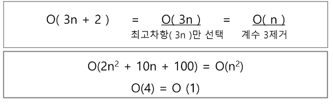
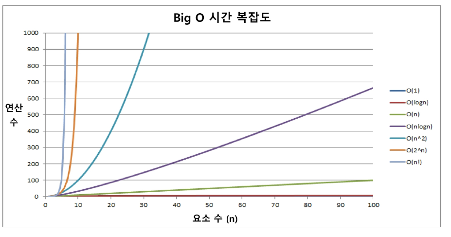
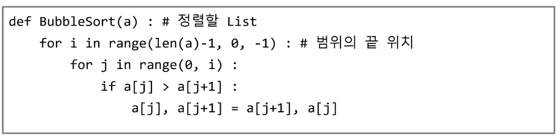
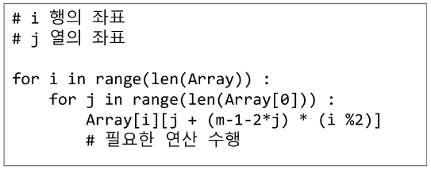
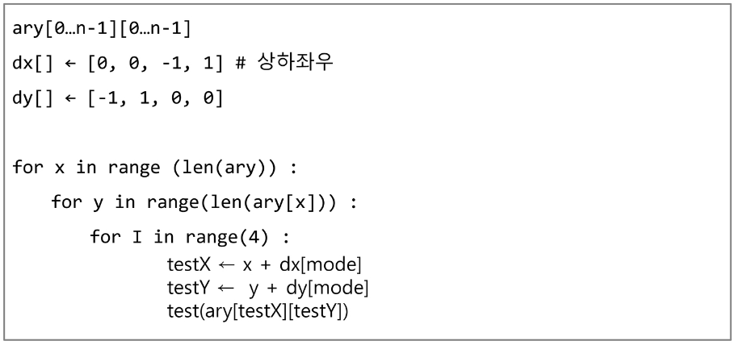
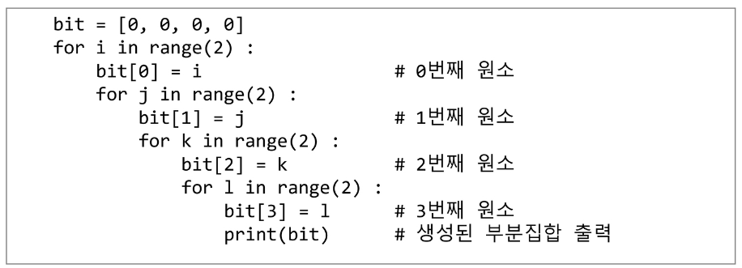
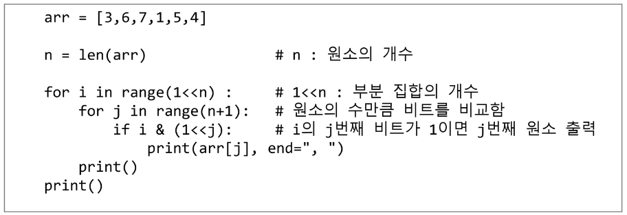
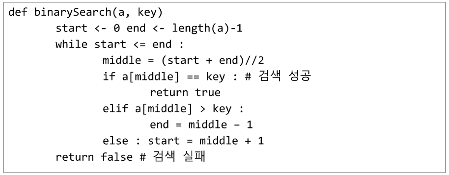
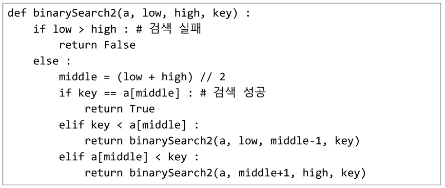

## 알고리즘

#### 무엇이 좋은 알고리즘인가?

1. 정확성: 얼마나 정확하게 동작하는가
2. 작업량: 얼마나 적은 연산으로 원하는 결과를 얻어내는가
3. 메모리 사용량: 얼마나 적은 메모리를 사용하는가
4. 단순성: 얼마나 단순한가
5. 최적성: 더 이상 개선할 여지없이 최적화되었는가

#### 시간 복잡도 (빅-오 표기법)

- 빅-오 표기법(Big-Oh Notation)
- 시간 복잡도 함수 중에서 가장 큰 영향력을 주는 n에 대한 항만을 표시
- 계수(Coefficient)는 생략하여 표시
  - 
- n개의 데이터를 입력 받아 저장한 후 각 데이터에 1씩 증가시킨 후 각 데이터를 화면에 출력하는 알고리즘의 시간복잡도는 어떻게 되나? O(n)
- 

## 정렬

#### 대표적인 정렬 방식의 종류

- 버블 정렬
- 카운팅 정렬
- 선택 정렬
- 퀵 정렬
- 삽입 정렬
- 병합 정렬

### 버블 정렬(Bubble Sort)

- 인접한 두 개의 원소를 비교하며 자리를 계속 교환하는 방식
- 정렬 과정
  - 첫 번째 원소부터 인접한 원소끼리 계속 자리를 교환하면서 맨 마지막 자리까지 이동한다.
  - 한 단계가 끝나면 가장 큰 원소가 마지막 자리로 정렬된다.
  - 교환하며 자리를 이동하는 모습이 물 위에 올라오는 거품 모양과 같다고 하여 버블 정렬이라고 한다.
- **시간 복잡도**
  - O(n**2)
- 

### 카운팅 정렬(Counting Sort)

- 항목들의 순서를 결정하기 위해 집합에 각 항목이 몇 개씩 있는지 세는 작업을 하여, 선형 시간에 정렬하는 효율적인 알고리즘
- 제한 사항
  - 정수나 정수로 표현할 수 있는 자료에 대해서만 적용 가능: 각 항목의 발생 회수를 기록하기위해, 정수 항목으로 인덱스 되는 카운트들의 배열을 사용하기 때문이다.
  - 카운트들을 위한 충분한 공간을 할당하려면 집합 내의 가장 큰 정수를 알아야 한다.
- **시간 복잡도**
  - O(n + k): n은 리스트 길이, k는 정수의 최대값
- 

## 완전 검색(Exaustive Search)

- 완전 검색 방법은 문제의 해법으로 생각할 수 있는 모든 경우의 수를 나열해보고 확인하는 기법이다.
- **Brute-force** 혹은 generate-and-test 기법이라고도 불리 운다.
- 모든 경우의 수를 테스트한 후, 최종 해법을 도출한다.
- 일반적으로 경우의 수가 상대적으로 작을 때 유용하다.

## 탐욕(Greedy) 알고리즘

- 탐욕 알고리즘은 최적해를 구하는 데 사용되는 근시안적인 방법
- 여러 경우 중 하나를 결정해야 할 때마다 그 순간에 최적이라고 생각되는 것을 선택해 나가는 방식으로 지행하여 최종적인 해답에 도달한다.
- 각 선택의 시점에서 이루어지는 결정은 지역적으로는 최적이지만, 그 선택들을 계속 수집하여 최종적인 해답을 만들었다고 하여, 그것이 최적이라는 보장은 없다.
- 일반적으로, 머리속에 떠오르는 생각을 검증 없이 바로 구현하면 Greedy 접근이 된다.

## 2차원 배열

- 지그재그 순회
  - 
- 델타를 이용한 2차 배열 탐색
  - 
- 전치 행렬
  - 

## 부분집합 생성하기

- 각 원소가 부분집합에 포함되었는지를 loop 이용하여 확인하고 부분집합을 생성하는 방법
  - 
- 비트 연산을 이용한 보다 간결하게 부분집합 생성
  - 

## 검색(Search)

- 저장되어 있는 자료 중에서 원하는 항목을 찾는 작업
- 목적하는 탐색 키를 가진 항목을 찾는 것
  - 탐색 키(search key): 자료를 구별하여 인식할 수 있는 키
- 검색의 종류
  - 순차 검색(sequential search)
  - 이진 검색(binary search)
  - 해쉬(hash)

### 이진 검색(Binary Search)

- 자료의 가운데에 있는 항목의 키 값과 비교하여 다음 검색의 위치를 결정하고 검색을 계속 진행하는 방법
  - 목적 키를 찾을 때까지 이진 검색을 순환적으로 반복 수행함으로써 검색 범위를 반으로 줄여가면서 보다 빠르게 검색을 수행함
- 이진 검색을 하기 위해서는 자료가 정렬된 상태여야 한다.
- 구현
  - 
  - 재귀 함수 이용
    - 

### 선택 정렬(Selection Sort)

- 주어진 자료들 중 가장 작은 값의 원소부터 차례대로 선택하여 위치를 교환하는 방식
- 정렬과정
  - 주어진 리스트 중에서 최소값을 찾는다.
  - 그 값을 리스트의 맨 앞에 위치한 값과 교환한다.
  - 맨 처음 위치를 제외한 나머지 리스트를 대상으로 위의 과정을 반복한다.
- **시간 복잡도**
  - O(n**2)
- 

