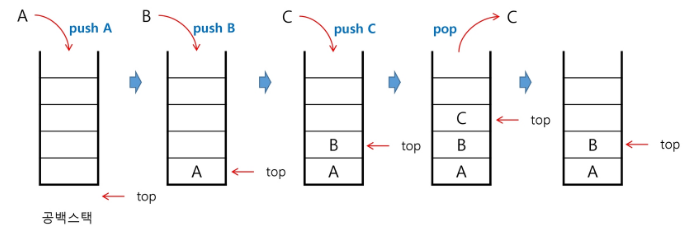
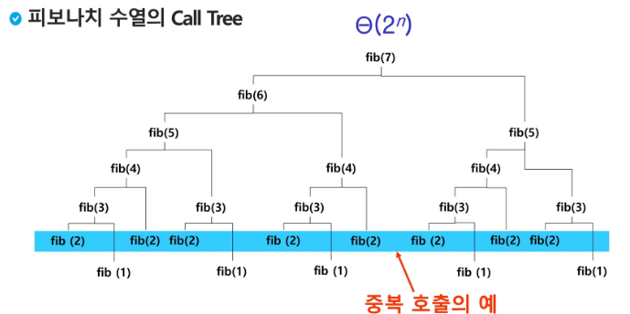
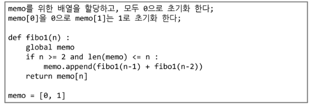
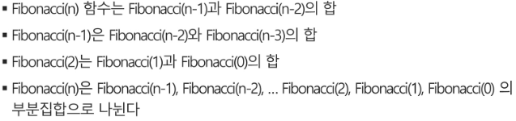
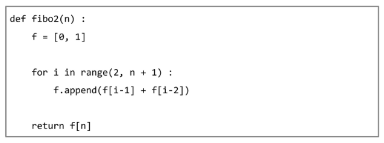
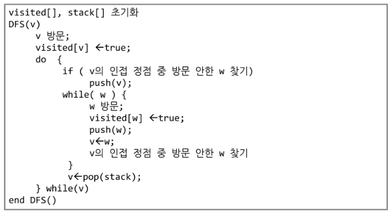

# Stack

- 스택(stack)의 특성
  - 물건을 쌍아 올리듯 자료를 쌓아 올린 형태의 자료구조이다.
  - 스택에 저장된 자료는 선형 구조를 갖는다.
    - 선형구조: 자료간의 관계가 1대1의 관계를 갖는다.
    - 비선형구조: 자료 간의 관계가 1대N의 관계를 갖는다.(예: 트리)
  - 스택에 자료를 삽입하거나 스택에서 자료를 꺼낼 수 있다.
  - **마지막에 삽입한 자료를 가장 먼저 꺼낸다. 후입선출(LIFO, Last-In-First-Out)이라고 부른다.**
    - 예를 들어 스택에 1, 2, 3 순으로 자료를 삽입한 후 꺼내면 역순으로 즉 3, 2, 1 순으로 꺼낼 수 있다.


- 스택을 프로그램에서 구현하기 위해서 필요한 자료구조와 연산
  - 자료구조: 자료를 선형으로 저장할 저장소
    - C언어에서는 배열을 사용할 수 있다.
    - 저장소 자체를 스택이라 부리기도 한다.
    - 스택에서 마지막 삽입된 원소의 위치를 top이라 부른다.
  - 연산
    - 삽입: 저장소에 자료를 저장한다. 보통 push라고 부른다.
    - 삭제: 저장소에서 자료를 꺼낸다. 꺼낸 자료는 삽입한 자료의 역순으로 꺼낸다. 보통 pop이라고 부른다.
    - 스택이 공백인지 아닌지를 확인하는 연산.  isEmpty
    - 스택의 top에 있는 item(원소)을 반환하는 연산. peek


- 스택의 삽입/삭제 과정
  - 


- 스택 구현 고려 사항
  - 1차원 배열을 사용하여 구현할 경우 구현이 용이하다는 장접이 있지만 스택의 크기를 변경하기가 어렵다는 단접이 있다.
  - 이를 해결하기 위한 방법으로 저장소를 동적으로 할당하여 스택을 구현하는 방법이 있다. 동적 연결리스트를 이용하여 구현하는 방법을 의미한다. 구현이 복잡하다는 단점이 있지만 메모리를 효율적으로 사용한다는 장접을 가진다.


- 스택의 응용
  - 괄호검사
  - function call
    - 프로그램에서의 함수 호출과 복귀에 따른 수행 순서를 관리


## Memoization

- 피보나치 수를 구하는 함수를 재귀함수로 구현한 알고리즘은 **엄청난 중복 호출이 존재한다.**

- 

- 메모이제이션은 컴퓨터 프로그램을 실행할 때 이전에 계산한 값을 메모리에 저장해서 매번 다시 계산하지 않도록 하여 전체적인 실행속도를 빠르게 하는 기술이다. 동적계획법의 핵심이 되는 기술이다.

- 'memoization'은 글자 그대로 해석하면 '메모리에 넣기(to put in memory)'라는 의미이며 '기억되어야 할 것'이라는 뜻의 라틴어 memorandum에서 파생 되었다. 흔히 '기억하기', '암기하기'라는 뜻의 memorization과 혼동하지만, 정확한 단어는 memoization이다. 동사형은 memoize이다.

- 피보나치 수를 구하는 알고리즘에서 fibo(n)의 값을 계산하자마자 저장하면(memoize), 실행시간을 O(n)으로 줄일 수 있다.

- Memoization 방법을 적용한 알고리즘

  - 

  - ```python
    def fibo(n):
        if n>=2 and memo[n]==0:
            memo[n] = fibo(n-1) + fibo(n-2)
        return memo[n]
    n = 10
    memo = [0] * (n+1)
    memo[0] = 0
    memo[1] = 1
    print(fibo(n))
    ```


# DP(Dynamic Programming)

- 동적 계획 알고리즘은 그리드 알고리즘과 같이 **최적화 문제**를 해결하는 알고리즘이다.
- 동적 계획 알고리즘은 먼저 입력 크기가 작은 부분 문제들을 모두 해결한 후에 그 해들을 이용하여 보다 큰 크기의 부분 문제들을 해결하여, 최종적으로 원래 주어진 입력의 문제를 해결하는 알고리즘이다.


#### 피보나치 수 DP 적용

1. 문제를 부분 문제로 분할한다.
   - 
2. 부분 문제로 나누는 일을 끝냈으면 가장 작은 부분 문제부터 해를 구한다.
3. 그 결과는 테이블에 저장하고, 테이블에 저장된 부분 문제의 해를 이용하여 상위 문제의 해를 구한다.


- 피보나치 수는 부분 문제의 답으로부터 본 문제의 답을 얻을 수 있으므로 최적 부분 구조로 이루어져 있다.

- 피보나치 수 DP 적용 알고리즘

  - ```python
    def fibo(n):
        table[0] = 0
        table[1] = 1
        for i in range(2, n+1):
            table[i] = table[i-1] + table[i-2]
        return table[n]
    n = int(input())
    table = [0] * (n+1)
    print(fibo(n))
    ```

  - 

  - 메모이제이션과의 차이는?

    - 메모이제이션은 재귀구조이지만 DP는 반복구조
    - n번 만큼만 연산을 하면 끝난다.
    - 재귀로인한 함수호출의 리소스를 줄일 수 있다.

- **memozation을 재귀적 구조에 사용하는 것보다 반복적 구조로 DP를 구현한 것이 성능 면에서 보다 효율적이다.**

- 재귀적 구조는 내부에 시스템 호출 스택을 사용하는 오버헤드가 발생하기 때문이다


# DFS(깊이우선탐색)

- 비선형구조인 그래프 구조는 그래프로 표현된 모든 자료를 빠짐없이 검색하는 것이 중요함.
- 두 가지 방법
  - 깊이 우선 탐색(Depth First Search, DFS)
  - 너비 우선 탐색(Breadth First Search, BFS)
- 시작 정접의 한 방향으로 갈 수 있는 경로가 있는 곳까지 갚이 탐색해 가다가 더 이상 갈 곳이 없게 되면, 가장 마지막에 만났던 갈림길 간선이 있는 정점으로 되돌아와서 다른 방향의 정점으로 탐색을 계속 반복하여 결국 모든 정점을 방문하는 순회방법
- 가장 마지막에 만났던 갈림길의 정점으로 되돌아가서 다시 깊이 우선 탐색을 반복해야 하므로 후입선출 구조의 스택 사용
- 지나온 경로를 저장하는 **방법 중 하나로 스택**을 사용 할 수 있다.


1. 시작 정점 v를 결정하여 방문한다.
2. 정점 v에 인접한 정점 중에서
   - 방문하지 않은 정점 w가 있으면, 정점 v를 스택에 push하고 정점 w를 방문한다. 그리고 w를 v로 하여 다시 2. 를 반복한다
   - 방문하지 않은 정점이 없다면, 탐핵의 방향을 바꾸기 위해서 스택을 pop하여 받은 가장 마지막 방문 정점을 v로 하여 다시 2. 를 반복한다.
3. 스택이 공백이 될 때까지 2. 를 반복한다.

- 

- DFS를 이용한 N Castle 문제 풀이 (재귀)

  - ```python
    def castle(i):
        global result
        if i == n:
            result += 1
            return
        for x in range(n):
            if used[x] == 1:
                continue
            Map[i][x] = 1
            used[x] = 1
            castle(i+1)
            Map[i][x] = 0
            used[x] = 0
    for test_ in range(1, 11):
        n = int(input())
        Map = [[0] * n for _ in range(n)]
        used = [0] * n
        result = 0
        castle(0)
        print('#{} {}'.format(test_, result))
    ```


