# 트리

- 비선형 구조
- 원소들 간에 1:n 관계를 가지는 자료구조
- 한개 이상의 노드로 이루어진 유한 집합
- 노드 중 최상위 노드를 루트라 한다.
- 나머지 노드들은 n(>=0)개의 분리 집합 T1,...TN으로 분리될 수 있다.
  - **이들 T1,....,TN은 각각 하나의 트리가 되면(재귀적 정의) 루트의 부 트리 (subtree)라 한다.
- 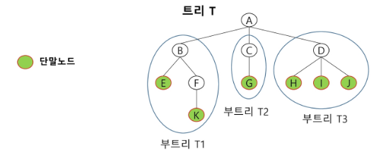

#### 용어정리

- 노드(node) - 트리의 원소
- 간선(edge) - 노드를 연결하는 선, 부모 노드와 자식노드를 연결
- 루트 노드(root node) - 트리의 시작 노드
- 형제 노드(sibling node) - 같은 부모 노드의 자식 노드들
- 조상노드 - 간선을 따라 루트 노드까지 이르는 경로에 있는 모든 노드들
- 서브 트리 - 부모 노드와 연결된 간선을 끊었을 때 생성되는 트리
- 자손 노드 - 서브 트리에 있는 하위 레벨의 노드들
- 차수(degree)
  - 노드의 차수: 노드에 연결된 자식 노드의 수
  - 트리의 차수: 트리에 있는 노드의 차수 중에서 가장 큰 값
  - 단말 노드(리프 노드) : 차수가 0인 노드, 자식 노드가 없는 노드
- 높이
  - 노드의 높이: 루트에서 노드에 이르는 간선의 수. 노드의 레벨
  - 트리의 높이: 트리에 있는 노드의 높이 중에서 가장 큰 값. 최대 레벨

## 이진 트리

- 모든 노드들이 2개의 서브트리를 갖는 특별한 형태의 트리
- 각 노드가 자식 노드를 최대한 2개 까지만 가질 수 있는 트리
- 레벨 i에서의 노드의 최대 개수는 2**i개
- 높이가 h인 이진 트리가 가질 수 있는 노드의 최소 개수는 (h+1)개가 되며, 최대 개수는 (2**(h+1)-1)개가 된다.

#### 포화 이진 트리(Full Binary Tree)

- 모든 레벨에 노드가 포화상태로 차 있는 이진 트리
- 높이가 h일 때, 최대의 노드 개수인 (2**(h+1)-1)의 노드를 가진 이진 트리
  - 높이가 3일 때 15개의 노드
- 루트를 1번으로 하여 (2**(h+1)-1)까지 정해진 위치에 대한 노드 번호를 가짐
- 왼쪽부터 위에 부터 순서대로 노드순서를 매긴다.
- 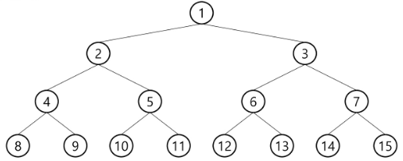

#### 완전 이진 트리(Complete Binary Tree)

- 높이가 h이고 노드 수가 n개 일때 (단, h+1 <= n < 2**(h+1)-1), 포화 이진 트리의 노드 번호 1번부터 n번 까지 빈 자리가 없는 이진 트리
- 포화 이진 트리처럼 번호를 매겼을 때 빠진게 없는 트리
- 예) 노드가 10개인 완전 이진 트리
  - 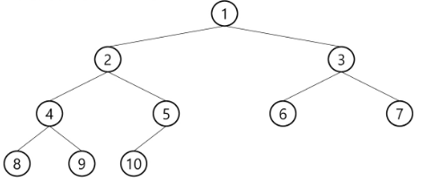

#### 편향 이진 트리(Skewed Binary Tree)

- 높이 h에 대한 최소 개수의 노드를 가지면서 한쪽 방향의 자식 노드만을 가진 이진 트리
- 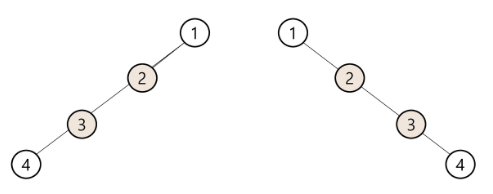

----

### 순회

- 트리의 노드들을 체계적으로 방문하는 것
- **3가지의 기본적인 순회방법**
  - 전위순회(preorder traversal): VLR
    - 부모노드 방문 후, 자식노드를 좌,우 순서로 방문
    - 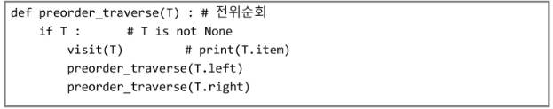
  - 중위순회(inorder traversal): LVR
    - 왼쪽 자식노드, 부모노드, 오른쪽 자식노드 순으로 방문한다.
    - 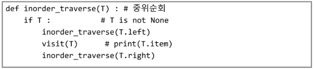
  - 후위순회(postorder traversal): LRV
    - 자식노드를 좌우 순서로 방문한 후, 부모노드로 방문한다.
    - 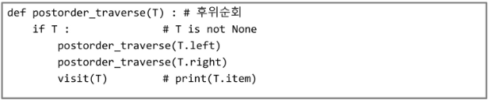
- 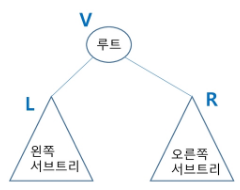

----

### 이진트리의 표현(저장방법)

#### 배열을 이용한 이진 트리의 표현

- 이진트리에 각 노드 번호를 다음과 같이 부여
- 루트의 번호를 1로 함
- 레벨 n에 있는 노드에 대하여 왼쪽부터 오른쪽으로 2\**n 부터 2**(n+1)-1 까지 번호를 차례로 부여
- 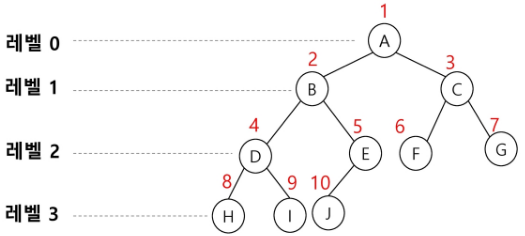
- 노드 번호의 규칙을 이용
  - 노드 번호가 i인 노드의 부모 노드 번호 == i//2
  - 노드 번호가 i인 노드의 왼쪽 자식 노드 번호 == 2*i
  - 노드 번호가 i인 노드의 오른쪽 자식 노드 번호 == 2*i+1
  - 레벨 n의 노드 번호 시작 번호 == 2**n
  - 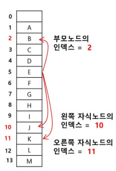
- 노드 번호를 배열의 인덱스로 사용
- 높이가 h인 이진 트리의 배열의 크기는 2**(h+1)-1
- 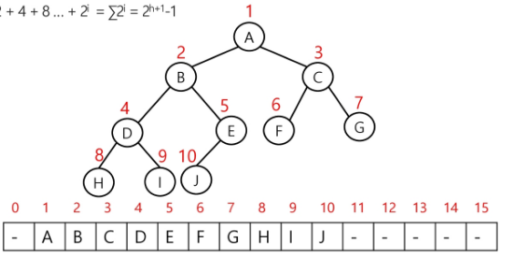
- 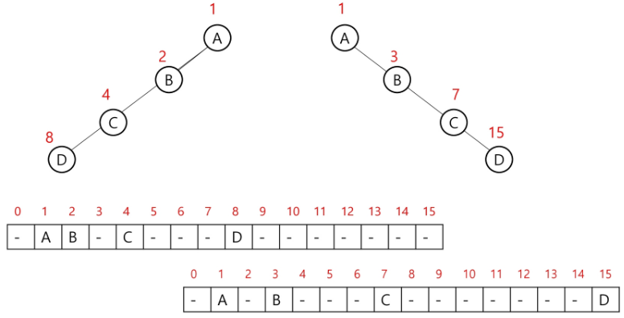
- 배열을 이용한 이진 트리 표현의 단점
  - 편향 이진 트리의 경우에 사용하지 않는 배열 원소에 대한 메모리 공간 낭비 발생
  - 트리의 중간에 새로운 노드를 삽입하거나 기존의 노드를 삭제할 경우 배열의 크기 변경 어려워 비효율적

#### 연결리스트를 이용한 이진트리 표현

- 배열을 이용한 이진 트리의 표현의 단점을 보완
- 이진 트리의 모든 노드는 최대 2개의 자식 노드를 가지므로 일정한 구조의 단순 연결 리스트 노드를 사용하여 구현
- 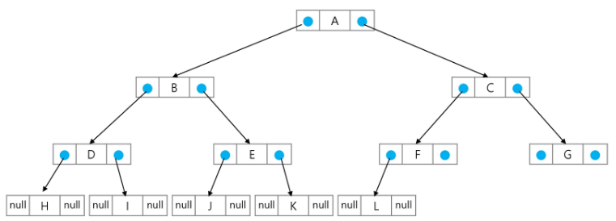

----

## 이진 탐색 트리

- 탐색작업을 효율적으로 하기 위한 자료구조
- 모든 원소는 서로 다른 유일한 키를 갖는다
- key(왼쪽 서브 트리) < key(루트 노드) < key(오른쪽 서브트리)
- 윈쪽 서브트리와 오른쪽 서브트리도 이진 탐색 트리다.
- 중위 순회하면 오름차순으로 정렬된 값을 얻을 수 있다
- 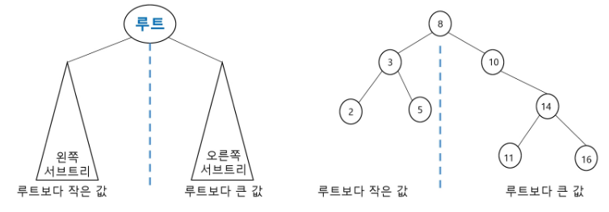

#### 탐색 연산

- 루트에서 시작한다.
- 탐색할 키 값 x를 루트 노드의 키 값과 비교한다.
  - 크면 오른쪽으로 탐색
  - 작으면 왼쪽으로 탐색
- 서브 트리에 대해서 순환적으로 탐색 반복
- 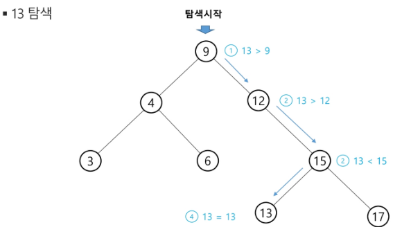

#### 삽인 연산

- 먼저 탐색 연산을 수행
  - 삽입할 원소와 같은 원소가 트리에 있으면 삽입할 수 없으므로 확인한다
  - 탐색에서 탐색 실패가 결정되는 위치가 삽입 위치가 된다.
- 탐색 실패한 위치에 원소를 삽입한다.
  - 

#### 성능

- 탐색, 삽입, 삭제 시간은 트리의 높이 만큼 시간이 걸린다.
  - O(h), h: BST의 깊이
- 평균의 경우
  - 이진 트리가 균형적으로 생성되어 있는 경우
  - O(log n)
- 최악의 경우
  - 한쪽으로 치우친 경사 이진트리의 경우
  - O(n)
  - 순차탐색과 시간복잡도가 같다.

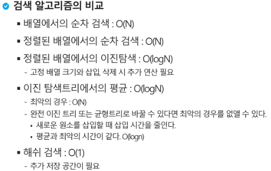

