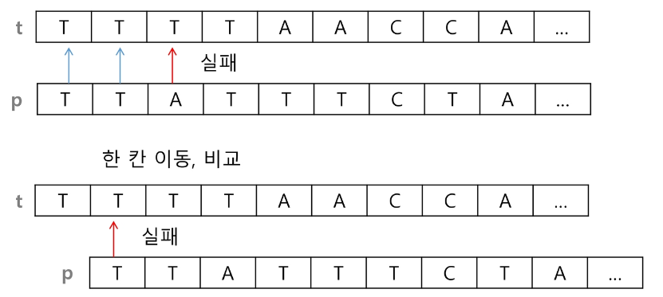
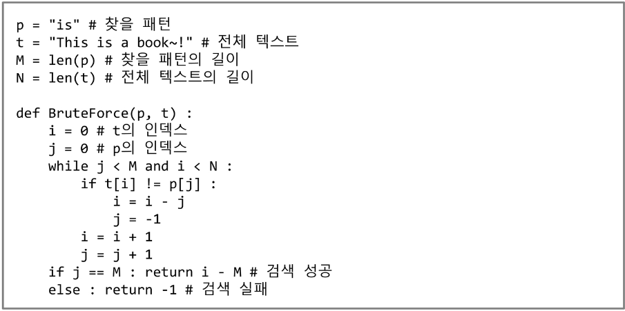
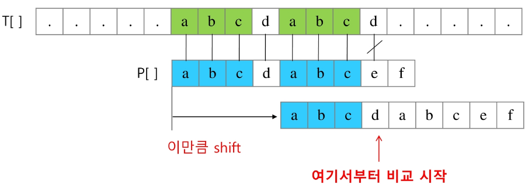
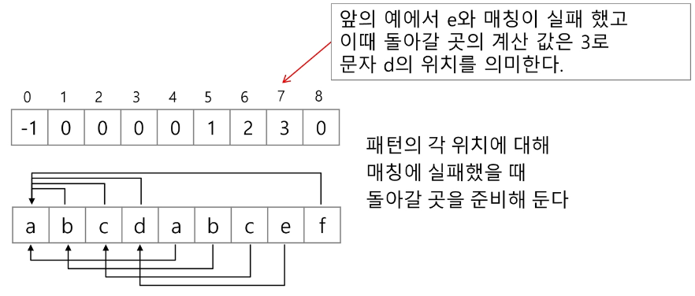
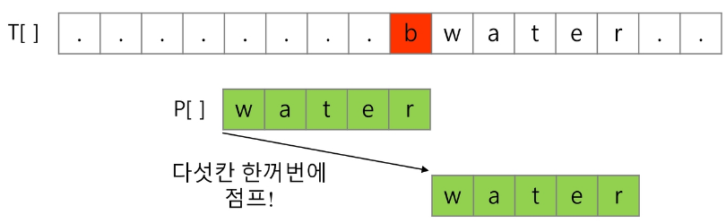
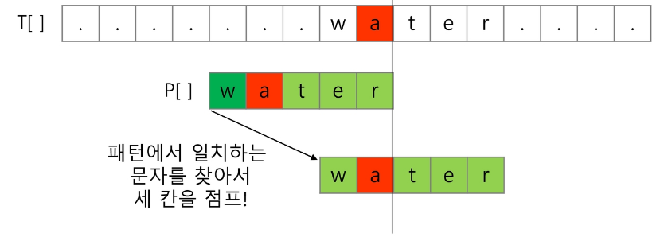
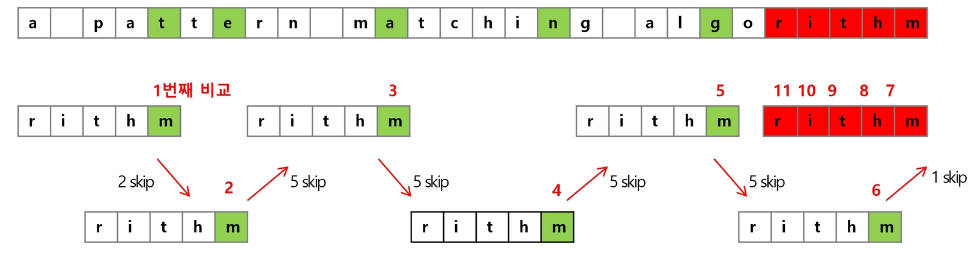
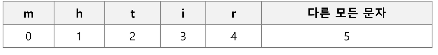
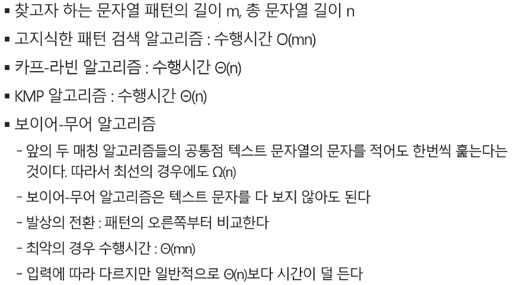

# 문자열(string)

- 패턴 매칭에 사용되는 알고리즘들
  - 고지식한 패턴 검색 알고리즘
  - 카프-라빈 알고리즘
  - KMP 알고리즘
  - 보이어-무어 알고리즘

### 고지식한 알고리즘(Brute Force)

- 본문 문자열을 처음부터 끝까지 차례대로 순회하면서 패턴 내의 문자들을 일일이 비교하는 방식으로 동작
  - 
- 
- 고지식한 패턴 검색 알고리즘의 시간 복잡도
  - 최악의 경우 시간 복잡도는 텍스트의 모든 위치에서 패턴을 비교해야 하므로 O(MN)이 됨

### KMP 알고리즘

- 불일치가 발생한 텍스트 스트링의 앞 부분에 어떤 문자가 있는지를 미리 알고 있으므로, 불일치가 발생한 앞 
  부분에 대하여 다시 비교하지 않고 매칭을 수행
  
- 패턴을 전처리하여 배열 next[M]을 구해서 잘못된 시작을 최소화함
  -  next[M]: 불일치가 발생했을 경우 이동할 다음 위치
  
- 시간 복잡도
  - O(M+N)
  
- 아이디어 설명
  - 텍스트에서 abcdabc까지는 매치되고, e에서 실패한 상황 패턴의 맨 앞의 abc와 실패 직전의 abc는 동일함을 이용할 수 있다.
  - 실패한 텍스트 문자와 P[4]를 비교한다.
  - 
  - 매칭이 실패했을 때 돌아갈 곳을 계산한다.
    - 
  
  >접두사와 접미사 부분으로 나누어서 앞부분과 일치하는 만큼을 표시해두는 배열을 만들어 놓는다.
  > 그 후 비교하다가 불일치가 발생했을 때 일치하는 부분 중에서 접두사와 접미사가 같은 부분 만큼 비교를 건너뛸 수 있다.

### 보이어-무어 알고리즘

- 오른쪽에서 왼쪽으로 비교
- 대부분의 상용 소프트웨어에서 채택하고 있는 알고리즘
- 보이어-무어 알고리즘은 패턴에 오른쪽 끝에 있는 문자가 불일치 하고 이 문자가 패턴 내에 존재하지 않는 경우, 이동 거리는 무려 패턴의 길이 만큼이 된다.
  - 
- 오른쪽 끝에 있는 문자가 불일치 하고 이 문자가 패턴 내에 존재할 경우
  - 
- 보이어-무어 알고리즘을 이용한 예
  - 
  - rithm 문자열의 skip 배열
    - 

## 문자열 매칭 알고리즘 비교

