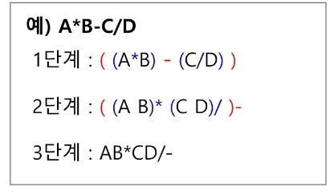
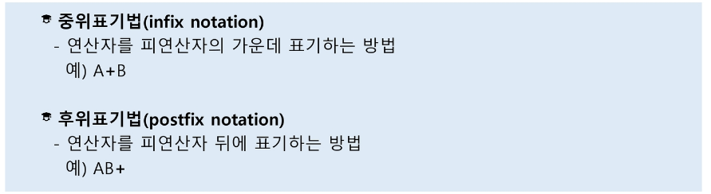

# 계산기

- 문자열로 된 계산식이 주어질 때, 스택을 이용하여 이 계산식의 값을 계산할 수 있다.

  1. 중위 표기법의 수식을 후위 표기법으로 변경한다. (스택이용)

     1. 수식의 각 연산자에 대해서 우선순위에 따라 괄호를 사용하여 다시 표현한다.
     2. 각 연산자를 그에 대응하는 오른쪽 괄호의 뒤로 이동시킨다.
     3. 괄호를 제거한다.

     

  2. 후위 표기법의 수식을 스택을 이용하여 계산한다.

     1. 피연산자를 만나면 스택에 push한다.
     2. 연산자를 만나면 필요한 만큼의 피연산자를 스택에서 pop하여 연산하고, 연산결과를 다시 스택에 push 한다.
     3. 수식이 끝나면, 마지막으로 스택을 pop하여 출력한다.

- 


- 계산기 구현 코드

  - ```python
    icp = {
        '+': 1,
        '-': 1,
        '*': 2,
        '/': 2,
        '(': 3,
    }
    isp = {
        '+': 1,
        '-': 1,
        '*': 2,
        '/': 2,
        '(': 0,
    }
    for test_ in range(1, 11):
        n = input()
        s = input().rstrip()
        stack = []
        result = ''
        for i in s:
            if ord('0') < ord(i) <= ord('9'):
                result += i
            else:
                if i == ')':
                    while stack[-1] != '(':
                        result += stack.pop()
                    stack.pop()
                else:
                    while stack and icp[i] <= isp[stack[-1]]:
                        result += stack.pop()
                    stack.append(i)
        while stack:
            result += stack.pop()
        for i in result:
            if ord('0') < ord(i) <= ord('9'):
                stack.append(i)
            else:
                a = int(stack.pop())
                b = int(stack.pop())
                if i == '-':
                    stack.append(b - a)
                elif i == '+':
                    stack.append(b + a)
                elif i == '*':
                    stack.append(b * a)
                elif i == '/':
                    stack.append(b / a)
        print('#{} {}'.format(test_, stack.pop()))
    ```


# 백트래킹

- 백트래킹 기법은 해를 찾는 도중에 '막히면' (즉, 해가 아니면) 되돌아가서 다시 해를 찾아 가는 기법이다.
- 백트래킹 기법은 최적화 (optimization) 문제와 결정 (decision) 문제를 해결할 수 있다.
- 결정 문제: 문제의 조건을 만족하는 해가 존재하는지의 여부를 'yes' 또는 'no'가 답하는 문제
  - 미로찾기
  - n-Queen 문제
  - Map coloring
  - 부분 집합의 합 (Subset Sum) 문제 등


## 백트래킹과 깊이우선 탐색과의 차이

- 어떤 노드에서 출발하는 경로가 해결책으로 이어질 것 같지 않으면 더이상 그 경로를 따라가지 않음으로써 시도의 횟수를 줄임. (Prunning 가지치기)
- 깊이우선탐색이 모든 경로를 추적하는데 비해 백트래킹은 불필요한 경로를 조기에 차단
- 깊이우선탐색을 가하기에는 경우의 수가 너무나 많음. 즉, N!가지의 경우의 수를 가진 문제에 대해 깊이우선탐색을 가하면 당연히 처리 불가능한 문제
- 백트래킹 알고리즘을 적용하면 일반적으로 경우의 수가 줄어들지만 이 역시 최악의 경우에는 여전히 지수함수 시간을 요하므로 처리 불가능


> - 우선적으로 깊이 우선 검색을 구현하고 여러 조건들을 추가해 줌으로써 경우의 수(실행시간)을 단축하는 기법이 백트래킹의 한 종류!
> -  다른 방식의 백트래킹도 존재


- n-Nastle

  - ```python
    def castle(i):
        global result
        if i == n:
            result += 1
            return
        for x in range(n):
            if used[x] == 1:
                continue
            Map[i][x] = 1
            used[x] = 1
            castle(i+1)
            Map[i][x] = 0
            used[x] = 0
    for test_ in range(1, 11):
        n = int(input())
        Map = [[0] * n for _ in range(n)]
        used = [0] * n
        result = 0
        castle(0)
        print('#{} {}'.format(test_, result))
    ```

  - `used`배열을 활용해 겹치는 열에대해서는 탐색을 하지 않는다. (가지치기)

- 부분집합의 합 구하기

  - ```python
    def sub_sum(num, total, idx, path):
        global cnt
        if num == 21:
            if total == k and idx == n:
                cnt += 1
            return
        if idx == n:
            if total == k:
                cnt += 1
            return
        if total >= k: return
        sub_sum(num+1, total+num, idx+1, path+str(num))
        sub_sum(num+1, total, idx, path)
    
    tc = int(input())
    for test_ in range(1, tc+1):
        n, k = map(int, input().split())
        cnt = 0
        sub_sum(1, 0, 0, '')
        print('#{} {}'.format(test_, cnt))
    ```

  - 구하는 합계보다 큰값에 대해서는 더 이상 탐색을 하지 않는다.
