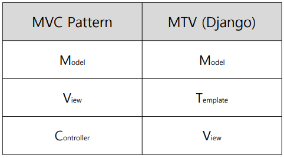
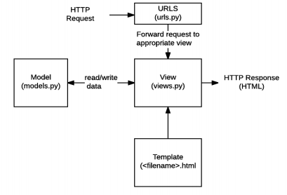
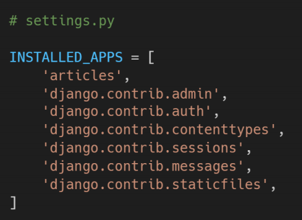
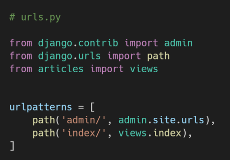
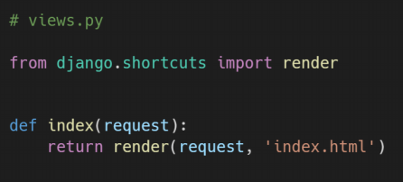
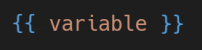
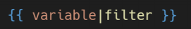
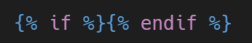
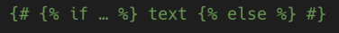

# 1. Django The Web Framework

## 1.1 Web Framework

- Django
  - Django is a high-level **Python Web framework** that encourages rapid development and clean, pragmatic design.
  - It takes care of much of the hassle of Web development, so **you can focus on writing your app without needing to reinvent the wheel.**
- Framework
  - 프로그래밍에서 특정 운영 체제를 위한 응용 프로그램 표준 구조를 구현하는 클래스와 라이브러리 모임
  - 재사용할 수 있는 수많은 코드를 프레임워크로 통합함으로써 개발자가 새로운 애플리케이션을 위한 표준 코드를 다시 작성하지 않아도 같이 사용할 수 있도록 도움
  - Application Framework 라고도 함
- Web framework
  - **웹 페이지를 개발하는 과정에서 겪는 어려움을 줄이는 것이 주 목적**으로 데이터베이스 연동, 템플릿 형태의 표준, 세션 관리, 코드 재사용 등의 기능을 포함
  - 동적인 웹 페이지나, 웹 애플리케이션, 웹 서비스 개발 보조용으로 만들어지는 Application Framework의 일종
- Framework Architecture
  - MVC Design Pattern (model-view- controller)
  - 소프트웨어 공학에서 사용되는 디자인 패턴 중 하나
  - 사용자 인터페이스로부터 프로그램 로직을 분리하여 애플리케이션의 시각적 요소나 이면에서 실행되는 부분을 서로 영향 없이 쉽게 고칠 수 있는 애플리케이션을 만들 수 있음
  - Django는 MTV Pattern이라고 함
- MTV Pattern
  - model
    - 응용프로그램의 데이터 구조를 정의하고 데이터베이스의 기록을 관리(추가, 수정, 삭제)
  - Template
    - 파일의 구조나 레이아웃을 정의
    - 실제 내용을 보여주는 데 사용(presentation)
  - View
    - HTTP 요청을 수신하고 HTTP 응답을 반환
    - Model을 통해 요청을 충족시키는데 필요한 데이터에 접근
    - template에게 응답의 서식 설정을 맡김
  - 
  - 

## 1.2 Django Intro

- 가상환경
  - `python -m venu venu`: 가상환경 생성
  - `source venu/Script/activate`: 가상황경 활성화

- Django
  - `pip install django`: 장고 설치
  - `django-admin startproject firstpjt .`: 장고 프로젝트 폴더 생성
  - `python manage.py startapp articles`: 장고 앱폴더 생성

- 프로젝트에서 앱을 사용하기 위해서는 반드시 `INSTALLED_APPS`리스트에 추가해야 함
  - 
  - 순서 중요
- `INSTALLED_APPS`
  - Django installation에 활성화 된 모든 앱을 지정하는 문자열 목록

## 1.3 요청과 응답

- URLS
  - HTTP 요청(request)을 알맞은 view로 전달
  - 
- View
  - HTTP 요청을 수신하고 HTTP 응답을 반환하는 함수 작성
  - Model을 통해 요청에 맞는 필요 데이터에 접근
  - Template에게 HTTP 응답 서식을 맡김
  - 
- Templates
  - 실제 내용을 보여주는데 사용되는 파일
  - 파일의 구조나 레이아웃을 정의 (ex. HTML)
  - Template 파일 경로의 기본 값은 **app 폴더 안의 templates 폴더**로 지정되어 있음

## 1.4 Template

- Static web page (정적 웹 페이지)
  - 서버에 미리 저장된 파일이 사용자에게 그대로 전달되는 웹 페이지
  - 서버가 정적 웹 페이지에 대한 요청을 받은 경우 서버는 추가적인 처리 과정 없이 클라이언트에게 응답을 보냄
  - 모든 상황에서 모든 사용자에게 동일한 정보를 표시
  - 일반적으로 HTML, CSS, JavaScript 로 작성됨
  - flat page 라고도 함
- Dynamic web page (동적 웹 페이지)
  - 웹 페이지에 대한 요청을 받은 경우 서버는 추가적인 처리 과정 이후 클라이언트에게 응답을 보냄
  - 동적 페이지는 방문자와 상호작용하기 때문에 페이지 내용은 그때그때 다름
  - 서버 사이드 프로그래밍 언어(python, java, c++ 등)가 사용되며 파일을 처리하고 데이터베이스와의 상호작용이 이루어짐
- Django Template
  - "데이터 표현을 제어하는 도구이자 표현에 관련된 로직"
  - 사용하는 built-in system
    - Django template language
- Django Template Language (DTL)
  - django template에서 사용하는 built-in template system
  - 조건, 반복, 변수 치환, 필터 등의 기능을 제공
  - 단순히 Python이 HTML에 포함 된 것이 아니며, 프로그래밍적 로직이 아니라 **프레젠테이션을 표현하기 위한 것**
  - Python처럼 일부 프로그래밍 구조(if, for 등)를 사용할 수 있지만, 이것은 해당 Python 코드로 실행되는 것이 아님
- DTL Syntax
  - Variable
    - 
  - Filters
    - 
  - Tags
    - 
  - Comments
    - 

- **코드 작성 순서**

  - 데이터의 흐름에 맞추어 작성

  1. urls.py
  2. views.py
  3. templates

- Django template system (feat. django 설계 철학)
  - "표현과 로직(view)을 분리"
    - 템플릿 시스템은 표현을 제어하는 도구이자 표현에 관련된 로직일 뿐이라고 생각한다.
    - 즉, 템플릿 시스템은 이러한 기본 목표를 넘어서는 기능을 지원하지 말아야 한다.
  - "중복을 배제"
    - 대다수의 동적 웹사이트는 공통 header, footer, navbar 같은 사이트 공통 디자인을 갖는다.
    - Django 템플릿 시스템은 이러한 요소를 한 곳에 저장하기 쉽게 하여 중복 코드를 없애야 한다.
    - 이것이 템플릿 상속의 기초가 되는 철학이다.