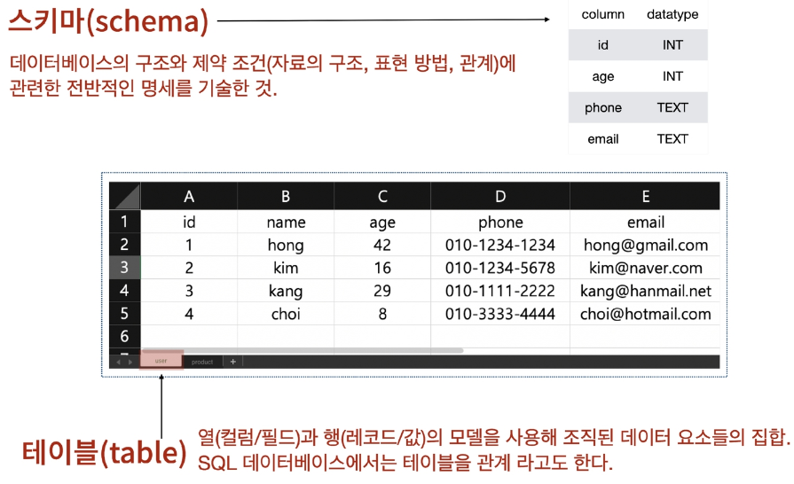
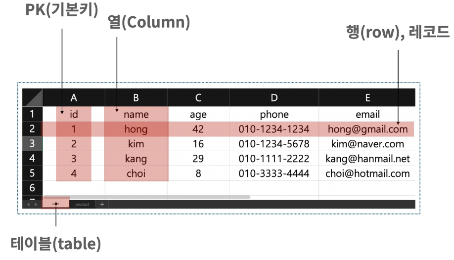
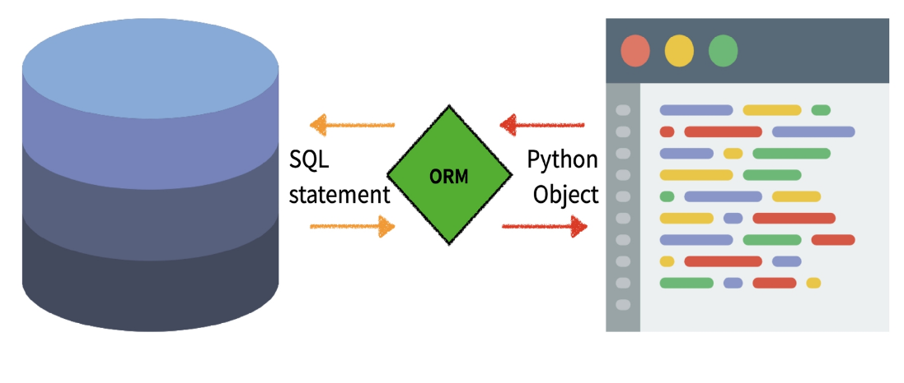
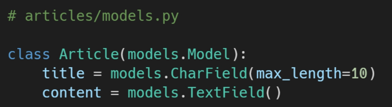
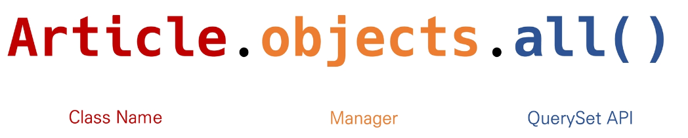
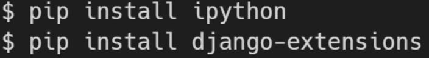
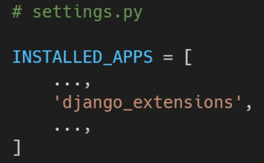
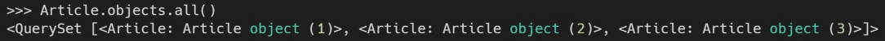
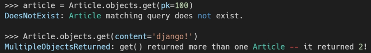
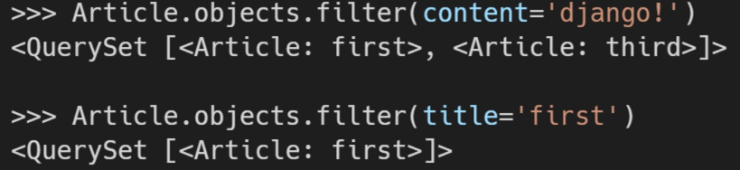

# 2. Django Model

## 2.1 Model

- Model
  - 단일한 데이터에 대한 정보를 가짐
    - 사용자가 저장하는 데이터들의 필수적인 필드들과 동작들을 포함
  - 저장된 데이터베이스의 구조(layout)
  - django는 model을 통해 데이터에 접속하고 관리
  - 일반적으로 각각의 model은 하나의 데이터베이스 테이블에 매핑 됨
- Database
  - 데이터베이스 (DB)
    - 체계화된 데이터의 모임
  - 쿼리 (Query)
    - 데이터를 조회하기 위한 명령어
    - 조건에 맞는 데이터를 추출하거나 조작하는 명령어
    - "쿼리를 날린다." -> DB를 조작한다.
  - 데이터베이스의 기본 구조
    - 스키마(Schema)
      - 데이터베이스에서 자료의 구조, 표현방법, 관계 등을 정의한 구조 (structure)
    - 테이블(Table)
      - 열(column): 필드(field) or 속성
      - 행(row) : 레코드(record) or 튜플
  - 
  - 
  - Model 정리
    - "웹 애플리케이션의 데이터를 **구조화**하고 **조작**하기 위한 도구"


## 2.2 ORM



- ORM
  - Object-Relational-Mapping
  - 객체 지향 프로그래밍 언어를 사용하여 호환되지 않는 유형의 시스템 간에(Django - SQL)데이터를 변환하는 프로그래밍 기술
  - OOP 프로그래밍에서 RDBMS을 연동할 때, 데이터베이스와 객체 지향 프로그래밍 언어 간의 호환되지 않는 데이터를 변환하는 프로그래밍 기법
  - Django는 내장 Django ORM을 사용함
- ORM의 장단점
  - 장점
    - SQL을 잘 알지 못해도 DB 조작이 가능
    - SQL의 절차적 접근이 아닌 객체 지향적 접근으로 인한 높은 생산성
  - 단점
    - ORM 만으로 완전한 서비스를 구현하기 어려운 경우가 있음
  - 현대 웹 프래임워크의 요점은 웹 개발의 속도를 높이는 것. **(생산성)**
- 왜 ORM을 사용할까?
  - "우리는 DB를 객체(object)로 조작하기 위해 ORM을 사용한다."
- models.py 작성
  - 
  - DB 컬럼과 어떠한 타입으로 정의할 것인지에 대해 django.db 라는 모듈의 models를 상속
    - 각 모델은 django.db.Model 클래스의 서브 클래스로 표현
  - title과 content은 모델의 필드를 나타냄
    - 각 필드는 클래스 속성으로 지정되어 있으며, 각 속성은 각 데이터베이스의 열에 매핑


##  2.3 Migrations

- Migrations
  - "django가 model에 생긴 변화를 반영하는 방법"
  - 마이그레이션 실행 및 DB 스키마를 다루기 위한 몇가지 명령어
    - `python manage.py makemigrations`
      - model을 변경한 것에 기반한 새로운 마이그레이션(like 설계도)을 만들 때 사용
    - `python manage.py migrate`
      - 마이그레이션을 DB에 반영하기 위해 사용
      - 설계도를 실제 DB에 반영하는 과정
      - 모델에서의 변경 사항들과 DB의 스키마가 동기화를 이룸
    - `pytthon manage.py sqlmigrate app_name 001`
      - 마이그레이션에 대한 SQL 구문을 보기 위해 사용
      - 마이그레이션이 SQL 문으로 어떻게 해석되어서 동작할지 미리 확인 할 수 있음
    - `python manage.py showmigrations`
      - 프로젝트 전체의 마이그레이션 상태를 확인하기 위해 사용
      - 마이그레이션 파일들이 migrate 됐는지 안됐는지 여부를 확인 할 수 있음
- migration 3단계
  1. models.py 변경 발생 시
  2. `python manage.py makemigrations`: migrations 파일 생성
  3. `python manage.py migrate`: DB 반영 (모델과 DB의 동기화)


## 2.4 Database API

- DB API
  - "DB를 조작하기 위한 도구"
  - django가 기본적으로 ORM을 제공함에 따른 것으로 DB를 편하게 조작할 수 있도록 도움
  - Model을 만들면 django는 객체들을 만들고 읽고 수정하고 지울 수 있는 database-abstract API를 자동으로 만듦
  - database-abstract API 혹은 database-access API 라고도 함
- 
  - Manager
    - django 모델에 데이터베이스 query 작업이 제공되는 인터페이스
    - 기본적으로 모든 django 모델 클래스에 objects라는 Manager를 추가
  - QuerySet
    - 데이터베이스로부터 전달받은 객체 목록
    - queryset 안의 객체는 0개, 1개 혹은 여러 개일 수 있음
    - 데이터베이스로부터 조회, 필터, 정렬 등을 수행 할 수 있음
- Django shell
  - 일반 Python shell을 통해서는 장고 프로젝트 환경에 접근할 수 없음
  - 그래서 장고 프로젝트 설정이 load 된 Pyrhon shell을 활용해 DB API 구문 테스트 진행
  - 
  - 
  - 


## 2.5 CRUD

- CRUD

  - 대부분의 컴퓨터 소프트웨어가 가지는 기본적인 데이터 처리 기능인 Create, Read, Update, Delete를 묶어서 일컫는 말

- CREATE 3가지 방법

  - 인스턴스 생성 후 인스턴스 변수 설정

    - ```python
      article = Article()
      article.title = 'first'
      article.content = 'django!'
      article.save()
      print(Article.objects.all())
      ```

  - 초기 값과 함께 인스턴스 생성

    - ```python
      article = Article(title='second', content='django!!')
      article.save()
      print(Article.objects.all())
      ```

  - QuerySet API - create() 사용

    - ```python
      Article.objects.create(title='third', content='django!!!')
      ```

- CREATE 관련 메서드

  - **save()** method
    - Saving objects
    - 객체를 데이터베이스에 저장함
    - 데이터 생성 시 save()를 호출하기 전에는 객체의 ID 값이 무엇인지 알 수 없음
      - ID 값으 django가 아니라 DB에서 계산되기 때문
    - **단순히 모델을 인스턴스화 하는 것은 DB에 영향을 미치지 않기 때문에 반드시 save()가 필요**

- READ

  - QuerySet API method를 사용해 다양한 조회를 하는 것이 중요
  - QuerySet API method는 크게 2가지로 분류
    1. Methods that **return new querysets**
    2. Methods that **do not return querysets**
  - all()
    - 현재 QuerySet의 복사본을 반환
    - 
  - get()
    - 주어진 lookup 매개변수와 일치하는 객체를 반환
    - 객체를 찾을 수 없으면 DoesNotExist 예외를 발생시키고, 둘 이상의 객체를 찾으면 MultipleObjectReturned 예외를 발생 시킴
    - 위와 같은 특징을 가지고 있기 때문에 primary key와 같이 고유(unique)성을 보장하는 조회에서 사용해야함
    - 
  - filter()
    - 주어진 lookup 매개변수와 일치하는 객체를 포함하는 새 QureySet을 반환
    - 


