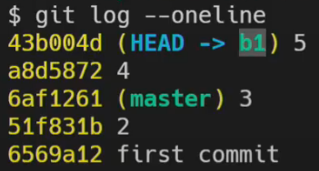

# 3. Git branch

- branch는 단순한 포인터(화살표)다.
- HEAD는 단순한 포인터다. (포인터의 포인터인 경우가 많다.)
- HEAD는 현재 내가 작업중인 커밋을 의미한다.
- HEAD가 master에 있다 == 현재 master에서 작업중이다.

- 통합 브랜치
  - 언제든지 배포할 수 있는 버전을 만들 수 있어야 하는 브랜치
  - 늘 안정적인 상태를 유지하는 것이 중요
  - 일반적으로 저장소를 처음 만들었을 때에 생기는 'master' 브랜치를 통합 브랜치로 사용
- 토픽 브랜치
  - 기능 추가나 버그 수정과 같은 단위 작업을 위한 브랜치
  - 여러 개의 작업을 동시에 진행할 때에는, 그 수 만큼 토픽 브랜치를 생성할 수 있다.
  - 토픽 브랜치는 보통 통합 브랜치로부터 만들어 내며, 토픽 브랜치에서 특정 작업이 완료되면 다시 통합 브랜치에 병합하는 방식으로 진행된다.
  - 
- `git branch b1`
  - 현재 작업중인 곳에서 새로운 브랜치(화살표)를 만든다.
  - 
- `git switch b1`
  - 
  - 
  - HEAD가 가르키는 브랜치를 바꿈
  - 현재 HEAD가 b1을 가르키고 b1과 master가 3 커밋을 가르킴
- `git add .`, `git commit -m '4'`
  - 
  - master브랜치는 3번커밋에 있고, b1브랜치는 4번 커밋에 있다.
  - 
- 만약 새로운 파일을 만들면(Untracked file)은 깃이 관리하지 않기때문에 어느 브랜치에서도 보인다.
  - 어디에서 처음 커밋하냐에 따라 보이는 브랜치가 달라진다.
  - `touch secret.txt`, `git add .`, `git commit -m '5'`
  - 현제 `b1`브랜치에서 커밋을 했기 때문에
  - `master`브랜치에서는 secret.txt파일이 이제는 보이지 않는다.
  - 
- `git switch master`
  - 
  - master브랜치에서는 3번 커밋까지밖에 안보인다.
  - 현재 자기 뒤에있는 커밋들만 볼 수 있다.

## Merge의 3가지 방식

### Fast-forward 방식

- `git merge b1` (fast-forward 방식)
  - master가 b1의 내용을 모두 흡수
  - 
  - 
  - 합쳐진다는 느낌보다는 뒤에있던 master화살표가 b1이 가르키는 곳으로 간다.
  - Fast-forward: 빨리감기

### Auto merge 방식

- 만약 두 브랜치에서 모두 작업(커밋)을 했고 작업내용을 합쳐야 한다면? (Auto merge 방식)
  - `git merge b2`
  - 
  - 어디에서 merge하느냐가 중요
    - 누가 앞으로 가냐
  - 
  - 자동으로 커밋을 만들어줌 (Merge branch 'b2')
  - 

### Conflict, Manual merge 방식

- 같은 파일을 서로 수정했다면 auto merge과정에서 conflict가 날 수 있다.
- 직접 conflict난 부분을 수정해서 다시 commit을 해야한다.(merge)
- 
- 

### 협업

- merge가 끝난 브랜치는 삭제하는 것이 일반적
- 

### remote와 연동하여 협업

- 
- 각 로컬에서 `git clone`후 새로운 브랜치(dev-a)를 만들고 거기서 작업후에 
- remote의 해당 브랜치에 push (`git push origin dev-a`)
- remote에서(gitlap, github) master 브랜치로 merge request 보냄
- 수락되면 merge완료
- 다음에 작업할 때는 로컬에서 master브랜치로 이동 후에
- `git pull origin master` remote의 master브랜치내용을 local의 master브랜치로 가져옴
- 다시 로컬에서 새로운 브랜치를 만들어서 작업
- 다시 리모트에 똑같은 브랜치로 푸쉬
- 머지 리퀘스트 보냄
- 수락
- 반복 ....