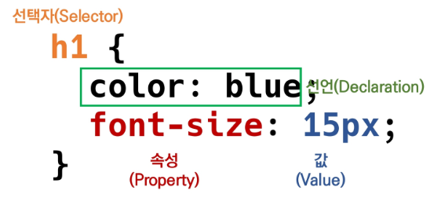
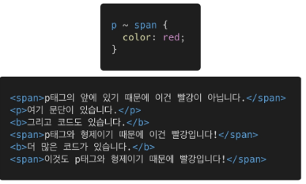
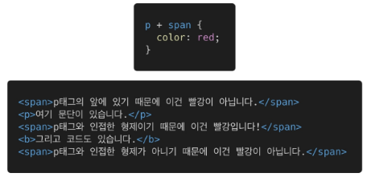
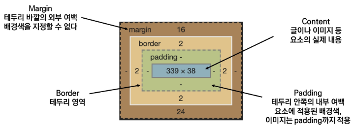
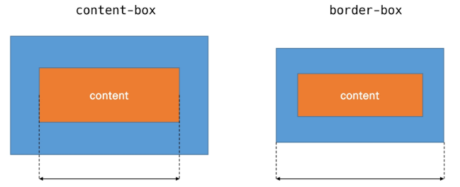
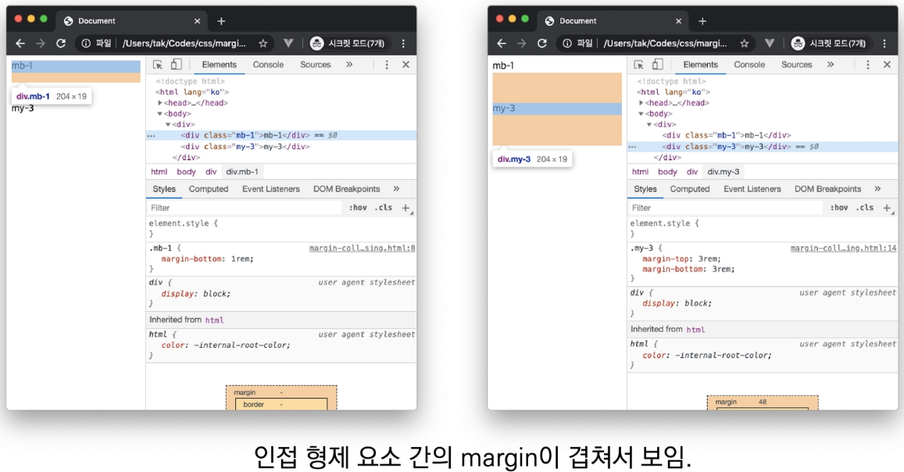

# CSS

- 스타일, 레이아웃 등을 통해 문서(HTML)를 표시하는 방법을 지정하는 언어
- 

## 상속

- CSS는 상속을 통해 부모 요소의 속성을 일부 자식에게 상속하다.
  - 속성(프로퍼티) 중에는 상속이 되는 것과 되지 않는 것들이 있다.
  - 상속 되는 것 예시
    - 예) Text 관련 요소(font, color, text-align), opacity, visibility 등
  - 상속 되지 않는 것 예시
    - 예) Box model 관련 요소(width, height, margin, padding, border, box-sizing, display)
    - position 관련 요소(position, top/right/bottom/left, z-index) 등
- 상속 가능한 프로퍼티
  - visibility
  - opacity
  - font
  - color
  - line-height
  - text-align
  - white-space

## CSS 단위

- 크기 키워드
- px (픽셀)
  - 모니터 해상도의 한 화소인 '픽셀'을 기준
  - 픽셀의 크기는 변하지 않기 때문에 고정적인 단위
- %
  - 백분율 단위
  - 가변적인 레이아웃에서 자주 사용
- em
  - (바로 위, 부모 요소에 대한) 상속의 영향을 받음
  - **배수 단위, 요소에 지정된 사이즈에 상대적인 사이즈를 가짐.**
- rem
  - (바로 위, 부모 요소에 대한) 상속의 영향을 받지 않음
  - **최상위 요소(html)의 사이즈를 기준으로 배수 단위를 가짐**
  - 깊이가 깊어지면 em은 계산하기가 힘들어 rem이 좀 더 사용하기 편하다
- viewport
  - 웹 페이지를 방문한 유저에게 바로 보이게 되는 웹 컨텐츠의 영역
  - 주로 스마트폰이나 테블릿 디바이스의 화변을 일컷는 용어로 사용됨
  - 글자 그대로 디바이스의 viewport를 기준으로 상대적인 사이즈가 결정됨
  - vw, vh, vmin, vmax

- 색상 키워드
  - 대소문자를 구분하지 않음
  - red, blue, black 과 같은 특정 색을 직접 글자로 나타냄
- RGB 색상
  - 16진수 표기법 혹은 함수형 표기법을 사용해서 특정 색을 표현하는 방식
  - '#'+ 16진수 표기법
  - rgb() 함수형 표기법
- HSL 생상
  - 색상, 채도, 명도를 통해 특정 색을 표현하는 방식
- 
  - *a는 alpha(투명도)가 추가된 것

## CSS 결합자(Combinators)

- 자손 결합자
  - selectorA 하위의 모든 selectorB 요소
- 자식 결합자
  - selectorA 바로 아래의 selectorB 요소
- 일반 형제 결합자
  - selectorA의 형제 요소 중 뒤에 위치하는 selectorB 요소를 모두 선택
  - 
  - 뒤의 두개 span태그 색깔 빨강 적용
- 인접 형제 결합자
  - selectorA의 형제 요소 중 바로 뒤에 위치하는 selectorB 요소를 선택
  - 
  - 두번째 span태그에만 색깔 빨강 적용

## Box model

- 모든 HTML 요소는 box 형태로 되어있음
- 하나의 박스는 네 부분(영역)으로 이루어짐
  - content
  - padding
  - border
  - margin
- 

- box-sizing
  - 기본적으로 모든 요소의 `box-sizing`은 `content-box`
    - **Padding을 제외한 순수 contents 영역만을 box로 지정**
  - 다만, 우리가 일반적으로 영역을 볼 때는 border까지의 너비를 100px 보는 것을 원함
    - 그 경우 `box-sizing`을 `content-box`으로 설정
  - 

- 마진 상쇄

  - block A의 top과 block B의 bottom에 적용된 각각의 margin이 둘 중에서 큰 마진 값으로 결합(겹쳐지게)되는 현상
  - 
  - 마진을 bottom이나 top 중 한 방향으로만 적용시키는 방법으로 해결한다.

  

## CSS Display

- 모든 요소는 네모(박스모델)이고, 
- 어떻게 보여지는지(display)에 따라 문서에서의 배치가 달라질 수 있다.

- `display: block`
  - 줄 바꿈이 일어나는 요소
  - 화면 크기 전체의 가로 폭을 차지한다.
  - 블록 레벨 요소 안에 인라인 레벨 요소가 들어갈 수 있음
  - 너비 100%
- `display: inline`
  - 줄 바꿈이 일어나지 않는 행의 일부 요소
  - content 너비만큼 가로 폭을 차지한다.
  - width, height, margin-top, margin-bottom을 지정할 수 없다.
  - 상하 여백은 line-height로 지정한다.
- block, inline 정렬
  - 
- `display: inline-block`
  - block과 inline 레벨 요소의 특징을 모두 갖는다.
  - inline처럼 한 줄에 표시 가능하며,
  - block처럼 width, height, margin(위아래) 속성을 모두 지정할 수 있다.
- `display: none`
  - 해당 요소를 화면에 표시하지 않는다. **(공간조차 사라진다.)**
  - 이와 비슷한 visibillity: hidden은 해당 요소가 공간은 차지하나 화면에 표시만 하지 않는다

## CSS position

- 문서 상에서 요소를 배치하는 방법을 지정한다.
- `static`: 모든 태그의 기본 값(기준 위치)
  - 일반적인 요소의 배치 순서에 따름 (좌측 상단)
  - 부모 요소 내에서 배치될 때는 부모 요소의 위치를 기준으로 배치 됨
- 아래는 좌표 프로퍼티(top, bottom, left, right)를 사용하여 이동이 가능하다. (음수 값도 가능)
  - relative
  - absolute
  - fixed
- `relative` : 상대 위치
  - 자기 자신의 static 위치를 기준으로 이동
  - 레이아웃에서 요소가 차지하는 공간은 static 일 때와 같음
- `absolute` : 절대 위치
  - 원래 위치해 있었던 과거 위치에 있던 공간은 더 이상 존재하지 않음
  - 요소를 일반적인 문서 흐름에서 제거 후 레이아웃에 공간을 차지하지 않음
    - 즉 다른 모든 것과 별개로 독자적인 곳에 놓임
  - 페이지의 다른 요소의 위치와 간섭하지 않는 격리된 사용자 인터페이스 기능을 만드는데 활용
  - **static이 아닌** 가장 가까이 있는 부모/조상 요소를 기준으로 이동 (없는 경우 body에 붙는 형태)
- `fixed` : 고정 위치
  - 요소를 일반적인 문서 흐름에서 제거 후 레이아웃에 공간을 차지하지 않음
  - 부모요소와 관계없이 viewport를 기준으로 이동
  - 스크롤 시에도 항상 같은 곳에 위치함
- `sticky`
  - relative처럼 자기 자리는 유지
  - 스크롤이 이동하면 부모 범위 내에서 viewport에 고정
