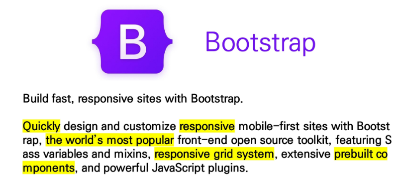
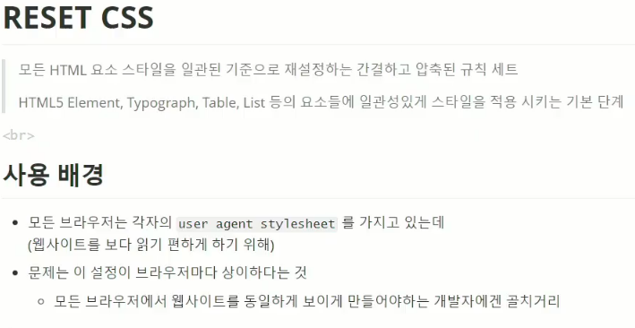
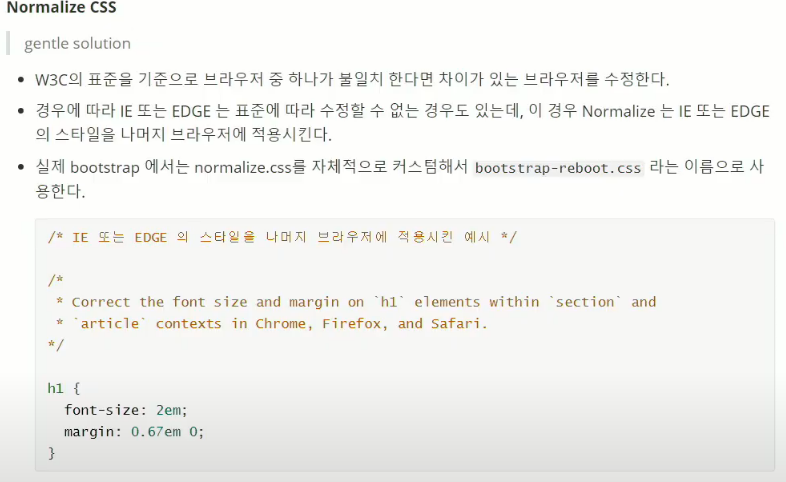
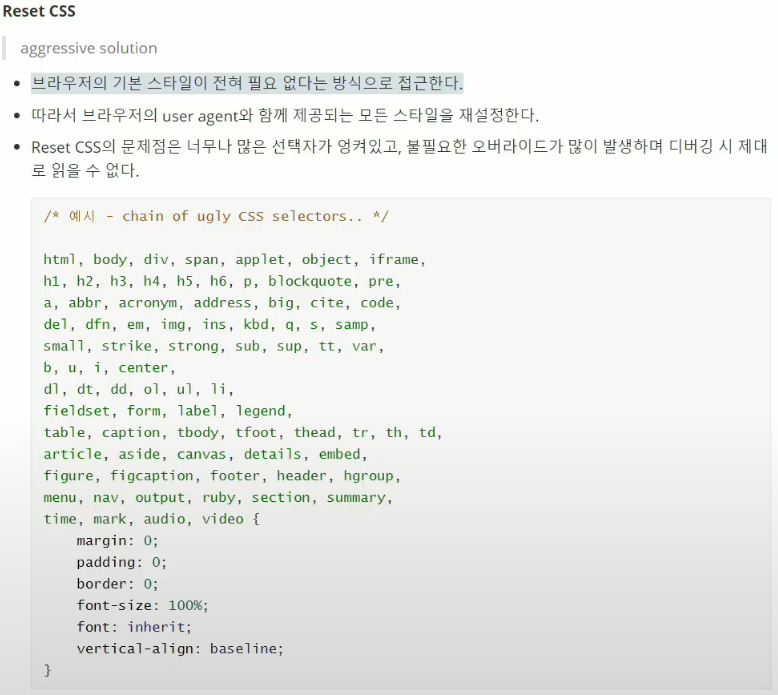
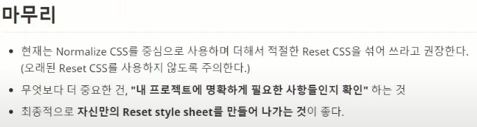
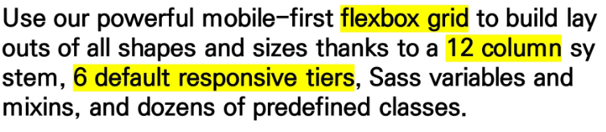

# Bootstrap

## CSS 초기화

- 
  - 
  - 
  - 

## CDN

- Content Delivery(Distribution) Network
- 컨텐츠(CSS, JS, Image, Text 등)을 효율적으로 전달하기 위해, 서버와 사용자 사이의 물리적 거리를 줄여 컨텐츠 로드 지연을 최소화
- 분산 된 서버로 이루어진 플랫폼
  - 전 세계 사용자들이 로딩 시간을 늦추지 않고 동일한 품질의 컨텐츠를 사용할 수 있음
- 장점
  - 사용자와 가까운 서버를 통해 빠르게 전달 가능
  - 외부 서버를 활용함으로써 본인 서버의 부하가 적어짐

## Responsive Web Design

- 다양한 화면 크기를 가진 디바이스들이 등장함에 따라 responsive web design 개념이 등장
- 방응형 웹은 별도의 기술 이름이 아닌 웹 디자인에 대한 접근 방식, 반응형 레이아웃 작성에 도움이 되는 사례들의 모음 등을 기술하는데 사용하는 용어
- 예시
  - Media Queries, Flexbox, Bootstrap Grid System, The viewport meta tag

#### Bootstrap Grid System

- Bootstrap Grid system은 flexbox로 제작됨
- container, rows, colum으로 컨텐츠를 배치하고 정렬
- 반드기 기억해야 할 2가지!
  - 12개의 column
  - 6개의 grid breakpoint