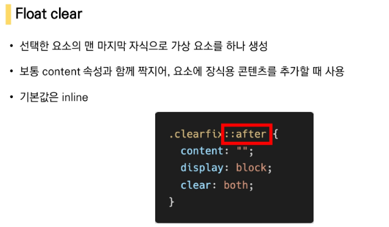

# CSS Layout

## Float

- 본래는 이미지 좌, 우측 주변으로 텍스트를 둘러싸는 레이아웃을 위해 도입
- 더 나아가 이미지가 아닌 다른 요소들에도 적용해 웹 사이트의 전체 레이아웃을 만드는데까지 발전
- Float 속성
  - none: 기본값
  - left: 요소를 왼쪽으로 띄움
  - right: 요소를 오른쪽으로 띄움
- 
- 
- 
- Float 정리
  - flexbox 및 그리드 레이아웃과 같은 기술이 나오기 이전에 Float은 열 레이아웃을 만드는데 사용됨
  - flexbox와 grid의 출현과 함께 결국 원래 텍스트 블록 내에서 float 이미지를 위한 역할로 돌아감
  - (**mdn 에서는 더 새롭고 나은 레이아웃 기술이 나와있으므로 레거시 레이아웃 기술로 분류해놓기도**)
  - 웹에서 여전히 사용하는 경우도 있음(ex. naver nav bar)

## Flexbox

- 요소 간 공간 배분과 정렬 기능을 위한 1차원(단방향) 레이아웃
- 크게 딱 2가지만 기억하자. **요소와 축!**
- 요소
  - Flex Container (부모요소)
  - Flex Item (자식요소)
- 축
  - main axis (메인 축)
  - cross axis (교차 축)
- 
  - Flex Conteainer (**부모요소**)
    - flexbox 레이아웃을 형성하는 가장 기본적인 모델
    - Flex Item들이 놓여있는 영역
    - display 속성을 flex 혹은 inline-flex로 지정
  - Flex Item (자식 요소)
    - 컨테이너의 컨텐츠
- 배치 방향 설정
  - `flex-direction`
- 메인축 방향 정렬
  - `justify-content`,`justify-self`, `justify-content`
- 교차축 방향 정렬
  - `align-items`, `align-self`, `align-content`
- 기타
  - `flex-wrap`, `flex-flow`, `flex-grwo`, `order`, `flex-shrink`, `flex-basis`

#### `flex-direction`

- main-axis 방향만 바뀐다.
- flexbox는 단방향 레이아웃이기 때문에
- 

#### justify & align

- 

#### content & items & self

- constents
  - 여러줄
- items
  - 한 줄
- self
  - flex item 개별 요소
- 예시
  - **justify-content: 메인축 기준 여러 줄 정렬**
    - 
  - **align-items: 교차축 기준 한 줄 정렬**
    - 
  - align-self: 교차축 기준 선택한 요소 하나 정렬
    - 
  - align-content
    - 

## 정리

- 
- 
- 
- 
- 
- 

