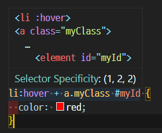

#	CSS Specificity

- CSS Specificity이란 하나의 엘리멘트에 같은 스타일에 여러 값이 선언이 되었을 때 CSS 선택자를 통해 가중치를 매겨 어떤 값을 표현할 지 결정하는 방법입니다.
- 예를들어 같은 엘리먼트에 `div span {color: blue}` 와 `.myClass {color: red}` 이렇게 두가지가 선언된다면 클래스 선택자가 좀 더 높은 점수를 받아 해당 엘리먼트의 텍스트는 red가 된다.

## 우선순위

1. inline style (1000점)

   - HTML에 인라인 스타일을 선언하면, 모든 다른 스타일을 오버라이드한다.

   - `<button style="color: red">Click me</button>`

2. ID (100점)

   - `#myId {color: red}`

3. Class, Pseudo-Class, Attribute (10점)

   - `.myClass: {color: red}`
   - `:hover {color: red}`
   - `[type="radio"] {color: red}`

4. Elements, pseudo-element (1점)

   - `li {color: red}`
   - `::after {color: red}`

5. 전역 선택자([`*`](https://developer.mozilla.org/ko/docs/Web/CSS/Universal_selectors)), 조합자([`+`](https://developer.mozilla.org/ko/docs/Web/CSS/Adjacent_sibling_combinator), [`>`](https://developer.mozilla.org/ko/docs/Web/CSS/Child_combinator), [`~`](https://developer.mozilla.org/ko/docs/Web/CSS/General_sibling_combinator), ['` `'](https://developer.mozilla.org/en-US/docs/Web/CSS/Descendant_combinator), [`||` (en-US)](https://developer.mozilla.org/en-US/docs/Web/CSS/Column_combinator)) 및 부정 의사 클래스(`:not()`)는 명시도에 영향을 주지 않습니다. (`:not()` *내부에* 선언한 선택자는 영향을 끼칩니다)

## Specificity 계산하기

- 
  - attribute + elements -> 11점  -> (0, 1, 1)

- 
  - ID + elements + pseudo-element -> 102점 -> (1, 0, 2)

- 
  - ID + class + pseudo-class + elements*2 -> 122점 -> (1, 2, 2)

