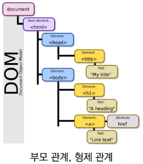

# HTML(Hyper Text Markup Language)

- **웹 페이지를 작성하기 위한(구조를 잡기 위한) 언어**
- **웹 컨텐츠의 의미와 구조를 정의**

### Hyper Text

- Hyper
  - 텍스트 등의 정보가 동일 선상에 있는 것이 아니라 다중으로 연결되어 있는 상태
- Hyper Text
  - 참조(하이퍼링크)를 통해 사용자가 한 문서에서 다른 문서로 즉시 접근할 수 있는 텍스트
- 

### Markup Language

- 태그 등을 이용하여 문서나 데이터의 구조를 명시하는 언어
- 프로그래밍 언어와는 다르게 단순하게 데이터를 표현하기만 한다.
- 대표적인 예 - HTML, Markdown

## HTML 기본구조

- html 요소
  - HTML문서의 최상위 요소로 문서의 root를 듯한다.
  - head와 body 부분으로 구분된다.
- head 요소
  - 문서 제목, 문자코드(인코딩)와 같이 해당 문서 정보를 담고 있으며, 브라우저에 나타나지 않는다.
  - CSS 선언 혹은 외부 로딩 파일 지정 등도 작성합니다.
- body 요소
  - 브라우저 화면에 나타나는 정보로 실제 내용에 해당한다.

#### DOM(Document Object Model)

- DOM Tree
  - 
- DOM은 문서의 구조화된 표현을 제공하며, 프로그래밍 언어가 DOM구종 접근할 수 있는 방법을 제공하여 그들이 문서 구조, 스타일 내용 등을 변경 할 수 있게 도움
- DOM은 동일한 문서를 표현하고, 저장하고, 조작하는 방법을 제공
- Web Page의 객체 지향 표현

## 요소(element)

- HTML 요소는 시작 태그와 종료 태그 그리고 태그 사이에 위치한 내용으로 구정
  - 태그(Element, 요소)는 컨텐츠(내용)를 감싸는 것으로 그 정보의 성격과 의미를 정의
- 내용이 없는 태그들
  - br, hr, img, input, link, meta
- 요소는 중첩(nested)될 수 있음
  - 요소의 중첩을 통해 하나의 문서를 구조화
  - 여는 태그와 닫는 태그의 쌍을 잘 확인해야함
  - 오류를 반환하는 것이 아닌 그냥 레이아웃이 깨진 상태로 출력되기 때문에, 디버깅이 힘들어 질 수 있음

#### 속성(attribute)

- 속성을 통해 태그의 부가적인 정보를 설정할 수 있음
- 요소는 속성을 가질 수 있으며, 경로나 크기와 같은 추가적인 정보를 제공
- 요소의 시작 태그에 작성하며 보통 이름과 같이 하나의 쌍으로 존재
- 태그와 상관없이 사용 가능한 속성들도 있음
  - id, class
  - hidden
  - lang
  - style
  - tabindex
  - title

#### 시멘틱 태그

- HTML5에서 의미론적 요소를 담은 태그의 등장
  - header: 문서 전체나 섹션의 헤더(머릿말 부분)
  - nav: 내비게이션
  - aside: 사이드에 위치한 공간, 메인 콘텐츠와 관련성이 적은 콘텐츠
  - section: 문서의 일반적인 구분, 컨텐츠의 그룹을 표현
  - article: 문서, 페이지, 사이트 안에서 독립적으로 구분되는 영역
  - footer: 문서 전체나 섹션의 푸터(마지막 부분)
- 요소의 의마가 명확해지기 때문에 코드의 가독성을 높이고 유지보수를 쉽게 함
- 검색엔진최적화(SEO)를 위해서 메타태크, 시맨틱 태그 등을 통한 마크업을 효과적으로 할 필요가 있다.
- 웹 상에 존재하는 수많은 웹 페이지들에 메타데이터를 부여하여, 기존의 단숞나 데이터의 집합이었던 웹페이지를 '의미'와 관련성을 가지는 거대한 데이터베이스로 구축하고자 하는 발상

