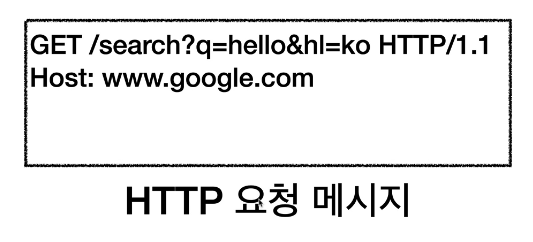

>[모든 개발자를 위한 HTTP 웹 기본 지식](https://www.inflearn.com/course/http-웹-네트워크/dashboard) 을 듣고 정리한 내용이며 **모든 그림 예제는 해당 강의에서 가져온 내용입니다**.

# URI(Uniform Resource Identifier)

- URI? URL? URN?
  - URI는 로케이터(locator), 이름(name) 또는 둘다 추가로 분류될 수 있다.
  - 
- URI 단어 뜻
  - Uniform: 리소스 식별하는 통일된 방식
  - Resource: 자원, URI로 식별할  수 있는 모든 것(제한 없음)
  - Idenrifier: 다른 항목과 구분하는데 필요한 정보
- URL, URN
  - URL - Lucator: 리소스가 있는 위치를 지정
  - URN - Name: 리소스에 이름을 부여
  - 위치는 변할 수 있지만, 이름은 변하지 않는다.
  - URN 이름만으로 실제 리소스를 찾을 수 있는 방법이 보편화 되지 않음(잘 사용X)

## 웹 브라우저 요청 흐름

1.  주소창에 url을 검색한다
2. DNS서버 조회해서 IP를 얻는다.
3. IP와 PORT 정보를 찾아낸다
4. HTTP 요청 메시지 생성
   - 
5. SOCKET라이브러리를 통해 3way handshake 실시
6. 운영체제 TCP/IP 계층으로 데이터를 넘긴다.
7. IP, PORT정보를 TCP/IP 패킷을 통해 데이터에 추가한다.
8. 인터넷망에 데이터를 보낸다.
9. 서버에 요청 도착
10. 서버에서 HTTP 메세지를 해석해서 데이터를 찾는다.
11. 응답메세지(패킷)를 마찬가지 방식으로 만든다.
12. 클라이언트에 도착
13. 브라우저가 데이터를 해석해서 화면에 그려준다.(랜더링)

