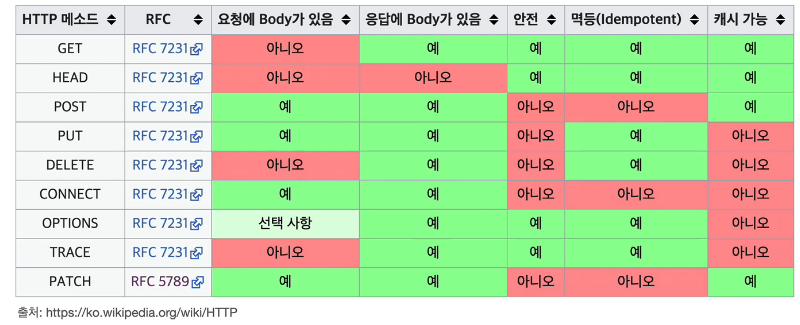

>[모든 개발자를 위한 HTTP 웹 기본 지식](https://www.inflearn.com/course/http-웹-네트워크/dashboard) 을 듣고 정리한 내용이며 **모든 그림 예제는 해당 강의에서 가져온 내용입니다**.

# HTTP 메서드

## API URI 설계

- 가장 중요한 것은 리소스를 식별하는 것
- URI는 리소스만 식별!
- 리소스와 해당 리소스를 대상으로 하는 행위를 분리
  - 리소스: 회원
  - 행위: 조회, 등록, 삭제, 변경
- 리소스는 명사, 행위는 동사
- 회원 목록 조회 /members
- 회원 조회 /members/{id}
- 회원 등록 /members/{id}
- 회원 수정 /members/{id}
- 회원 삭제 /members/{id}

- GET: 리소스 조회
- POST: 요청 데이터 처리, 주로 등록에 사용
- PUT: 리소스를 대체, 해당 리소스가 없으면 생성
- PATCH: 리소스 부분 변경
- DELETE: 리소스 삭제

## GET

- 리소스 조회
- 서버에 전달하고 싶은 데이터는 query를 통해서 전달
- 메시지 바디을 사용해서 데이터를 전달할 수 있지만, 지원하지 않는 곳이 많아서 권장하지 않음

## POST

- 스펙: POST 메서든는 대상 리소스가 리소스의 고유 한 의미 체계에 따라 요청에 포함 된 표현을 처리하도록 요청합니다.
  - 예) HTML FORM에 입력한 정보로 회원 가입, 주문 등에서 사용
  - 예) 게시판 글쓰기, 댓글달기
  - 신규 주문 생성
  - 한 문서 끝에 내용 추가하기
- **정리: 이 리소스 URI에 POST 요청이 오면 요청 데이터를 어떻게 처리할지 리소스마다 따로 정해야 함**
- **단순히 데이터를 생성하거나, 변경하는 것을 넘어서 프로세스를 처리해야 하는 경우**
- 요청 데이터 처리
- 메시지 바디를 통해 서버로 요청 데이터 전달
- 서버는 요청 데이터를 처리
  - 메시지 바디를 통해 들어온 데이터를 처리하는 모든 기능을 수행한다.
- 주로 전달된 데이터로 신규 리소스 등록, 프로세스 처리에 사용
- 사실상 모든 기능이 가능

## PUT

- 기존 리소스를 완전히 대체
  - 리소스가 있으면 대체
  - 리소스가 없으면 생성
  - 쉽게 이야기해서 덮어버림
- **중요! 클라이언트가 리소스를 식별**
  - PUT /members/**100**
  - 클라이언트가 리소스 위치를 알고 URI 지정
  - POST와 차이점

## PATCH

- 리소스 부분 변경, 수정

## DELETE

- 리소스 제거

## HTTP 메서드 속성

- 
- 안전(Safe Methods)
  - 호출해도 리소스를 변경하지 않는다. (예: GET)
- 멱등(Idempotent Methods)
  - f(f(x)) = f(x)
  - 한번 호출하든 두 번 호출하든 100번 호출하든 결과가 똑같다.
  - 멱등 메서드
    - GET: 한 번 조회하든, 두 번 조회하든 같은 결과가 조회된다.
    - PUT: 결과를 대체한다. 따라서 같은 요청을 여러번 해도 최종 결과는 같다.
    - DELETE: 결과를 삭제한다. 같은 요청을 여러번 해도 삭제된 결과는 똑같다.
    - POST: **멱등이 아니다!** 두 번 호출하면 같은 결제가 중복해서 발생할 수 있다.
  - 활용
    - 자동 복구 메커니즘
    - 서버가 TIMEOUT 등으로 정상 응답을 못주었을 때, 클라이언트가 같은 요청을 다시 해도 되는가? 판단근거
  - 멱등은 외부 요인으로 중간에 리소스가 변경되는 것 까지는 고려하지 않는다.
- 캐시가능(Cacheable Methods)
  - 응답 결과 리소스를 캐시해서 사용해도 되는가?
  - GET, HEAD, POST, PATCH 캐시가능
  - 실제로는 GET, HEAD 정도만 캐시로 사용
    - POST, PATCH는 본문 내용까지 캐시 키로 고려해야 하는데, 구현이 쉽지 않음
  - 캐시라는 것은 원본 데이터가 변경되지 않고 유지되어야 합니다. 그런데 POST, PUT, DELETE, PATCH로 데이터를 변경하게 되면 원본 데이터가 변경되기 때문에 캐시를 유지하기가 어렵다.

