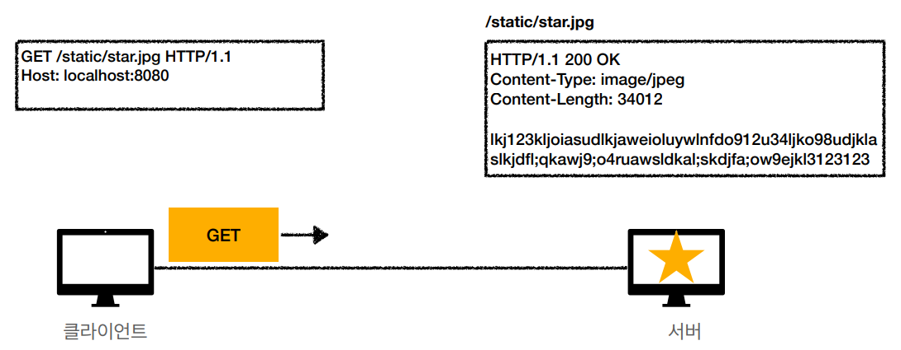
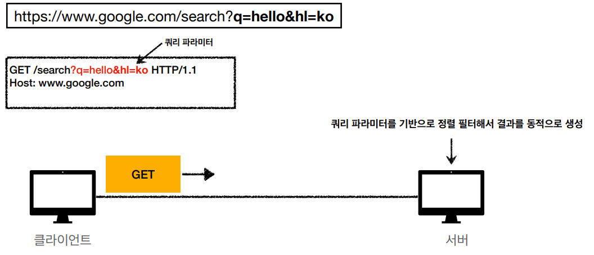
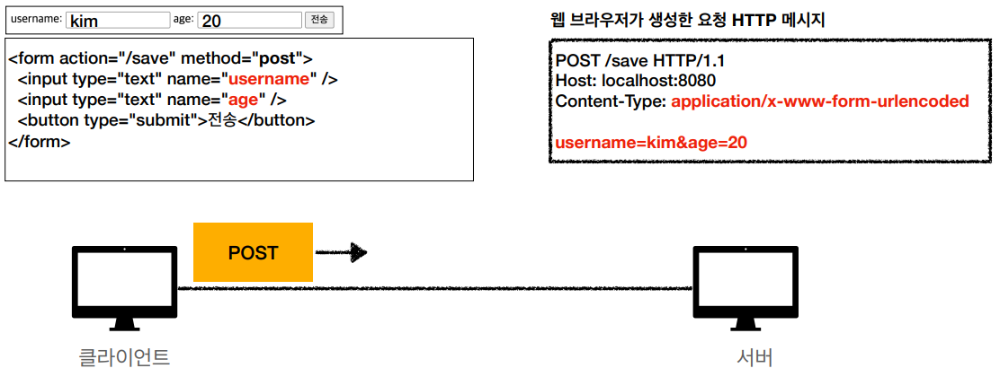
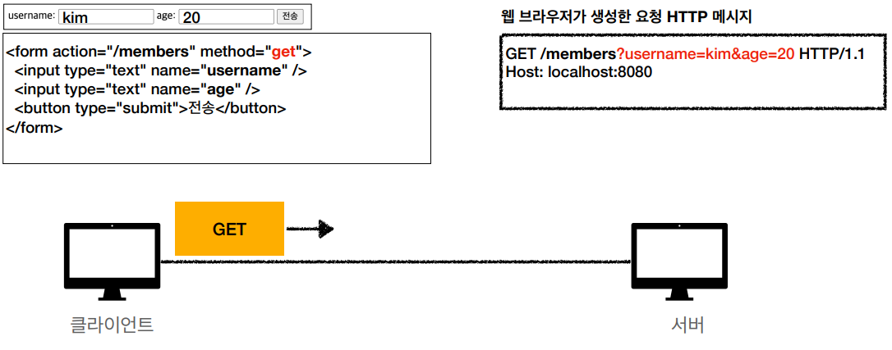
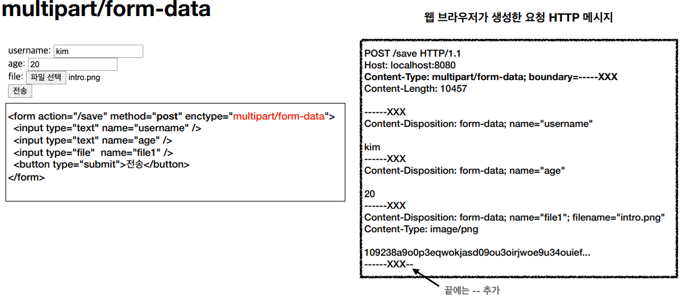
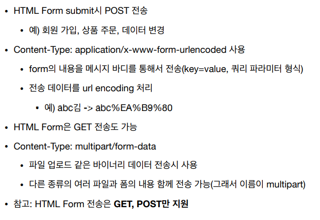
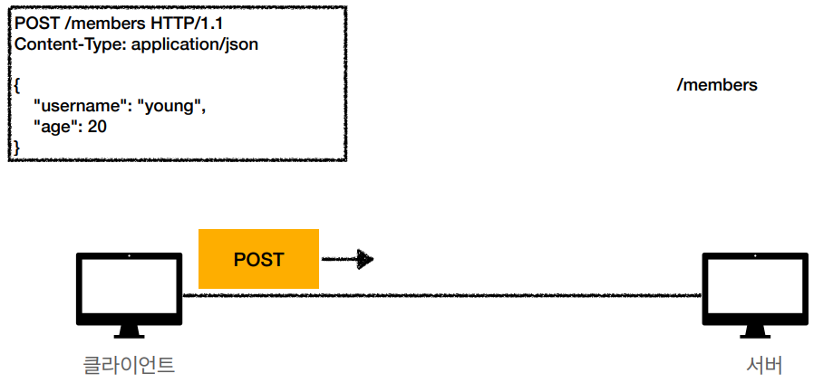

[모든 개발자를 위한 HTTP 웹 기본 지식](https://www.inflearn.com/course/http-웹-네트워크/dashboard) 을 듣고 정리한 내용이며 **모든 그림 예제는 해당 강의에서 가져온 내용입니다**.

# 클라이언트에서 서버로 데이터 전송

## 정적 데이터 조회

- 이미지, 정적 텍스트 문서
- 쿼리 파라미터 없이 리소스 경로로 단순하게 조회 가능
- 

## 동적 데이터 조회

- 주로 검색, 게시판 목록에서 정렬 필터(검색어)
- 조회 조건을 줄여주는 필터, 조회 결과를 정렬하는 정렬 조건에 주로 사용
- 조회는 GET 사용
- GET은 쿼리 파라미터 사용해서 데이터를 전달
- 

## HTML Form 데이터 전송

- 회원 가입, 상품 주문, 데이터 변경
- HTML Form형식에 맞춰 자동으로 HTTP 메세지를 만들어 줌
- POST 전송 - 저장
  - `Content-Type: application/x-www-form-urlencoded`
  - body에 쿼리 파라미터 형식으로 데이터 전송
  - 
- GET 전송 - 조회
  - 쿼리 파라미터로 데이터 전송
  - 
- `multipart/form-data`
  - 
  - 여러 종류의 데이터를 같이 보낼때 사용
- 정리
  - 

## HTTP API 데이터 전송

- 
- 서버 to 서버
  - 백엔드 시스템 통신
- 앱 클라이언트
  - 아이폰, 안드로이드
- 웹 클라이언트
  - HTML에서 Form 전송 대신 자바 스크립트를 통한 통신에 사용(AJAX)
  - 예) React, VueJs 같은 웹 클라이언트와 API 통신
- POST, PUT, PATCH: 메세지 바디를 통해 데이터 전송
- GET: 조회, 쿼리 파라미터로 데이터 전달
- Content-Type: application/json을 주로 사용(사실상 표준)
  - TEXT, XML, JSON등등

