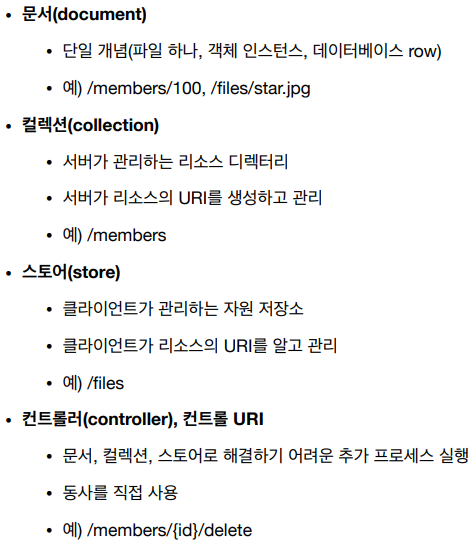

[모든 개발자를 위한 HTTP 웹 기본 지식](https://www.inflearn.com/course/http-웹-네트워크/dashboard) 을 듣고 정리한 내용이며 **모든 그림 예제는 해당 강의에서 가져온 내용입니다**.

# 1. 클라이언트에서 서버로 데이터 전송

## 1.1. 정적 데이터 조회

- 이미지, 정적 텍스트 문서
- 쿼리 파라미터 없이 리소스 경로로 단순하게 조회 가능
- 

## 1.2. 동적 데이터 조회

- 주로 검색, 게시판 목록에서 정렬 필터(검색어)
- 조회 조건을 줄여주는 필터, 조회 결과를 정렬하는 정렬 조건에 주로 사용
- 조회는 GET 사용
- GET은 쿼리 파라미터 사용해서 데이터를 전달
- 

## 1.3. HTML Form 데이터 전송

- 회원 가입, 상품 주문, 데이터 변경
- HTML Form형식에 맞춰 자동으로 HTTP 메세지를 만들어 줌
- POST 전송 - 저장
  - `Content-Type: application/x-www-form-urlencoded`
  - body에 쿼리 파라미터 형식으로 데이터 전송
  - 
- GET 전송 - 조회
  - 쿼리 파라미터로 데이터 전송
  - 
- `multipart/form-data`
  - 
  - 여러 종류의 데이터를 같이 보낼때 사용
- 정리
  - 

## 1.4. HTTP API 데이터 전송

- 
- 서버 to 서버
  - 백엔드 시스템 통신
- 앱 클라이언트
  - 아이폰, 안드로이드
- 웹 클라이언트
  - HTML에서 Form 전송 대신 자바 스크립트를 통한 통신에 사용(AJAX)
  - 예) React, VueJs 같은 웹 클라이언트와 API 통신
- POST, PUT, PATCH: 메세지 바디를 통해 데이터 전송
- GET: 조회, 쿼리 파라미터로 데이터 전달
- Content-Type: application/json을 주로 사용(사실상 표준)
  - TEXT, XML, JSON등등

# 2. HTTP API 설계 예시

## 2.1.1. API 설계 - POST 기반 등록 (회원 관리 시스템)

- 회원 목록 /members -> GET
- **회원 등록 /members -> POST**
- 회원 조회 /members/{id} -> GET
- 회원 수정 /members/{id} -> PATCH, PUT, POST
  - 회원 정보를 한번에 다 보낼 수 있다면 PUT을 써도 되긴하지만 왠만하면 PATCH를 쓰는 것이 좋다.
  - PUT 같은 경우는 게시판을 수정할때 사용할 수 있다.
- 회원 삭제 /members/{id} -> DELETE

### 2.1.2. POST - 신규 자원 등록 특징

- **클라이언트는 등록될 리소스의 URI를 모른다.**
  - 회원 등록 /members -> POST
  - POST /members
- 서버가 새로 등록된 리소스 URI를 생성해준다.
  - HTTP/1.1 201 Created
  - Location: **/members/100**
- 컬렉션(Collection)
  - 서버가 관리하는 리소스 디렉토리
  - 서버가 리소스의 URI를 생성하고 관리
  - 여기서 컬렉션은 /members

## 2.2.1. API 설계 - PUT 기반 등록 (파일 관리 시스템)

- 파일 목록 /files -> GET
- 파일 조회 /files/{filename} -> GET
- **파일 등록 /files/{filename} -> PUT**
- 파일 삭제 /files/{filename} -> DELETE
- 파일 대량 등록 /files -> POST
  - POST의 위치가 남기때문에 상황에 맞게 설계해주면 된다

## 2.2.2. PUT - 신규 자원 등록 특징

- 클라이언트가 리소스 URI를 알고 있어야 한다.
  - 파일 등록 /files/{filename} -> PUT
  - PUT /files/stat.jpg
- **클라이언트가 직접 리소스의 URI를 지정한다.**
  - 파일 등록 /files/{filename} -> PUT
- 스토어(Store)
  - 클라이언트가 관리하는 리소스 저장소
  - 클라이언트가 리소스의 URI를 알고 관리
  - 여기서 스토어는 /files

## 2.3.1. API 설계 - HTML FORM (회원 관리 시스템)

- 회원 목록 /members -> GET
- 회원 등록 폼 /members/new -> GET
- 회원 등록 /members/new, /members -> POST
- 회원 조회 /members/{id} -> GET
- 회원 수정 폼 /members/{id}/edit -> GET
- 회원 수정 /members/{id}/edit, /members/{id}  -> POST
- 회원 삭제 /members/{id}/delete -> POST

## 2.3.2. HTML FORM 사용

- HTML FORM은 GET, POST만 지원
- AJAX 같은 기술을 사용해서 해결 가능 -> 회원 API 참고
- 여기서는 순수 HTML, HTML FORM 이야기
- GET, POST만 지원하므로 제약이 있음

## 3. 참고하면 좋은 URI 설계 개념

- 실무에서는 컨트롤러, 컨트롤 URI가 필요한 경우가 많다.
