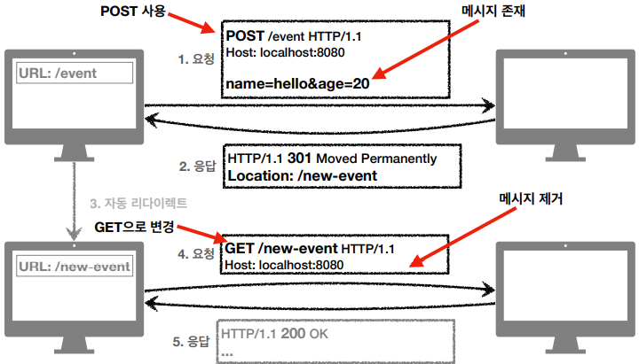

> [모든 개발자를 위한 HTTP 웹 기본 지식](https://www.inflearn.com/course/http-웹-네트워크/dashboard) 을 듣고 정리한 내용이며 **모든 그림 예제는 해당 강의에서 가져온 내용입니다**.

#	1. 상태코드

- 클라이언트가 보낸 요청의 처리 상태를 응답에서 알려주는 기능
  - 1xx (Informational): 요청이 수신되어 처리중
  - 2xx (Successful): 요청 정상 처리
  - 3xx (Redirection): 요청을 완료하려면 추가 행동이 필요
  - 4xx (Client Error): 클라이언트 오류, 잘못된 문법등으로 서버가 요청을 수행할 수 없음
  - 5xx (Server Error): 서버 오류, 서버가 정상 요청을 처리하지 못함
- 모든 상태코드를 사용하기 보다는 내부적으로 상태코드의 범위를 정해놓고 사용하는게 좋다

## 1.1. 만약 모르는 상태 코드가 나타나면?

- 클라이언트가 인식할 수 없는 상태코드를 서버가 반환하면?
- 클라이언트는 상위 상태코드로 해석해서 처리
- 미래에 새로운 상태코드가 추가되어도 클라이언트를 변경하지 않아도 됨
- 예)
  - 299 ?? -> 2xx (Successful)
  - 451 ?? -> 4xx (Client Error)
  - 599 ?? -> 5xx (Server Error)

## 1.2. 2xx 성공 (Successful)

- 클라이언트 요청을 성종적으로 처리
- 200 OK
  - 요청 성공
  - 
- 201 Created
  - 요청 성공해서 새로운 리소스가 생성됨
  - 
- 202 Accepted
  - 요청이 접수되었으나 처리가 완료되지 않았음
  - 배치처리 같은 곳에서 사용
  - 예) 요청 접수 후 1시간 뒤에 배치 프로세스가 요청을 처리함
- 204 No content
  - 서버가 요청을 성공적으로 수행했지만, 응답 페이로드 본문에 보낼 데이터가 없음
  - ㅇ) 웹 문저 편집기에서 save 버튼
  - save 버튼의 결과로 아무 내용이 없어도 된다.
  - save 버튼을 눌러도 같은 화면을 유지해야 한다.
  - 결과 내용이 없어도 204 메시지(2xx)만으로 성공을 인식할 수 있다.

## 1.3. 3xx 리다이렉션 (Redirection)

- 요청을 완료하기 위해 유저 에이전트(브라우저)의 추가 조치 필요
- 300 Multiple Choices
- 301 Moved Permanently
- 302 Found
- 303 See Other
- 304 Not Modified
- 307 Temporary Redirect
- 308 Permanent Redirect
- 주로 301 ~ 308 사용

### 1.3.1 리다이렉션 이해

- 웹 브라우저는 3xx 응답의 결과에 Location 헤더가 있으면, Location 위치로 자동 이동(리다이렉트)
- 
- 종류
  - **영구 리다이렉션** - 특정 리소스의 URI가 영구적으로 이동
    - 예) /members -> /users
    - 예 /event -> /new-event
  - **일시 리다이렉션** - 일시적으로 변경
    - 주문 완료 후 주문 내역 화면으로 이동
    - PRG: Post/Redirect/Get
  - **특수 리다이렉션**
    - 결과 대신 캐시를 사용

### 1.3.2 영구 리다이렉션 301, 308

- 리소스의 URI가 영구적으로 이동
- 원래의 URL를 사용X, 검색 엔진 등에서도 변경 인지
- **301 Moved Permanently**
  - **리다이렉트시 요청 메서드가 GET으로 변화고, 본문이 제거될 수 있음(MAY)**
  - 
- **308 Permanent Redirect**
  - 301과 기능은 같음
  - **리다이렉트시 요청 메서드와 본문 유지(처음 POST를 보내면 리다이렉트도 POST 유지)**
  - 
  - 실무에서 이런경우가 잘 존재하지는 않는다.

### 1.3.3 일시적인 리다이렉션 302, 307, 303

- 리소스의 URI가 일시적으로 변경
- 따라서 검색 엔진 등에서 URL을 병경하면 안됨
- **302 Found**
  - **리다이렉트시 요청 메서드가 GET으로 변하고, 본문이 제거될 수 있음(MAY)**
  - 대부분 GET으로 바꿔 사용하지만 명확하지가 않아서 307과 303이 나옴
- **307 Temporary Redirect**
  - 302와 기능은 같음
  - **리다이렉트시 요청 메서드와 본문 유지(요청 메서드를 변경하면 안된다. MUST NOT)**
  - POST로 오면 POST로 리다이렉트 GET으로 오면 GET으로 리다이렉트
- **303 See Other**
  - 302와 기능은 같음
  - **리다이렉트시 요청 메서드가 GET으로 변경**

#### 1.3.3.1 PRG: Post/Redirect/Get

- POST로 주문후에 웹 브라우저를 새로고침하면?
- 새로고침은 (마지막요청이?)다시 요청
- 중복 주문이 될 수 있다.
  - 
- PRG(리다이렉트) 사용시 장점
  - POST로 주문후에 새로 고침으로 인한 중복 주문 방지
  - POST로 주문후에 주문 결과 화면을 GET 메서드로 리다이렉트
  - 새로고침해도 결과화면을 GET으로 조회
  - 중복 주문 대신에 결과 화면만 GET으로 다시 요청
  - 
  - URL이 이미 POST -> GET으로 리다이렉트 됨
  - 새로 고침 해도 GET으로 결과 화면만 조회
  - 사용자 사용성이 좋아지고, 서버 오류가 줄어든다.

#### 기타 리다이렉션 300, 304

- 300 Multiple Choices: 안쓴다.
- 304 Not Modified
  - 캐시를 목적으로 사용
  - 클라이언트에게 리소스가 수정되지 않았음을 알려준다. 따라서 클라이언트는 로컬PC에 저장된 캐시를 재사용한다. (캐시로 리다이렉트 한다.)
  - 304 응답은 응답에 메시지 바디를 포함하면 안된다. (로컬 캐시를 사용해야 하므로)
  - 조건부 GET, HEAD 요청시 사용

