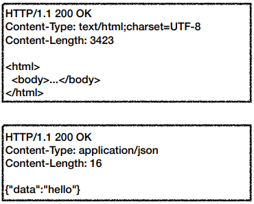
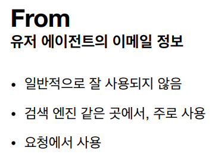

# HTTP 헤더 개요

- HTTP헤더의 용도
  - HTTP 전송에 필요한 모든 부가정보
  - 예) 메세지 바디의 내용, 메세지 바디의 크기, 압축, 인증, 요청 클라이언트, 서버 정보, 캐시 관리 정보...

## RFC2615(과거)

- 
- 헤더 분류
  - General 헤더: 메세지 전체에 적용되는 정보, (Connection: close)
  - Request 헤더: 요청 정보, (User-Agent: Moziia/5.0)
  - Response 헤더: 응답 정보, (Server: Apache)
  - Entity 헤더: 엔티티 바디 정보, 예) Content-Type: text/html, Content-Length: 3433
- 
  - 메세지 본문(message body)은 엔티티 본문(entity body)을 전달하는데 사용
  - 엔티티 분문은 요청이나 응답에서 전달할 실제 데이터
  - 엔티티 헤더는 엔티티 본문의 데어트를 해설할 수 있는 정보 제공
    - 데이터  유형(html, json), 데이터 길이, 압축 정보 등등
- RFC2616 폐기
  - 
  - 엔티티(Entity) -> 표현(Representation)
  - Representation = representation Metadata + Representation Data
  - 표현 = 표현 메타데이터 + 표현 데이터

## HTTP BODY - RFC7230(최신)

- 메세지 본문(message body)을 통해 표현 데이터 전달
- 메세지 본문 = 페이로드(payload)
- 표현은 요청이나 응답에서 전달할 실제 데이터
- 표현 헤더는 표현 데이터를 해석할 수 있는 정보 제공
  - 데이터 유형(html, json), 데이터 길이, 압축 정보 등등
- 참고: 표현 헤더는 표현 메타데이터와, 페이로드 메세지를 구분해야 하지만 여기서는 생략

# 표현

- Content-Type: 표현 데이터의 형식
- Content-Encoding: 표현 데이터의 압축 방식
- Content-language: 표현 데이터의 자연 언어
- Content-Length: 표현 데이터의 길이
- 표현 헤더는 전송, 응답 둘다 사용
- 

#### Content-Type

- 미디어 타입, 문자 인코딩

- 예)

  - text/html; charset-utf-8

  - application/json

  - image/png

    

#### Content-Encoding

- 표현 데이터를 압축하기 위해 사용
- 데이터를 전달하는 곳에서 압축 후 인코딩 헤더 추가
- 데이터를 읽는 쪽에서 인코딩 헤더의 정보로 압축 해제
- 예)
  - gzip
  - deflate
  - identity

#### Content-Language

- 표현 데이터의 자연 언어를 표현
- 예)
  - ko
  - en
  - en-US
- 

#### Content-Length

- 바이트 단위
- Transfer-Encoding(전송코딩)을 사용하면 Content-Length를 사용하면 안됨

# 협상(콘텐츠 네고시에이션)

클라이언트가 선호하는 표현 요청

- Accept: 클라이언트가 선호하는 미디어 타입 전달
- Accept-Charset: 클라이언트가 선호하는 문자 인코딩
- Accept-Encoding: 클라이언트가 선호하는 압축 인코딩
- Accept-Language: 클라이언트가 선호하는 자연 언어
- 협상 헤더는 요청시에만 사용
- 예)
  - 

### 우선순위

# 전송 방식

- 
- 
- 
- 
- 

# 일반 정보

# 특별한 정보

# 인증

- Authorization: 클라이언트 인증 정보를 서버에 전달
  - Authorztion: Basic xxxxxxxxxxxxx
  - 여러가지 인증 메커니즘에 따라 밸류값이 달라질 수는 있지만 HTTP에서는 헤더만 제공
- WWW-Authenticate
  - 리소스 접근시 필요한 인증 방법 정의
  - 401 Unauthorized 응답과 함께 사용
  - 

