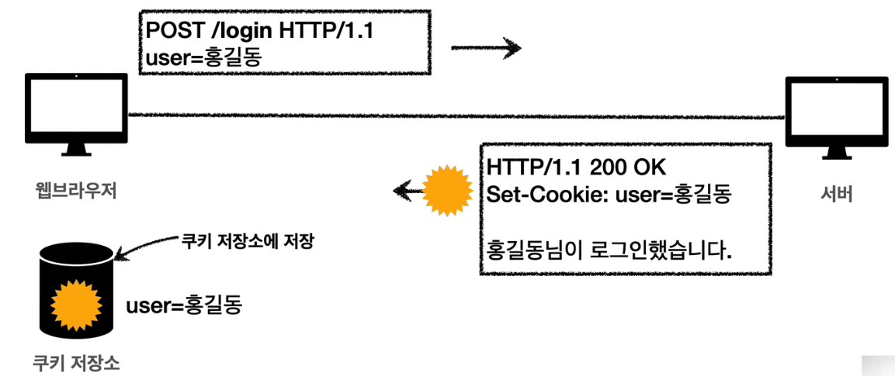

# 쿠키

- Set-Cookie: 서버에서 클라이언트로 쿠기 전달(응답)
- Cookie: 클라이언트가 서버에서 받은 쿠키를 저장하고, HTTP 요청시 서버로 전달

### 쿠키 미사용

- 로그인 이후 요청에 대해서 사용자를 파악할 수 없음
  - HTTP는 무상태(Stateless) 프로토콜이다.
  - 클라이언트와 서버가 요청과 응답을 주고 받으면 연결이 끊어진다.
  - 클라이언트가 다시 요청하면 서버는 이전 요청을 기억하지 못한다.
  - 클라이언트와 서버는 서로 상태를 유지하지 않는다.
- 사용자를 파악할려면 매 요청마다 클라이언트에서 사용자 정보를 서버로 보내줘야함
  - 예) GET /welcome?user=홍길동 HTTP/1.1
  - 문제점
    - 개발하기 복잡하고 힘듬(귀찮고 반복)
    - 브라우저를 완전히 종료하고 다시 열면?
      - 현재 웹스토리지를 사용하면 가능하지만 이것역시 매번 정보를 보내줘야함, 개발이 힘듬

### 쿠키 로그인

- 
- 서버가 응답에 쿠키에 사용자정보를 넣어서 클라이언트에 보냄
- 웹 브라우저의 쿠키 저장소에다가 데이터를 저장함
- **이후의 모든 요청에 쿠키의 데이터를 자동으로 같이 넣어서 보냄**
  - Cookie: user=홍길동
- 서버에서 쿠키 세팅
  - 예)  Set-cookie: sessionid=abcde1234; expires=Sat, 26-Dec-2020 00:00:00 GMT; path=/; domain=.google.com; Secure
  - sessionid: 로그인이 성공하면 서버에서 세션키를 생성해서 데이터베이스에 저장하고 클라이언트에 반환 (보안상의 이유)
- 사용처
  - 사용자 로그인 세션 관리
  - 광고 정보 트래킹
- 쿠키 정보는 항상 서버에 전송됨
  - 네타워크 트래픽 추가 유발
  - 최소한의 정보만 사용(세션 id, 인증 토큰)
  - 서버에 전송하지 않고, 웹 브라우저 내부에 데이터를 저장하고 싶으면 웹 스토리지 (localStorage, sessionStorage) 참고
    - 요청마다 보내지 않고 클라이언트에서 가지고 있다가 필요할 때만 사용하고 싶을때
- 주의!
  - 쿠키나 웹스토리지는 보안에 민감한 데이터는 저장하면 안됨(주민번호, 신용카드 번호 등등)

#### 쿠키 - 생명주기

- Set-cookie: expires=Sat, 26-Dec-2020 00:00:00 GMT;
  - 만료일이 되면 쿠키 삭제
- Set-Cookie: max-age=3600 (초단위)
  - 0이나 음수를 지정하면 쿠키 삭제
- 세션 쿠키: 만료 날짜를 생략하면 브라우저 종료시 까지만 유지
- 영속 쿠키: 만료 날짜를 입력하면 해당 날짜까지 유지

#### 쿠키 - 도메인

- 예) domain=example.org
- 명시: 명시한 문서 기준 도메인 + 서브 도메인 포함
  - domain=example.org를 지정해서 쿠키 생성
    - example.org는 물론이고
    - dev.example.org도 쿠키 접근
- 생략: 현재 문서 기준 도메인만 적용
  - example.org 에서 쿠키를 생성하고 domain 지정을 생략
    - example.org 에서만 쿠키 접근
    - dev.example.org는 쿠키 미접근

#### 쿠키 - 경로

- 예) path=/home
- 이 경로를 포함한 하위 경로 페이지만 쿠키접근
- 일반적으로 path=/ 루트로 지정
- 예)
  - path=/home 지정
  - /home -> 가능
  - /home/level1 -> 가능
  - /home/level1/level2 -> 가능
  - /hello -> 불가능

#### 쿠키 - 보안

- Secure
  - 쿠키는 http, https를 구분하지 않고 전송
  - Secure를 적용하면 https인 경우에만 전송
- HttpOnly
  - XSS 공격 방지
  - 자바스크립트에서 접근 불가(doctument.cookie)
  - HTTP 전송에만 사용
- SameSite
  - XSRF 공격 방지
  - 요청 도메인과 쿠키에 설정된 도메인이 같은 경우만 쿠키 전송
  - 최근에 나와서 브라우저 호환 확인 필요

