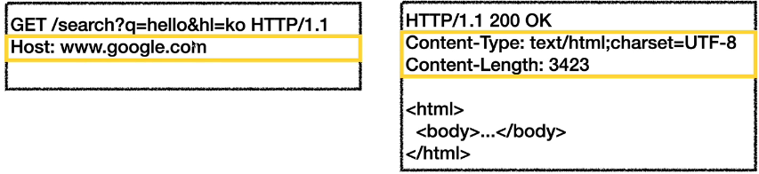

#	HTTP (HyperText Transfer Protocol)

- HTTP 메세지에 모든 것을 전송
  - HTML, TEXT
  - IMAGE, 음성, 영상, 파일
  - JSON, XML (API)
  - 거의 모든 형태의 데이터 전송 가능
  - 서버간에 데이터를 주고 받을 때도 대부분 HTTP 사용

## HTTP 역사

- HTTP/0.9 1991년: GET 메서드만 지원, HTTP 헤더 X
- HTTP/1.0 1996년: 메서드, 헤더 추가
- **HTTP/1.1 1997년: 가장 많이 사용, 우리에게 가장 중요한 버전**
  - RFC2068 (1997) -> RFC2616(1999) -> RFC7230~7235 (2014)
- HTTP/2 2015년: 성능 개선
- HTTP/0.9 진행중: TCP 대신에 UDP 사용, 성능 개선

## 기반 프로토콜

- TCP: HTTP/1.1, HTTP/2
- UDP: HTTP/3
  - 조금씩 늘어나는 추세
- 현재 HTTP/1.1 주로 사용
  - HTTP/2, HTTP/3 도 점점 증가

## 클라이언트 서버 구조

- Request Response 구조
- 클라이언트는 서버에 요청을  보내고, 응답을 대기
- 서버가 요청에 대한 결과를 만들어서 응답
- 
- 클라이언트와 서버를 분리한다는 것이 중요
  - 역활을 분리함으로써 클라이언트, 서버 각자가 독립적으로 진화할 수 있다.
  - 클라이언트는 어떻게 UI, UX를 효과적으로 그릴지
  - 서버는 어떻게 데이터를 효율적으로 보관할지

## 무상태 프로토콜(Stateless)

- 서버가 클라이언트의 상태를 보존X
- 장점: 서버 확장성 높음(스케일 아웃)
- 단점: 클라이언트가 추가 데이터 전송
- 상태유지: 중간에 다른 점원으로 바뀌면 안된다. (현재 고객들의 요청사항들을 알고 있어야한다.)
  - 상태정보를 다른 점원에게 미리 알려줘야 한다.
- 무상태: 중간에 다른 점원으로 바뀌어도 된다.(고객이 필요한 것을 모두 말하기 때문에)
  - 갑자기 고객이 증가해도 점원을 대거 투입할 수 있다.
  - 갑자기 클라이언트 요청이 증가해도 서버를 대거 투입할 수 있다.
- 무상태는 응답 서버를 쉽게 바꿀 수 있다. -> 무한한 서버 증설 가능

- 한계점
  - 클라이언트측에서 많은 데이터를  보내야한다.
  - 모든 것을 무상태로 설계 할 수 있는 경우도 있고 없는 경우도 있다.
  - 무상태
    - 예) 로그인이 필요 없는 단순한 서비스 소개화면
  - 상태유지
    - 예) 로그인
  - 로그인한 사용자의 경우 로그인 했다는 상태를 서버에 유지
  - 일반적으로 브라우저 쿠키와 서버 세션등을 사용해서 상태유지
  - 상태 유지는 최소한만 사용
- 로그인을 유지(상태유지) 서버를 증설하는 방식
  - 관계형 데이터베이스에 세션 정보를 저장하는 방법
  - WAS 서버들 끼리 클러스터로 세션 정보를 공유하는 방법
  - redis 같은 곳에 저장하고 관리하는 방법
  - JWT를 사용하면 어느정도 해소할 수 있다.

## 비연결성(connectionless)

- 서버는 자원을 아끼기위해 클라이언트와의 요청/응답 후 연결을 끊는다.
- 비 연결성의 한계와 극복
  - TCP/IP 연결을 새로 맺어야 함 - 3 way handshake 시간 추가
  - 웹 브라우저로 사이트를 요청하면 HTML 뿐만 아니라 자바스크립트,  css, 추가 이미지 등등 수 많은 자원이 함께 다운로드
  - 지금은 HTTP 지속 연결**(Persistent Connections)**로 문제 해결
  - HTTP/2, HTTP/3에서 더 많은 최적화

#### HTTP 지속 연결(Persistent Connections)

- 서버에서는 클라이언트에 응답을 보내기 위한 클라이언트 IP, PORT와 같은 정보를 가지고 있다
- 이런 자원들을 계속들고있으면 부담이 되기 때문에 응답후 제거한다.(비 연결성)
- 하지만 Persistent Connections은 **약 60초정도를 유지**하면서 HTML, 자바스크립트, 이미지 등 연속된 요청에 바로바로 응답을 할 수 있게한다.

## HTTP 메세지

- 
- start-line - 요청 메세지
  - method SP(공백) request-target SP HTTP-version CRLF(엔터)
  - ex) GET /search?q=hello&hl=ko HTTP/1.1
- start-line - 응답 메세지
  - HTTP-version SP status-code SP reason-phrase CRLF
  - ex) HTTP/1.1 200 OK
- HTTP 헤더
  - field-name":" OWS field-value OWS		(OWS: 띄어쓰기 허용)
  - 
  - HTTP 전송에 필요한 모든 부가정보
  - 예) 메세지 바디의 내용, 메세지 바디의 크기, 압축, 인증, 요청 클라이언트(브라우저) 정보, 서버 애플리케이션 정보, 캐시 관리 정보...
  - 표준 헤더가 너무 많음
  - 필요시 임의의 헤더 추가 가능
    - helloworld: hihi
- HTTP 메세지 바디
  - 실제 전송할 데이터
  - HTML 문저, 이미지, 영상, JSON 등등 byte로 표현할 수 있는 모든 데이터 전송 가능

