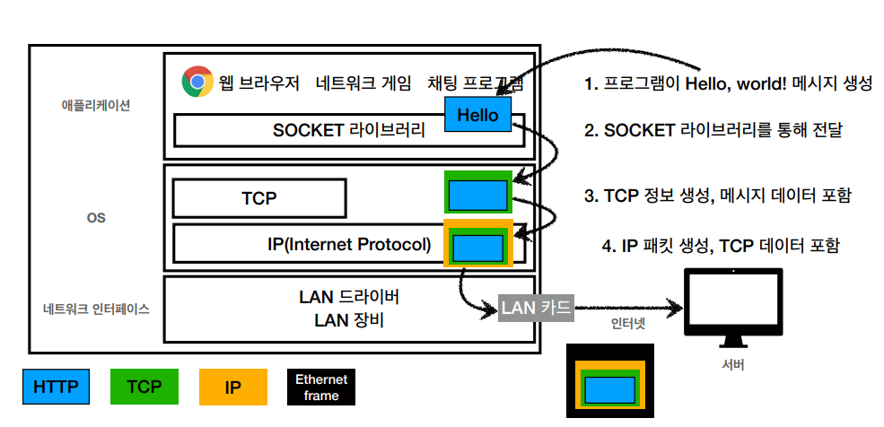
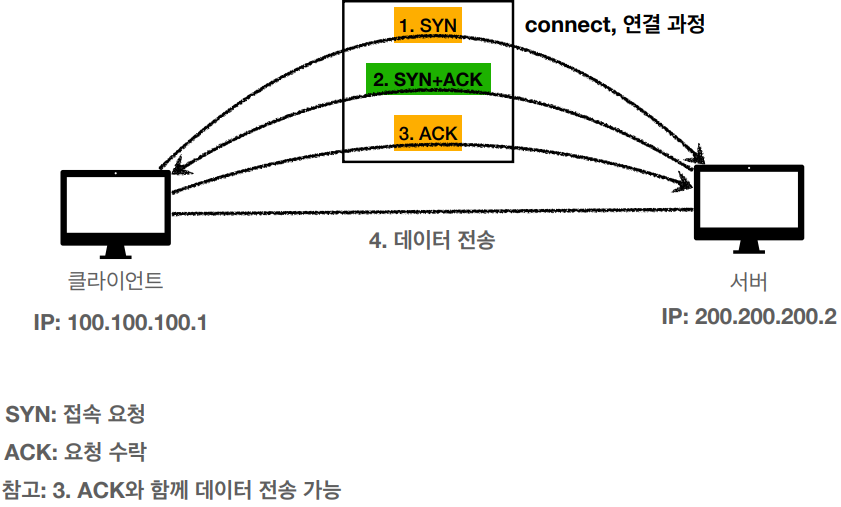

# IP(인터넷 프로토콜)

- 지정한 IP 주소에 데이터 전달
- 패킷(Packet)이라는 통신 단위로 데이터 전달
  - IP 패킷 : 출발지 IP, 목적지 IP, 전송데이터, ...등 데이터를 포함

- 클라이언트 패킷 전달
  - 만들어진 패킷을 인터넷망에 보낸다.
  - 여러 노드를 거쳐 목적지 IP에 도착하게 된다
- 서버 패킷 전달
  - 받은 데이터를 기반으로(출발지와 목적지 스왑) 응답 IP패킷을 만들어 인터넷망에 보낸다.
  - 여러 노드를 거쳐 목적지 IP에 도착하게 된다

## IP프로토콜의 한계

- 비연결성
  - 패킷을 받을 대상이 없거나 서비스 불능 상태여도 패킷 전송
- 비신뢰성
  - 중간에 패킷이 사라지면?
  - 패킷이 순서대로 안오면?
    - 데이터의 용량이 큰 경우 패킷이 나눠지는데 이 때 도착 순서가 달라질 수 있다.
- 프로그램 구분
  - 같은 IP를 사용하는 서버에서 통신하는 애플리케이션이 둘 이상이면?
- 이러한 문제들을 해결해주는 것이 TCP,UDP

## TCP, UDP

- 인터넷 프로토콜 스택의 4계층
  - 
- TCP 세그먼트 : 출발지 PORT, 목적지 PORT, 전송제어, 순서, 검증정보, ...

## TCP 특징

- 전송 제어 프로토콜(Transmission Control Protocol)
- 연결지향 - TCP 3 way handshake (가상 연결)
  - 
  - 완벽한 물리적 연결은 x, 논리적 연결

- 데이터 전달 보증
- 순서 보장
- 신뢰할 수 있는 프로토콜
- 현재는 대부분 TCP 사용

## UDP 특징

- 사용자 데이터그램 프로토콜(User Datagram Protocol)
- 하얀 도화지에 비유(기능이 거의 없음)
- 연결지향 - TCP 3 way handshake X
- 데이터 전달 보증 X
- 순서 보장 X
- 데이터 전달 및 순서가 보장되지 않지만, 단순하고 빠름
- 정리
  - IP와 거의 같다 + PORT + 체크섬(메세지검증) 정도만 추가
  - 애플리케이션에서 추가 작업 필요
- 장점
  - 최적화 가능

## PORT

- 한번에 둘 이상 연결해야 하면?
- 
- IP = 아파트, PORT = 동, 호수
- 패킷을 보낼 때 출발지PORT, 도착지PORT 정보도 같이 보냄

- 0 ~ 65535 : 할당 가능
- 0 ~ 1023 : 잘 알려진 포트, 사용하지 않는 것이 좋음
  - FTP - 20, 21
  - TELNET - 23
  - HTTP - 80
  - HTTPS - 443

## DNS

- 도메인 네임 시스템(Domain Name System)
- IP는 변할 수 있다.
- 전화번호부와 비슷한 역할
- 도메인 명을 IP 주소로 변환
- IP가 아닌 도메인명으로 요청

