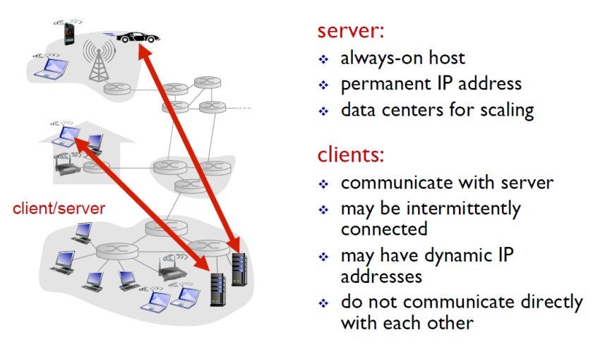
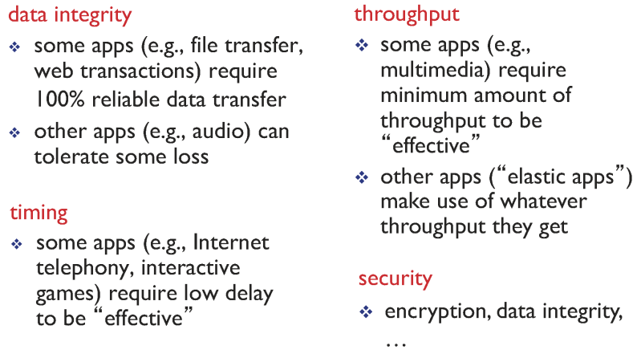
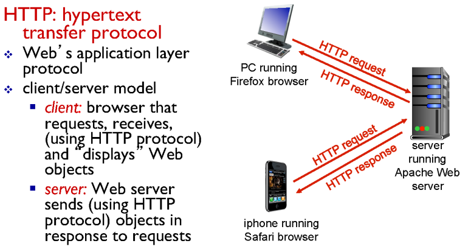
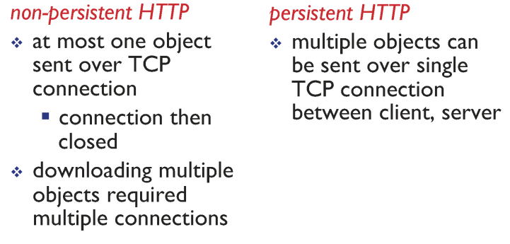

# Application Layer

## 1. Client-Server architecture

- 서버
  - 24시간 동작을 해야한다.
  - 고정 IP주소라는 잘 알려진 주소를 갖는다.
- 클라이언트
  - 바뀔수 있는(dynamic) IP주소를 가지고 있다.
- IP, PORT
  - ip는 어떤 컴퓨터인지 식별
  - port는 하나의 컴퓨터 안에서 어떤 프로세스인지 식별

## 2. What transport service does an app need?

- 애플리케이션이 이용 가능한 트랜스포트 서비스
  - **현재 트랜스포트 레이어에서 제공해주는 서비스는 data integrity 하나 뿐이다.**
  - 트랜스포트 계층에서 제공 안해주기 때문에 위(어플리케이션 계층)에서 구현 해야한다.
    - 보안을 어플리케이션에서 구현중 
  - data integrity (신뢰적 데이터 전송)
    - 송신 프로세스는 데이터를 소켓으로 보내고 그 데이터가 오류 없이 수신 프로세스에 도착할 것이라는 확신을 갖는다
    - 손실 허용 애플리케이션(loss-tolerant application)
      - 트랜스포트 계층 프로토콜이 신뢰적 데이터 전송을 제공하지 않을 때
      - 어느 정도의 데이터 손실을 참아낼 수 있는 실시간 오디오/비디오 같은 멀티미디어 애플리케이션에서는 받아들여질 수 있다.
  - timing guarantee (시간 보장)
    - 시간 보장은 여러가지 형태로 나타난다.
    - 한 가지 예는 송신자가 소켓으로 내보내는 모든 비트가 수신자의 소켓에 100msec 내에 도착하도록 하는 것
      - 인터넷 전화, 가상 환경, 원격회의 멀티게임과 같은 상호 작용 실시간 애플리케이션에 매력적이다.
  - throughput (처리량)
    - 어플리케이션은 r bits/sec의 보장된 처리율을 요구할 수 있고 트랜스포트 프로토콜은 가용한 처리율이 항상 적어도 r bps 임을 보장한다.
    - 대역폭 민감 어플리케이션 (bandwidth-sensitive application)
      - 현존하는 멀티미디어 애플리케이션은 대역폭에 민감하다.
      - 특정 처리율 요구사항을 갖는다
    - 탄력적 애플리케이션 (elastic application)
      - 가용한 처리율이 많으면 많은 대로 적으면 적은 대로 이용할 수 있다.
      - 전자메일, 파일 전송, 웹 전송
  - security (보안)
    - 하나 이상의 보안 서비스를 제공할 수 있다.
    - 송신 호스트에서 트랜스포트 프로토콜은 송신 프로세스가 전송하는 모든 데이터를 암호화할 수 있고
    - 수신 호스트에서 트랜스포트 프로토콜은 그 데이터를 수신 프로세로 전달하기 전에 데이터의 암호를 해독할 수 있다.

## 3. Web and HTTP

### 3.1. HTTP overview

- 웹페이지는 객체들로 구성된다.
- 객체는 단순히 단일 URL로 지정할 수 있는 하나의 파일(HTML 파일, JPEG 이미지, GIF 이미지, 자바 애플릿, 오디오 클립등)이다.
- 대부분의 웹 페이지는 기본 HTML 파일과 여러 참조 객체로 구성된다.
- 각각의 객체들은 URL로  addressable하다
- 기본 HTML 파일은 페이지 내부의 다른 객체를 그 객체의 URL로 참조한다.

### 3.2. HTTP connections

- HTTP는 TCP 커넥션을 기반으로 그 위에서 메세지(request, response)를 주고받는다.
- **TCP커넥션을 사용하는 방법에 따라서** 두 가지 방식을 가진다.
  - persistent HTTP (지속적)
  - non-persistent HTTP (비지속적)
- persistent는 서버와 클라이언트간의 요청,응답 후에 TCP 커넥션을 계속 유지하고 다음 요청,응답에도 사용한다.

