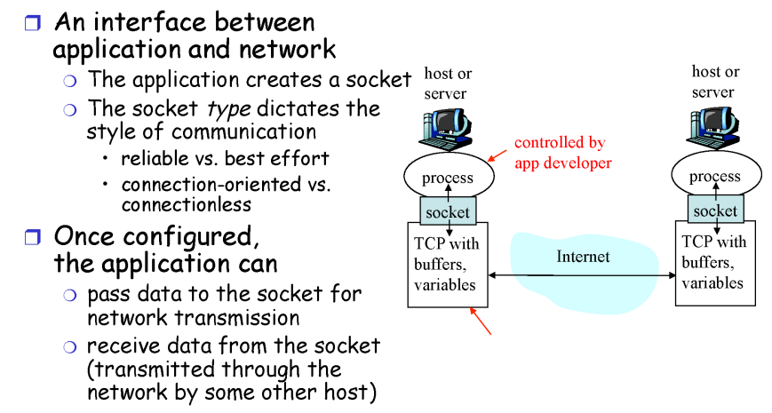
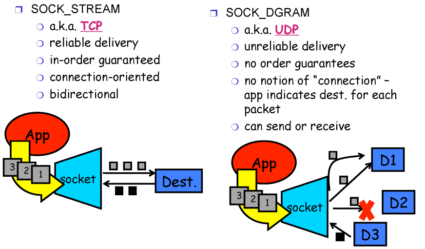
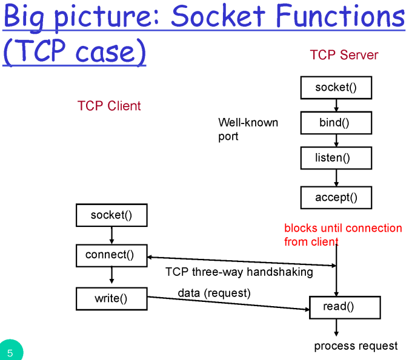
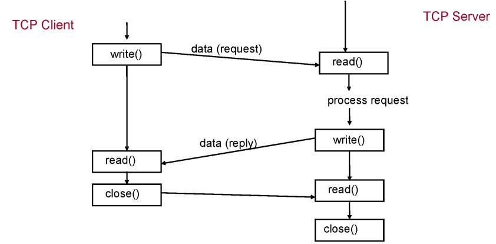

# 2. Socket

## 1. What is a socket?

## 2. 두 가지 타입의 소켓

- 소켓의 타입은 TCP소켓(SOCK_STREAM), UDP소켓(SOCK_DGRAM) 두 가지가 있다.
- TCP 소켓으로 데이터를 보내면 TCP방식으로 가는 것이고
- UDP 소켓으로 데이터를 보내면 UDP방식으로 간다.

### 2.1. Socket Functions (TCP case)

- 한번 커넥션을 맺고나면 이 후로는 read, write만 하면 된다.

