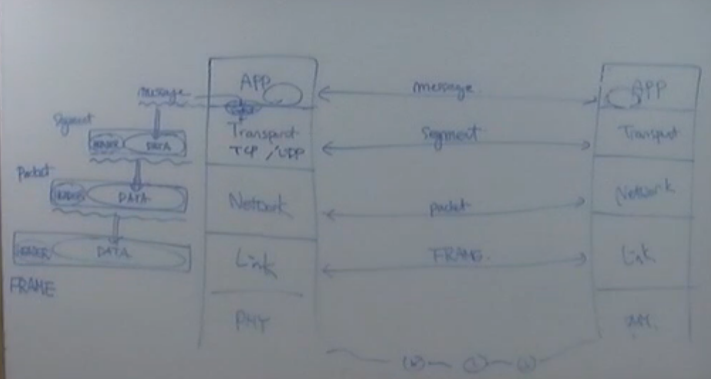
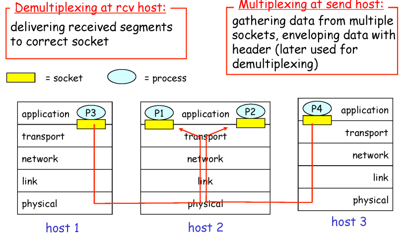
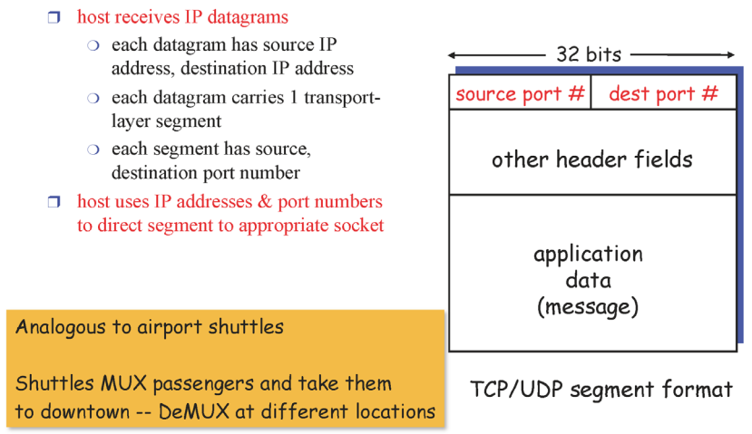
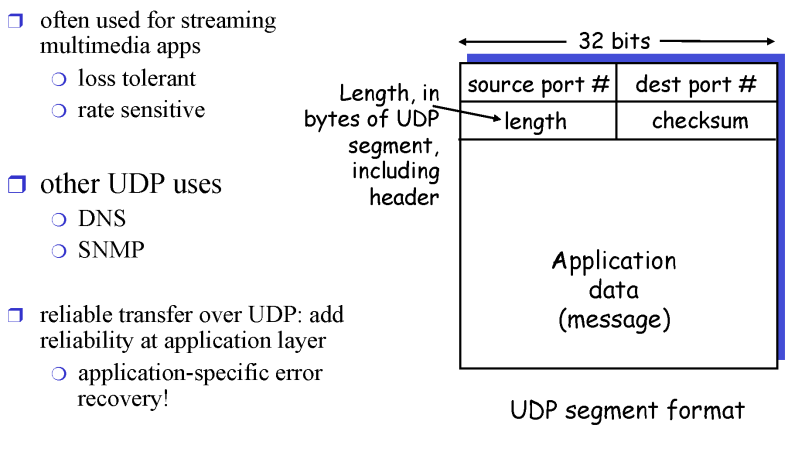

# 3. Transport Layer

## 3.1. Multiplexing / Demultiplexing 

- Multiplexing 
  - 클라이언트 쪽에서 어플리케이션의 계층의 여러 프로세스들이 각자의 소켓으로 트랜스포트 레이어로 메세지를 내려보내면 트랜스포트계층에서 각각 하나의 세그먼트를 만들어서 밑의 계층으로 내려보낸다.
  - 즉, 여러 구멍(어플리케이션 계층의 여러 프로세스들)에서 내려오는 각각의 메세지들을 받아서 세그먼트로 만들어서 보낸다.
- Demultiplexing 
  - 반대로 서버쪽의 트랜스포트 계층에서 세그먼트들을 받아서 어플리케이션 계층의 알맞은 프로세스에게 보내준다.

### 3.1.1. How demultiplexing works

- **어떻게 어떤 프로세스로 올려줄지 판단을 하냐?**
  - 세그먼트이 헤더에있는 정보를 이용
  - 세그먼트는 데이터와 헤더로 이루어져 있다.
  - 헤더에 적힌 포트정보를 가지고 demultiplexing을 한다.
    - source post: 자기자신 포트넘버
    - dest port: 목적지 포트넘버

### 3.1.2. UDP와 TCP에서의 Demultiplexing

- UDP에서의 demultiplexing은 dest ip, dest port만을 가지고 이루어진다.
- TCP에서의 demultiplexing은 source ip, source port, dest ip, dest port 4가지를 가지고 이루어진다.
  - 즉, 4개중 하나라도 다르면 다른 소켓(프로세스)로 간다.

- 예를 들어 웹 서버 프로세스가 하나가 있고 사용자별로 쓰레드가 있고 각 쓰레드가 소켓을 담당한다.

## 3.2. UDP segment header

- port 를이용해서 Demultiplexing
- checksum: 데이터가 전송도중에 에러가 있었는지 없었는지 판단
  - 에러가 있을경우 데이터를 올리지않고 drop시킨다.
- UDP는 두가지 기능을 제공해준다.
  - Demultiplexing
  - 에러 체크

