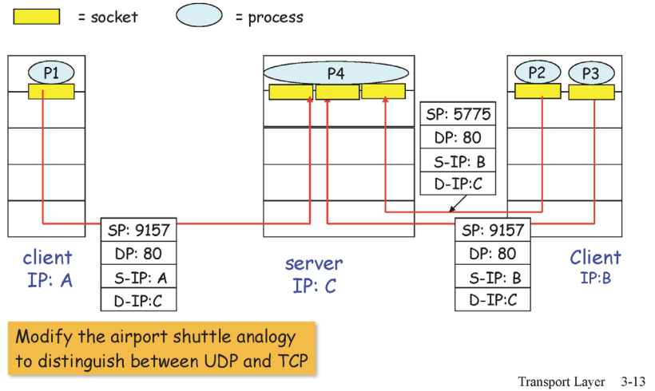
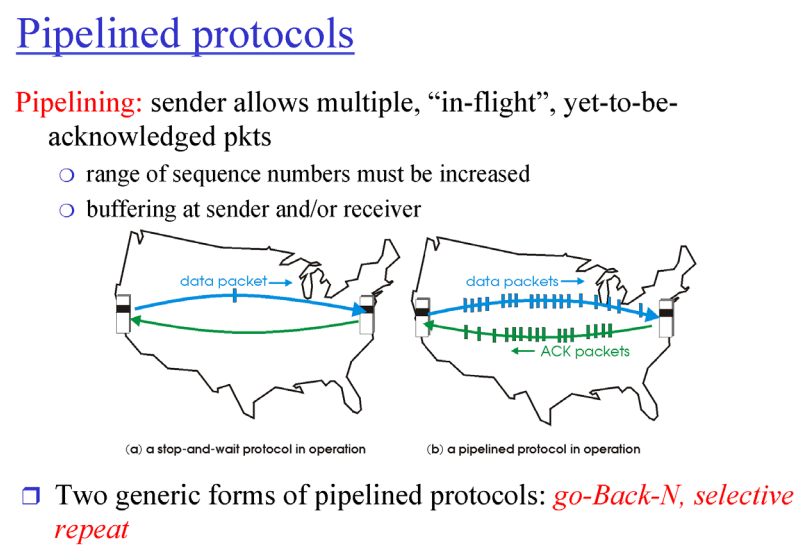

# 3. Transport Layer

## 3.1. Multiplexing / Demultiplexing 

- Multiplexing 
  - 클라이언트 쪽에서 어플리케이션의 계층의 여러 프로세스들이 각자의 소켓으로 트랜스포트 레이어로 메세지를 내려보내면 트랜스포트계층에서 각각 하나의 세그먼트를 만들어서 밑의 계층으로 내려보낸다.
  - 즉, 여러 구멍(어플리케이션 계층의 여러 프로세스들)에서 내려오는 각각의 메세지들을 받아서 세그먼트로 만들어서 보낸다.
- Demultiplexing 
  - 반대로 서버쪽의 트랜스포트 계층에서 세그먼트들을 받아서 어플리케이션 계층의 알맞은 프로세스에게 보내준다.

### 3.1.1. How demultiplexing works

- **어떻게 어떤 프로세스로 올려줄지 판단을 하냐?**
  - 세그먼트이 헤더에있는 정보를 이용
  - 세그먼트는 데이터와 헤더로 이루어져 있다.
  - 헤더에 적힌 포트정보를 가지고 demultiplexing을 한다.
    - source post: 자기자신 포트넘버
    - dest port: 목적지 포트넘버

### 3.1.2. UDP와 TCP에서의 Demultiplexing

- UDP에서의 demultiplexing은 dest ip, dest port만을 가지고 이루어진다.
- TCP에서의 demultiplexing은 source ip, source port, dest ip, dest port 4가지를 가지고 이루어진다.
  - 즉, 4개중 하나라도 다르면 다른 소켓(프로세스)로 간다.

- 예를 들어 웹 서버 프로세스가 하나가 있고 사용자별로 쓰레드가 있고 각 쓰레드가 소켓을 담당한다.

## 3.2. UDP segment header

- port 를이용해서 Demultiplexing
- checksum: 데이터가 전송도중에 에러가 있었는지 없었는지 판단
  - 에러가 있을경우 데이터를 올리지않고 drop시킨다.
- UDP는 두가지 기능을 제공해준다.
  - Demultiplexing
  - 에러 체크

- TCP나 UDP는 기본적으로 에러체크와 멀티플렉싱기능을 제공한다

------

## 3.3. Reliable (믿을 수 있는)

- **Message error와 Message loss 이 두 가지 상황만 잘 해결하면 reliable하게 만들 수 있다.**

### 3.3.1. Message error만 발생하는 상황

- Message error만 발생하는 상황에서 어떻게 reliable하게 만들 수 있을까?
- Error detection
  - checksum bit를 이용해서 데이터에 에러가 발생했는지를 체크한다.
- Feedback
  - 에러가 없을 경우 ACKs, 에러가 있을 경우 NAKs를 보내서 피드백을 준다.
- Retransmission
  - NAKs를 받으면 다시 데이터를 보낸다.

- ACKs에 에러가 발생할 경우 sender입장에서는 데이터를 잘 받았는지 알 수가 없어서 다시 데이터를 보낸다.
- 하지만 receiver입장에서는 같은 데이터를 두번 보낸건지 다른 데이터를 또 보낸건지 알 수가 없다

- 따라서, sequence number를 활용해서 데이터에 번호를 매겨서 데이터의 중복을 방지한다.

- sequence number
  - 하나의 비트(0과 1)만 사용 
  - 왜? 현재 프로토콜은 매우 단순해서 하나보내고 응답받고 또 보내고 응답받기 때문에 0과 1로만 구별이 가능하다.

- NAK를 없애고 ACK에 현재까지 받은 sequence number을 포함해서 보내면 sender입장에서 어떤 요청에 에러가 있는지 알 수 있다.

### 3.3.2. Message loss 와 Message error가 같이 발생하는 상황 (실상황)

- Message loss가 발생해서 타이머시간동안 응답이 오지않으면 재전송 한다.
- 타이머를 얼마나 설정해야하는 가는 정답이없는 어려운 문제
  - 타이머의 시간이 짧으면 loss가 발생했을 경우 해결이 빠르지만 loss가 아니라 패킷이 오래걸려 늦게 도착했을 경우 중복된 패킷이 전송될 수 있다.
  - 타이머가 길면 loss가 발생했을 경우 반응이 늦다.
- sequence number가 있기때문에 중복메세지를 처리할 수 있다.

## 3.4. Pipelined protocols

- 현실에서는 위의 메커니즘을 사용할 수 없다.
- 실제로는 패킷을 하나씩 주고 받는게 아니라 한 번에 여러 요청을 보내고 한번에 여러 요청을 받는다.

### 3.4.1. Go-Back-N

- window size: 한 번에 얼마나 많은 패킷들을 보낼 것인가
- ACK(n): n번 까지 완벽하게 잘 받았다.

- 위 그림에서 window size는 4
- 처음에 0번부터 3번 패킷까지 한번에 보낸다.
- ACK0을 받으면 다음 패킷인 4번 패킷을 보낸다.
- ACK1을 받으면 그 다음 패킷 5번을 보낸다.
- GBN에서  receive는 단순하게 다음 패킷만 기다린다.
  - 만약 0, 1, 2 번 패킷을 받았으면 3번 패킷만 기다리고 4, 5, 6 등 이 후 패킷들을 버린다(discard).
- 만약 2번 패킷에 loss가 발생하면 2번 패킷의 타이머가 완료되고 2번 부터 window size만큼 재전송 한다.
  - ACK0과 ACK1을 받았기 때문에 현재 윈도우에는 2,3,4,5 패킷이 들어있다.
- 단점, loss, error, 타이머 초과가 발생하면 윈도우 사이즈 만큼 재전송 해야된다.
- 단점을 보안한 selective repeat 방식이 나왔다.

### 3.4.2. Selective Repeat

- ACK(n): n번까지 잘 받았다가 아닌 n번 패킷을 잘 받았다는 의미

- receive 쪽에서 버퍼가 필요해 진다.
- 잘 받은 패킷을 receive 쪽의 버퍼에 저장

### 3.4.3. Sequence Number

- Sequence Number는 헤더에 들어가는 정보이기 때문에 크기를 줄이는 것이 좋다.
- **window size에 따라서 sequence number size는 얼마로 설정해야 할까??**
