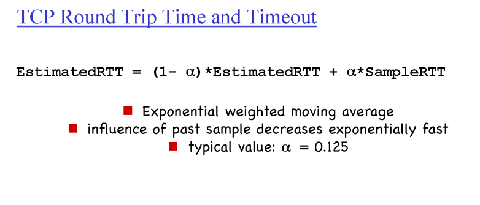
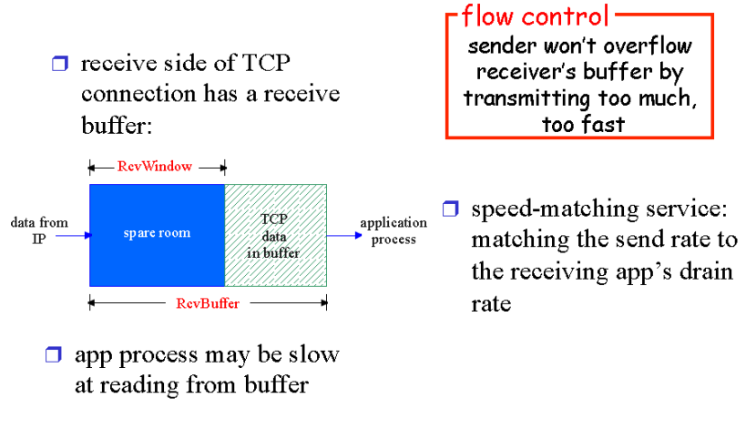

# 4. TCP

## 4.1. TCP Overview

- point-to-point
  - 소켓 하나와 소켓 하나 사이의(소켓 한쌍 끼리의) 통신을 책임진다.
- pipelined
  - 한 번에 window size만큼 메세지를 보낸다.
- 클라이언트, 서버 모두 sender이자 receiver이다.
- send & receive buffers
  - **send와 receive모두 window size만큼의 send buffers와 receive buffers가 두 개다 필요하다.**
  - send buffers: window size 만큼 메세지를 한 번에 보내기 때문에 그 중에 유실된 메세지가 있을 수 있을 경우 재전송할려면 저장 하고 있어야 한다.
  - receive buffers: 순서대로 도착하지 않는 메세지들을 저장해 놓기 위해서 필요하다. 유실된 패킷이 있으면 다시 받는다.

## 4.2. TCP segment structure

- source port, dest port
  - 멀티플랙싱을 위해 필요한 정보
  - 16비트이기 때문에 포트 번호는 0~((2**16)-1)개
- checksum
  - 에러체크
- receive window
  - 현재 receive buffer에 얼마만큼의 빈 공간이 피드백을 해주기 위해

### 4.2.1 Sequence Number, Acknowledgement Number

- host B는 받은 데이터를 그대로 돌려주는 에코서버
- 데이터는 1바이트("C")라고 가정함
- TCP에서 사용하는 sequence number는 데이터의 제일 앞 바이트의 번호
  - 만약 100바이트짜리 데이터를 10바이트씩 나눠서 보낸다고 하면
  - 첫 번째 세그먼트의 sequence number는 0, 두 번째 sequence number는 10, ...
- TCP에서 ACK number는 현재 받아야하는 데이터의 번호
  - 만약 ACK10이라고 한다면 9번까지 잘 받았으니 10번을 기다리고 있다는 의미
- 만약 데이터가 1바이트가 아니라 8바이트라면 
  - A -> B: Seq=42, ACK=79, data='COMPUTER'
  - B -> A: Seq=79, ACK=50, data='COMPUTER'

### 4.2.2. Timeout

- Timeout value를 얼마로 설정할 것인가
  - 유실을 확신하면서도 타임아웃은 작게하는 것이 관건
- RTT: 세그먼트를 보내고 응답이 오기까지 걸리는 시간

- 대략적으로 타임아웃값은 변동성을 줄인 RTT값에다가 마진을 더 해준 값을 사용한다.

## 4.3. 추가사항

- TCP에서는 ACK를 보낼 때 500ms정도 기다린 후에 보내는 것을 권장하고 있다.
  - sender쪽에서 한 번에 많은 패킷을 보내기 때문에 일일이 ACK를 하기보다는 시간을 두고 받은 후에 ACK를 하는 것이 효율적이다.
- 타임아웃이 완료되기 전에 같은 number의 ack를 많이 받는다면 그 number의 패킷이 유실되었다는 것을 유추할 수 있다. 따라서 이런 경우 재전송하라고 권장하고 있다. (fast retransmit)
  - three duplicate ACK: ack를 받고 동일한 number의 ack가 3번더 오는 경우
    - 결국 총 4번의 같은 number의 ack를 받는다.
    - ex) ack10, ack10, ack10, ack10 

## 4.4. TCP Flow Control

- receive buffer의 남은 공간의 크기를 세그먼트 해더의 recv buffer 필드에 적어서 보내면
- sender는 그 양만큼 패킷을 보낸다.
- 따라서 오버플로를 방지한다.

## 4.5. TCP Connection Management

- 데이터를 주고 받기 위해서 필요한 것
  - sender쪽에서 필요한 것
    - sender buffer, receive buffer, 나의 seq#, 상대방의 seq#
  - receive쪽에서 필요한 것
    - sender buffer, receive buffer, 나의 seq#, 상대방의 seq#

### 4.5.1. TCP 3-way handshake

- 첫 번째 요청 (SYN)
  - TCP 커넥션을 열고싶다는 의사표시
  - 나의 seq #을 상대방에게 알려준다.
  - 세그먼트 해더의 SYNbit가 1
- 두 번째 요청 (SYNACK)
  - 나의 seq #을 상대방에게 알려준다.
  - 세그먼트 해더의 SYNbit가 1
- 세 번째 요청 (ACK)
  - 데이터를 포함할 수 도있고 포함하지 않을 수도 있다.
- TCP 커넥션을 열기 위해서는 위 3번의 과정이 필요하다.
- 굳이 2-way가 아닌 3-way를 쓰는이유는?
  - 서버 입장에서 마지막 ACK가 오지 않으면 잘 응답받았는지 알 수 가없다.

## 4.6. Closing TCP Connection

- FIN
  - FINbit(플래그)가 1
  - 더이상 보낼 데이터가 없다는 의미
- timed wait
  - 마지막 ACK가 유실될 경우 다시 FIN을 보내서 ACK를 받아야하는데 상대방이 종료해 버리면 ACK를 받을 수 가 없다.
  - 따라서 어느정도 시간을 두고 종료를 한다. 

## 4.7. TCP congestion control (혼잡 제어)

- sender와 receiver가 데이터를 주고 받을 때 sender는 얼마만큼의 양을 보낼 수 있을까?
  - receiver의 receive buffer의 남은양?
  - 네트워크의 상태에 따라?
  - 결국 둘 중 작을 쪽을 선택해야 한다.
  - 예를들어 receiver는 10만큼 받을 수 있고 네트워크는 20만큼 처리할 수 있다면 10만큼 보내는 게 맞고
  - receiver는 10만큼 받을 수 있고 네트워크는 5만큼 처리할 수 있다면 5만큼 보내는 것이 맞다.

- TCP는 네트워크의 상황이 안좋아지면 모든 네트워크를 사용하는 사용자들을 위해서 보내는 데이터의 양을 줄일 필요가 있다.
  - 차가 막히면 차가 들어오는 양을 일시적으로 줄여서 교통체증을 풀어야한다.
  - 안그러면 데이터 손실
- 이를 해결하는 두 가지 방법
  - Network-assisted congestion control
    - 라우터가 네트워크상황을 알려준다.
    - 현재 구현되어 있지 않다.
    - 비현실적 (라우터는 다른 할일이 많다.)
  - End-end congestion control
    - 데이터를 주고받는 sender와 receiver끼리 요청 속도를 분석해서 네트워크상황을 유추한다.

- Slow start
  - 처음 시작할때는 윈도우사이즈를 작게하여(1부터 시작) 현재 네트워크 상황이 괜찮은지 파악한다.
  - 너무 조금씩 보내면 효율이 너무 떨어지니 지수적으로 증가시킨다.
- Additive increase
  - 어느 지점(threshold)를 지나면 선형적으로 윈도우사이즈를 증가시킨다.
- Multiplicative decrease
  - 점점 윈도우사이즈를 증가시키다가 패킷 loss를 감지하면 윈도우사이즈를 절반으로 줄여서 다시 선형적으로 증가시킨다.
- 왜 늘릴때는 조금씩 늘리고 줄일때는 반으로 확 줄이느냐?
  - 네트워크 혼잡이 발생하면 조금씩 줄여서 혼잡이 해결되지 않는다. 다 같이 확 줄여야 혼잡을 해결할 수 있다.
- MSS (Maximum Segment Size) (500byte)
  - 세그먼트가 가질 수 있는 최고 크기
  - 윈도우 사이즈의 단위가 된다.
  - 윈도우 사이즈가 1이면 buffer의 크기는 1MSS로 세팅된다.

- 결국 전송 속도를 결정하는 것은 네트워크이다.
- 다르게는 우리 모두(네트워크의 사용자)에 따라 전송 속도가 결정 된다.

- 처음에는 지수적으로 증가 (Slow start)
- Threshold를 넘으면 선형적으로 증가 (Additive increase)
- 패킷 유실이 탐지되면
  - Tahoe 버전 (Timeout으로 인한 패킷 유실 감지의 경우)
    - Threshold값을 패킷 유실이 탐지된 윈도우사이즈의 절반값으로 설정
    - 윈도우 사이즈는 다시 1부터 Slow start 시작
  - Reno 버전 (3 dup ACK로 인한 패킷 유실 감지의 경우)
    - Threshold값을 패킷 유실이 탐지된 윈도우사이즈의 절반값으로 설정
    - 윈도우 사이즈를 절반으로 줄여서 Additive increase 시작
  - 3 dup ACK로 인한 패킷 유실 감지의 경우 Reno를 사용하는 이유
    - Timeout으로 인한 패킷 유실은 굉장히 심각한 상황이지만
    - 3 dup ACK로 인한 패킷 유실은 통신은 잘되지만 패킷 유실이 발생한 경우라고 볼 수 있어서

- 이렇게 네트워크 사용자 모두를 위해서 사용량을 조절하는데 그럼 네트워크 사용자 모두는 공평하게 네트워크를 사용하게 될까??
  - 결과적으로 공평하게 사용하게 된다.
  - 또한 TCP커넥션을 많이 열게되면 그만큼 네트워크를 많이 사용한다.
