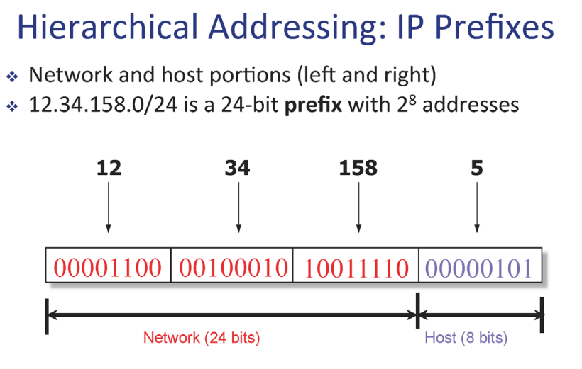

# 5. Network layer

- source(출발지)부터 destination(목적지)까지 데이터를 어떤 경로로 잘 보낼 것인가에 대한 이야기
- 중간에 라우터들이 존재

- 패킷의 헤더에 목적지 정보와 포워딩 테이블을 비교해서 어디로 보내야 할지 정한다.
- **라우팅: 포워딩 테이블을 만드는 일을 하는것**
- **포워딩: 라우팅 알고리즘이 만든 포워딩 테이블을 참조해서 패킷을 전달하는 것**

- 포워딩 테이블에서 주소마다 일일이 output link가 있으면 테이블이 너무 크기때문에 범위로 output link를 지정해 준다.
- 위 그림에서는 
  - 첫번째 예제는 2번 Link interface로 보낸다.
  - 두번째 예제는 1번 Link interface로 보낸다.
    - 가장 길게 일치하는 곳으로 보냄 (Longest prefix matching)

## 5.1. IP 프로토콜

- ver: IP 프로토콜의 버전
- length: 패킷의 전체 길이(바이트)
- source IP address: 메세지를 생성해서 보내는 사람의 IP 주소
- destination IP address: 최종 목적지의 IP 주소
- time to live(ttl): 라우터를 거칠때마다 1씩 줄어들고 0이되면 이 패킷을 버려진다.
- upper layer: 데이터가 TCP프로토콜인지 UDP프로토콜인지 명시해준다.
- TCP해더 20바이트, IP해더 20바이트 -> 따라서 기본적으로 패킷에는 데이터 외에 총 40바이트가 추가된다.

### 5.1.1. IP Address (IPv4)

- 8비트씩 끊어서 읽기 쉽게 10진수로 바꿔서 읽는다.
- 실제로는 32비트
- IP주소는 결국 호스트에 들어있는 네트워크 인터페이스(랜카드)자체를 지징하는 주소이다.

- ip주소를 막지정하면 포워딩 테이블이 너무 커지기 때문에 계층화를 시켜놨다.
- 앞부분은 네트워크 아이디(prefix, subnet id), 뒷 부분은 호스트 아이디
- 같은 네트워크에 해당하는 호스트들은 같은 네트워크 아이디를 가진다.
- 따라서 포워딩 테이블이 단순해 진다.
- 또한 호스트를 추가할 때 포워딩 테이블에 변화를 주지않고 추가할 수 있다.

- 기계들이 알기 쉽게 어디까지가 network id인지 표시하기위해 subnet mask를 이용한다. 
- 항상 같이 다닌다.

- 유연한 network id크기를 가진다.
  - 8비트 단위로 prefix크기를 지정하는 것이 아닌 자유롭게 지정

- 목적지 ip와 포워딩 테이블의 주소들의 prefix와 비교하는데 가장 긴(prefix가 큰)것과 매칭되는 것을 선택한다.
- 결국 라우터가하는 일은 목적지ip와 포워딩 테이블을 비교해서 라우팅 시켜주는 것

## 5.2. Subnet

- 서브넷
  - 같은 prefix를 가진 디바이스들의 집합
  - 라우터를 거치지 않고 접근이 가능한 호스트들의 집합

- 위 그림은 6개의 서브넷을 가진다.(파란색 색칠한 부분)
- 라우터는 여러개의 네트워크 인터페이스(ip주소)를 가질 수 있다.

## 5.3. Network Address Translation (NAT)

- IP주소(32비트)의 개수 부족을 예견해서 1996년에 IPv6(128비트)가 나왔다.
- 하지만 현재까지 IPv4를 사용할 수 있는 것은 NAT 때문

- 내부적으로만 사용하는 ip주소를 가진다.
- 문제점 
  - NAT에서는 port넘버로 호스트를 구별하는데 그렇게 되면 원래의 port 기능인 프로세스를 식별하는 일을 할 수 가없다.
    - 따라서 서버로써 사용하기 어렵다.
  - 또한 network layer에서 port넘버를 수정하는 것은 상위 레이어의 데이터를 건드리는 일
