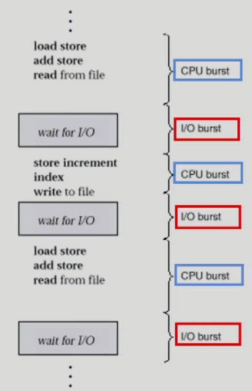
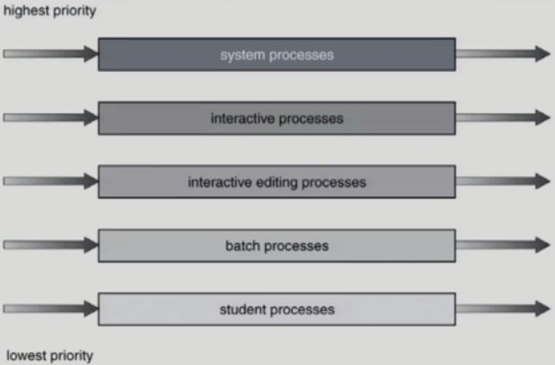
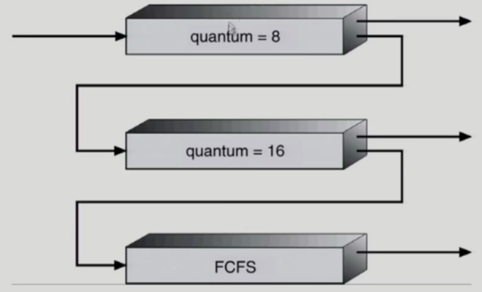

# 3. CPU Scheduling

- CPU and I/O Bursts in Program Execution

  - 
  - 하나의 프로세스의 일생을 나타낸 그림
  - CPU burst: CPU를 가지고 기계어를 실행하는 단계
  - I/O burst: I/O 작업을 실행하는 단계 (CPU burst단계보다 훨씬 시간이 오래걸림)
  - 얼마나 I/O 작업을 많이(자주) 하냐가 중요
  - I/O bound process: CPU를 잡고 계산하는 시간보다 I/O에 많은 시간이 필요한 job (many short CPU bursts)
  - CPU-bound process: 계산 위주의 job (few very long CPU bursts)
  - **CPU를 어떤 프로세스에게 먼저 주는것이 효율적인가?**
    - I/O 단계가 많은 프로세스(I/O bound job)
      - CPU를 짧게 쓰고 I/O작업을 하러 가기 때문에 먼저 CPU를 주는 것이 좋다
      - 보통 I/O작업이 많으면 사람과 인터랙션이 많다는 것이 때문에 빨리 처리해주는 것이 좋다

- CPU Scheduler & Dispatcher

  - 운영체제 코드의 일부분을 하는 역활에 따라 이름을 붙여서 부름

  - CPU Scheduler

    - Ready 상태의 프로세스 중에서 이번에 CPU를 줄 프로세스를 고른다

  - Dispatcher

    - CPU의 제어권을 CPU scheduler에 의해 선택된 프로세스에게 넘긴다
    - 이 과정을 context switch(문맥 교환)라고 한다.

    > Dispatcher는 CPU가 프로세스1에서 2로 넘어갈때(문맥 교환) CPU를 빼앗기는 프로세스의 context를 세이브해 놓고 새롭게 CPU를 얻는 프로세스의 context를 로드하는 역활을 한다.

  - CPU 스케줄링이 필요한 경우는 프로세스에게 다음과 같은 상태 변화가 있는 경우이다.

    - Running -> Blocked (예: I/O 요청하는 시스템 콜)
    - Running -> Ready (예: 할당시간말료로 timer interrupt)
    - Blocked -> Ready (예: I/O 완료후 인터럽트)
      - I/O가 완료된 직후에 실행되어야하는 중요한 작업들
    - Terminate
    - 위의 모든 스케줄링은 nonpreemptive (강제로 빼앗지 않고 자진 반납)
    - 나머지 스케줄링은 preemptive (강제로 빼앗음)

- Scheduling Criteria (Performance Index, Performance Measure, 성능 척도)

  - CPU utilization (이용률)

    - keep the CPU as busy as possible
    - 전체시간 중에서 CPU가 일한 시간

  - Throughput (처리량)

    - \# of processes that complete their execution per time unit
    - 단위 시간당 처리량

  - Turnaround time (소요시간, 반환시간)

    - amount of time to execute a particular process

    > CPU를 사용한 시간, 기다린 시간의 합, 총 CPU burst시간

  - Waiting time (대기 시간)

    - amount of time a process has been waiting in the ready queue

    > CPU burst안에서 기다린 시간들의 합

  - Response time (응답 시간)

    - amount of time it takes from when a request was submitted until the first response is produced, not output (for time-sharing environment)

    > I/O burst가 끝나고 CPU burst로 들어와서 처음 CPU를 사용하는데 까지 걸리는 시간

### CPU Scheduling 알고리즘

- FCFS (First-Come First-Served)

  - 도착한 순서에 따라 CPU를 준다.
  - Convoy effect: CPU burst time이 긴 프로세스가 먼저 도착하면 뒤에 모든 프로세스의 기다리는 시간이 길어진다. (비효율)

- SJF (Shortest-Job-First)

  - 각 프로세스의 다음번 CPU burst time을 가지고 스케줄링에 활용
  - CPU burst time이 가장 짧은 프로세스를 제일 먼저 스케줄
  - Two schemes:
    - Nonpreemptive
      - 일단 CPU를 잡으면 이번 CPU burst가 완료될 때까지 CPU를 선점(preemption) 당하지 않음
    - Preemptive
      - 현재 수행중인 프로세스의 남은 burst time보다 더 짧은 CPU burst time을 가지는 새로운 프로세스가 도착하면 CPU를 빼앗김 
      - 이 방법을 Shortest-Remaining-Time-First (SRTF)이라고도 부른다
  - SJF is optimal
    - 주어진 프로세스들에 대해 **minimum average waiting time**을 보장
  - 단점
    - CPU burst time이 긴 작업은 영원히 CPU를 얻지 못할 수도 있음
    - CPU burst time을 미리 알 수가 없다.
  - 다음 CPU Burst Time 예측
    - 다음번 CPU burst time을 어떻게 알 수 있는가?
    - 추정(estimate)만이 가능하다
    - 과거의 CPU burst time을 이용해서 추정

- Priority Scheduling

  - A priority number (integer) is associated with each process

  - highest priority를 가진 프로세스 에게 CPU 할당 (smallest integer = highest priority)

    - preemptive
    - nonpreemptive

  - SJF는 일종의 priority scheduling이다

    - Priority = predicted next CPU burst time

  - Problem

    - Starvation: low priority processes may never execute

  - Solution

    - Aging: as time progresses increase the priority of the process

    > 시간이 지남에 따라 우선순위를 높여준다.

- Round Robin (RR)

  - 각 프로세스는 동일한 크기의 할당 시간**(time quantum)**을 가짐 (일반적으로 10-100 milliseconds)
  - 할당 시간이 지나면 프로세스는 선점(preempted)당하고 ready queue의 제일 뒤에 가서 다시 줄을 선다
  - n 개의 프로세스가 ready queue에 있고 할당 시간이 q time unit인 경우 각 프로세스는 최대 q time unit 단위로 CPU 시간의 1/n을 얻는다.
    - 어떤 프로세스도 (n-1)q time unit 이상 기다리지 않는다.
  - Performance
    - q large => FCFS와 유사
    - q small => context switch 오버헤드가 커진다
  - 일반적으로 SJF보다 average turnaround time이 길지만 response time은 더 짧다.
  - CPU burst time이 비슷한 경우 average turnaround time이 커지기 때문에 CPU burst time이 차이가 있는 일들이 모여있을 때 유리하다.
  - 기다리는 시간이 CPU burst time에 어느정도 비례하다.

- Multilevel Queue

  - Ready queue를 여러 개로 분할

    - foreground (interactive)
    - background (batch - no human interaction)

  - 각 큐는 독립적인 스케줄링 알고리즘을 가짐

    - foreground - RR
    - background - FCFS

  - 큐에 대한 스케줄링이 필요

    - Fixed priority scheduling

      > 모든 foreground queue를 처리한 다음에 background queue를 실행
      >
      > background queue에 Starvation 위험이 있음

      - serve all from foreground then from background
      - Possibility of starvation

    - Time slice

      - 각 큐에 CPU time을 적절한 비율로 할당
      - Eg. 80% to foreground in RR, 20% to background in FCFS

  - 

- Multilevel Feedback Queue

  - 프로세스가 다른 큐로 이동 가능
  - 에이징(aging)을 이와 같은 방식으로 구현할 수 있다.
  - Multilevel-feedback-queue scheduler를 정의하는 파라미터들
    - Queue의 수
    - 각 큐의 scheduling algorithm
    - Process를 상위 큐로 보내는 기준
    - Process를 하위 큐로 내쫓는 기준
    - 프로세스가 CPU 서비스를 받으려 할 때 들어갈 큐를 결정하는 기준
  - Multilevel Feedback Queue의 하나의 예
    - 
      - 위의 queue의 우선순위가 가장 높다
      - quantum이 8인 RR알고리즘 후에 작업이 끝나지 않으면 quantum이 16인 아래의 queue로 강등

- Multiple-Processor Scheduling

  - CPU가 여러개인 경우 스케줄링은 더욱 복잡해짐
  
  - Homeogeneous processor인 경우
    - Queue에 한줄로 세워서 각 프로세스가 알아서 꺼내가게 할 수 있다.
    - 반드시 특정 프로세서에서 수행되어야 하는 프로세스가 있는 경우에는 문제가 더 복잡해짐
    
  - Load sharing
  
    - 일부 프로세서에 job이 몰리지 않도록 부하를 적절히 공유하는 메커니즘 필요
    - 별개의 큐를 두는 방법 vs 공동 큐를 사용하는 방법
  
  - Symmetric Multiprocessing (SMP)
  
    - 각 프로세서가 각자 알아서 스케줄링 결정
  
    > 모든 CPU들이 대등하게 일을함
  
  - Asymmetric multiprocessing
  
    - 하나의 프로세서가 시스템 데이터의 접근과 공유를 책임지고 나머지 프로세서는 거기에 따름
  
    > 한개의 CPU가 대장이 된다.
  
- Real-Time Scheduling

  - Hard real-time systems
    - Hard real-time tast는 정해진 시간 안에 반드시 끝내도록 스케줄링해야 함
  - Soft real-time computing
    - Soft real-time task는 일반 프로세스에 비해 높은 priority를 갖도록 해야 함

- Thread Scheduling

  > 운영체제가 스레드의 존재를 안다면 운영체제의 CPU스케줄러가 직접하는 것이고(Global Scheduling)
  >
  > 모른다면 운영체제는 프로세스에게 CPU를 주고 프로세스 내부에서 스레드스케줄링을 결정한다.(Local Scheduling)

  - Local Scheduling
    - User level thread의 경우 사용자 수준의 thread library에 의해 어떤 thread를 스케줄할지 결정
  - Global Scheduling
    - Kernel level thread의 경우 일반 프로세스와 마찬 가지로 커널의 단기 스케줄러가 어떤 thread를 스케줄할지 결정

## Algorithm Evaluation

- Queueing models

  - 확률 분포로 주어지는 arrival rate와 service rate 등을 통해 각종 performance index 값을 계산

- Implementation (구현) & Measurement (성능 측정)

  - 실제 시스템에 알고리즘을 구현하여 실제 작업(workload)에 대해서 성능을 측정 비교

  > 실제 리눅스의 코드를 고쳐서 실험해보는 것은 굉장히 어려움

- Simulation (모의 실험)

  - 알고리즘을 모의 프로그램으로 작성후 trace를 입력으로 하여 결과 비교

>참고
>http://www.kocw.net/home/cview.do?cid=4b9cd4c7178db077
