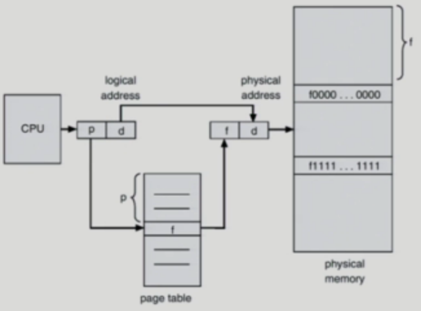
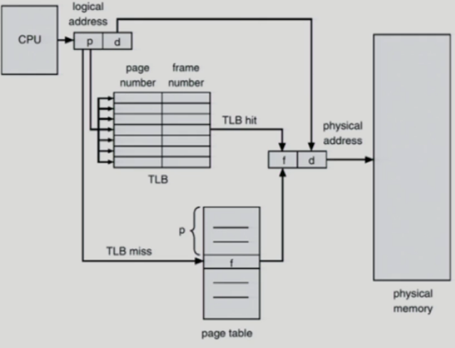
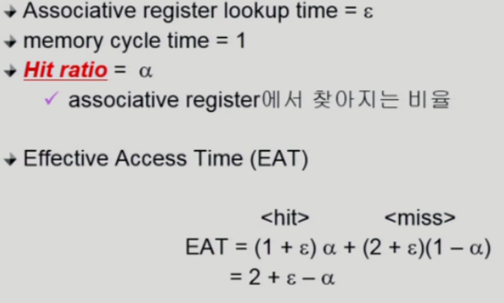
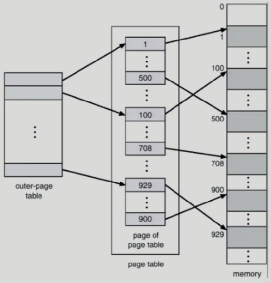
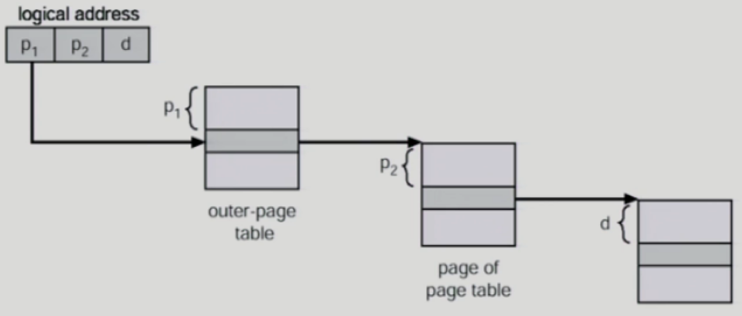
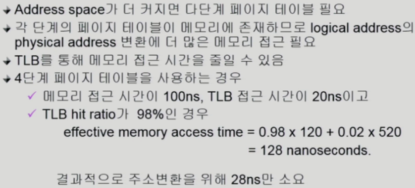

# 7. 메모리 관리 (Paging)

- Process의 vitual memory를 동일한 사이즈의 page 단위로 나눔
- Virtual memory의 내용이 page 단위로 noncontiguous하게 저장됨
- **일부는 backing storage에, 일부는 physical memory에 저장**
- Basic Method
  - physical memory를 동일한 크기의 frame으로 나눔
  - logical memory를 동일 크기의 page로 나눔 (frame과 같은 크기)
  - 모든 가용 frame들을 관리
  - **page table을 사용하여 logical address를 physical address로 변환**
    - 모든 페이지의 물리적 메모리 주소를 가지고 있다.
  - External fragmentation(외부 조각) 발생 안함
  - Internal fragmentation(내부 조각) 발생 가능

- 위 그림에서 Page번호는 page table에 의해서 frame번호로 바뀌지만 page안에서 얼마만큼 떨어져 있는가하는 주소(d)(오프셋)는 바뀌지가 않는다.
- 전통적으로 주소(p와d)의 크기는 32bit를 사용하지만 요즘에는 64bit를 사용하기도 한다.
  - logical 주소의 크기가 32bit라는 것은 프로그램을 구성하는 논리적 메모리의 크기가 최대 얼마다 라는 것을 제한한다는 의미
  - 메모리 주소는 1byte단위로 매겨진다
  - 만약 메모리 주소의 크기가 1bit라고 하면 2byte를 구분할 수 있다. 2bit이면 4byte, 32bit이면 2**32byte(4기가바이트)만큼 구분할 수 있다.
  - 32bit주소 체계를 사용한다면 프로그램이 가질 수 있는 최대 메모리크기는 4기가바이트이다.
  - 페이지 하나당 4킬로바이트 따라서 총 페이지 수는 약 백만개가 조금 넘는다.(1메가)
  - 통째로 physical 메모리에 프로그램을 올리는 contiguous allocation에서는 레지스터 1개만 있으면 프로그램 1개를 주소변환 할 수 있었다.
  - 페이징 기법에서는 페이지 테이블에 페이지 개수만큼의 엔트리가 필요하다

## Implementation of Page Table

- 테이블 자료구조

- Page table은 main memory에 상주
  - 페이지의 개수가 프로세스마다 백만개가 넘기 때문에 페이지 테이블을 레지스터에 넣을 수 없어서
  
- 기존에 사용하던 MMU의 base register, limit register은 어디에 사용을 할 것인가
  - Page-table base register (PTBR)가 page table의 시작위치를 가리킴
  - Page-table length register (PTLR)가 테이블 크기를 보관
  
- 모든 메모리 접근 연산에는 2번의 memory access 필요
  - page table 접근 1번, 실제 data/instruction 접근 1번
  - 성능 저하를 막기위해 주소변환을 전담하는 캐쉬 메모리를 두고 있다.(TLB)
  - 속도 향상을 위해 associative register 혹은 translation look-aside buffer (TLB) 라 불리는 고속의 lookup hardware cache 사용
  
- Paging Hardware with TLB
  - 
  - TLB는 page table의 일부만 담고있다.
  - TLB 캐쉬가 없을 때는 page table을 통해 주소변환
  - 그림과 달리 page table은 physical memory안에 있다.
  - physical memory를 2번(page table 1번, 실제 데이터의 physical address에 1번) 접근해야하는 것을 일부 막기위해 TLB를 사용
  
- Associative Register
  - Associative Register (TLB): parallel search가 가능 (병렬적으로 한번에)
    - TLB에는 page table 중 일부만 존재
    - 그래서 인덱스로 한번에 접근이 불가능하기 때문에 전체를 탐색해야하는데 속도 향상을 위해를 병렬적으로 한번에 탐색 (Associative Register)
  - Address translation
    - page table 중 일부가 associative register에 보관되어 있음
    - 만약 해당 page가 associative register에 있는 경우 곧바로 해당 frame을 얻음
    - 그렇지 않은 경우 main memory에 있는 page table로 부터 frame을 얻음
    - TLB는 context switch 때 flush (remove old entries)
      - 프로세스마다 page table이 따로 존재하기 때문에
  
- Effective Access Time (메모리 접근하는데 걸리는 시간)

  

  - Associative register lookup time = TLB접근 시간
  - memory cycle time = 메모리 접근하는 시간
  - Hit ratio = TLB에서 페이지 번호를 찾을 확률
  - 사실 Hit ratio가 대단히 1에 가까운 값을 가지기 때문에 메모리 접근 시간을 줄이는 효과가 있다.

### Two-Level Page Table

- 현대의 컴퓨터는 address space가 매우 큰 프로그램 지원
  - 32 bit address 사용시: 2**32 (4G)의 주소 공간
    - page size가 4K시 1M개의 page table entry 필요
    - 각 page entry가 4B시 프로세스당 4M의 page table 필요
    - **그러나, 대부분의 프로그램은 4G의 주소 공간 중 지극히 일부분만 사용하므로 page table 공간이 심하게 낭비됨**
    - 이런 문제를 해결하고자 Two-Level Page Table 기법 사용
  
  
- page table 자체를 page로 구성

- 사용되지 않는 주소 공간에 대한 outer page table의 엔트리 값은 NULL (대응하는 inner page table이 없음)

- 메모리 접근이 1번더 늘어나기 때문에 시간상으로 대단히 손해 하지만 공간상으로 이득

- 2단계 페이징에서의 Address-translation scheme
  - 

### Multilevel Paging and Performance

- 
- TLB를 통한 메모리 접근 비율(TLB hit ratio)를 높이면 page table의 단계가 많더라도(Multilevel Paging) 주소변환을 위한 시간을 줄일 수 있음
  - page table을 이용한 주소변환 비율이 작기 때문에

### Memory Protection

- Page table의 각 entry 마다 아래의 bit를 둔다
- Protection bit
  - page에 대한 접근 권한(read/write/read-only)
  - 접근은 어차피 자기 자신의 페이지 테이블에만 할 수 있기때문에 접근 주체에 대한 권한이 아닌
  - read/write/read-only에 대한 권한
- Valid-invalid bit
  - 'valid'는 해당 주소의 frame에 그 프로세스를 구성하는 유효한 내용이 있음을 뜻함 (접근 허용)
  - 'invalid'는 해당 주소의 frame에 유효한 내용이 없음을 뜻함 (접근불허)
    - 유효한 내용이 없음이란
      - 프로세스가 그 주소 부분을 사용하지 않는 경우
      - 해당 페이지가 메모리에 올라와 있지 않고 swap area에 있는 경우

### Inverted Page Table Architecture (역방향 페이지 테이블)

- 원래 페이지테이블이라는 것은 논리주소로부터 물리주소를 얻는 과정이지만 Inverted Page Table Architecture는 물리주소로부터 논리주소를 얻어내는 기법
- 테이블 페이지를 하나로 합치고 모든 프로세스의 페이지를 인덱스로 관리
  - 찾고있는 페이지번호가 f번째 페이지 테이블에 있으면 물리적 주소의 f번째에 해당페이지 있음
  - 페이지번호외에 프로세스를 구별할 수 있는 값이 추가적으로 필요
- 장점
  - 페이지테이블이 하나만 존재하면된다. (프로세스마다 X)
- 하지만 주소변환 자체에는 별 도움이 되지않음
- 기존의 page table이 매우 큰 이유
  - 모든 process 별로 그 logical address에 대응하는 모든 page에 대해 page table entry가 존재
  - 대응하는 page가 메모리에 있든 아니든 간에 page table에는 entry로 존재
- inverted page table
  - Page frame 하나당 page table에 하나의 entry를 둔 것 (system-wide)
  - 각 page table entry는 각각의 물리적 메모리의 page frame이 담고 있는 내용 표시 (process-id, process의 logical address)
  - 단점 
    - 테이블 전체를 탐색해야 함
  - 조치
    - associative register 사용 (비쌈)

### Shared Page

- Shared code
  - Re-entrant Code (Pure code)
  - read-only로 하여 프로세스 간에 하나의 code만 메모리에 올림
    - ex) text editors, compilers, window systems
  - Shared code는 모든 프로세스의 logical address space에서 동일한 위치에 있어야 함
    - 프로세스안에서 동일한 위치에 있어야한다. (=**페이지 번호가 같아야한다.**)
      - 프로그램 내부에서는 논리적주소를 그대로 사용하기 때문에
- Private code and data
  - 각 프로세스들은 독자적으로 메모리에 올림
  - Private data는 logical address space의 아무 곳에 와도 무방

>참고
>http://www.kocw.net/home/cview.do?cid=4b9cd4c7178db077
