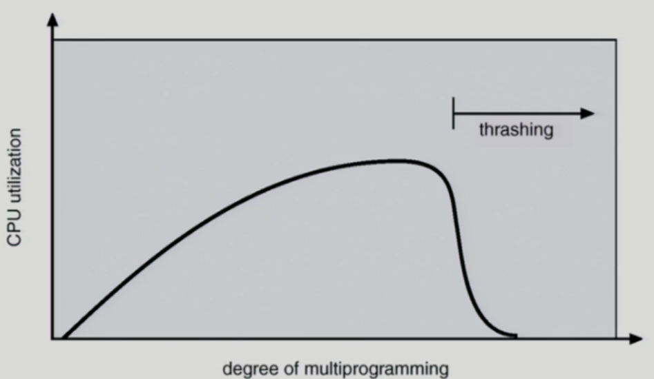

- [9. 가상 메모리](#9-------)
  * [9.1 Demand Paging](#91-demand-paging)
    + [9.1.1 Page Fault](#911-page-fault)
      - [9.1.1.1 Performance of Demand Paging](#9111-performance-of-demand-paging)
    + [9.1.2 Free frame이 없는 경우](#912-free-frame-------)
  * [9.2 Replacement Algorithm](#92-replacement-algorithm)
    + [9.2.1 FIFO Algorithm](#921-fifo-algorithm)
    + [9.2.2 LRU(Least Recently Used) Algorithm](#922-lru-least-recently-used--algorithm)
    + [9.2.3 LFU(Least Frequently Used) Algorithm](#923-lfu-least-frequently-used--algorithm)
    + [9.2.4 LRU와 LFU 알고리즘 예제](#924-lru--lfu--------)
    + [9.2.5 LRU와 LFU 알고리즘의 구현](#925-lru--lfu---------)
    + [9.2.6 다양한 캐슁 환경](#926----------)
    + [9.2.7 Clock Algorithm](#927-clock-algorithm)
  * [9.3 Page Frame의 Allocation](#93-page-frame--allocation)
    + [9.3.1 Global vs Local Replacement](#931-global-vs-local-replacement)
  * [9.4 Thrashing](#94-thrashing)
    + [9.4.1 Thrashing Diagram](#941-thrashing-diagram)
    + [9.4.2 Thrashing 방지 Algorithm](#942-thrashing----algorithm)
      - [9.4.2.1 Working-Set Model](#9421-working-set-model)
      - [9.4.2.2 Working-Set Algorithm](#9422-working-set-algorithm)
      - [9.4.2.3 PFF(Page-Fault Frequency) Scheme](#9423-pff-page-fault-frequency--scheme)
  * [9.5 Page Size의 결정](#95-page-size----)

# 9. 가상 메모리

## 9.1 Demand Paging

- 실제로 필요할 때 page를 메모리에 올리는 것
  - I/O 양의 감소
  - Memory 사용량 감소
  - 빠른 응답 시간
  - 더 많은 사용자 수용
- Valid / Invalid bit의 사용
  - Invalid의 의미
    - 사용되지 않는 주소 영역인 경우
    - 페이지가 물리적 메모리에 없는 경우
  - 처음에는 모든 page entry가 invalid로 초기화
  - address translation 시에 invalid bit이 set되어 있으면
    - "page fault"

### 9.1.1 Page Fault

- invalid page를 접근하면 MMU가 trap을 발생시킴 (page fault trap)
- Kernel mode로 들어가서 page fault handler가 invoke됨(실행됨)
- 다음과 같은 순서로 page fault를 처리한다
  - Invalid reference? (ex. bad address, protection violation) -> abort process
  - Get an empty page frame (없으면 뺏어온다: replace)
  - 해당 페이지를 disk에서 memory로 읽어온다
    - disk I/O가 끝나기까지 이 프로세스는 CPU를 preempt 당함 (block)
    - Disk read가 끝나면 page tables entry 기록, valid/invalid bit = "valid"
    - ready queue에 process를 insert -> dispatch later
  - 이 프로세스가 CPU를 잡고 다시 running
  - 아까 중단되었던 instruction을 재개

#### 9.1.1.1 Performance of Demand Paging

- Page Fault Rate 0 <= p <= 1.0
  - if p = 0 no page faults
  - if p = 1, every reference is a fault
- Effective Access Time
  - 

### 9.1.2 Free frame이 없는 경우

- Page replacement
  - 
  - 어떤 frame을 빼앗아올지 결정해야 함
  - 곧바로 사용되지 않을 page를 쫒아내는 것이 좋음
  - 동일한 페이지가 여러 번 메모리에서 쫓겨났다가 다시 들어올 수 있음
- Replacement Algorithm
  - page-fault rate을 최소화하는 것이 목표 (0에 가깝도록)
  - 알고리즘의 평가
    - 주어진 page reference string에 대해 page fault를 얼마나 내는지 조사
  - reference string의 예
    - 1, 2, 3, 4, 1, 2, 5, 1, 2, 3, 4, 5.
- Optimal Algorithm
  - MIN (OPT): 가장 먼 미래에 참조되는 page를 replace
  - 4 frames example
  - 
    - 5번 frame을 처음 참조할 때 1,2,3,4중에 4번 frame이 제일 마지막으로 참조될 것이기 때문에 4자리에 5를 넣는다.
  - 미래의 참조를 어떻게 아는가?
    - Offline algorithm
    - 미래에 참조될 페이지들(page reference string)을 전부 다 안다고 가정
  - 다른 알고리즘의 성는에 대한 upper bound 제공
    - 이것보다 더 최적화 될 수는 없다. (기준점을 제공)
    - Belady's optimal algorithm, MIN, OPT 등으로 불림

## 9.2 Replacement Algorithm

### 9.2.1 FIFO Algorithm

- FIFO: 먼저 들어온 것을 먼저 내쫓음

- FIFO Anomaly (Belady's Anomaly)
  - more frames -> less page faults
  - 메모리를 늘려도(3 page frames -> 4 page frames) 성능이 더 떨어질  수 있다.

### 9.2.2 LRU(Least Recently Used) Algorithm

- LRU: 가장 오래 전에 참조된 것을 지움

### 9.2.3 LFU(Least Frequently Used) Algorithm

- LFU: 참조 횟수(reference count)가 가장 적은 페이지를 지움
  - 최저 참조 횟수인 page가 여럿 있는 경우
    - LFU 알고리즘 자체에서는 여러 page 중 임의로 선정한다
    - 성능 향샹을 위해 가장 오래 전에 참조됨 page를 지우게 구현할 수도 있다.
  - 장단점
    - LRU처럼 직전 참조 시점만 보는 것이 아니라 장기적인 시간 규모를 보기 때문에 page의 인기도를 좀 더 정확히 반영할 수 있음
    - 참조 시점의 최근성을 반영하지 못함
    - LRU보다 구현이 복잡함

### 9.2.4 LRU와 LFU 알고리즘 예제

### 9.2.5 LRU와 LFU 알고리즘의 구현

- LRU
  - linked list를 이용해 가장 최근에 사용된 페이지를 앞으로 보내고 내보낼 대는 제일 뒤에있는 것을 내보낸다.
- LFU
  - 힙(2진트리)을 이용해서 자식 둘보다 참조횟수가 더 많으면 자식과 자리를 바꿈
  - 내보낼 때는 루트를 쫒아내고 힙을 재구성한다

### 9.2.6 다양한 캐슁 환경

- 캐슁 기법
  - 한전된 빠른 공간(=캐쉬)에 요청된 데이터를 저장해 두었다가 후속 요청시 캐쉬로부터 직접 서비스하는 방식
  - paging system 외에도 cache memory, buffer caching, web caching등 다양한 분야에서 사용
- 캐쉬 운영의 시간 제약
  - 교체 알고리즘에서 삭제할 항목을 결정하는 일에 지나치게 많은 시간이 걸리는 경우 실제 시스템에서 사용할 수 없음
  - Buffer caching이나 web caching의 경우
    - O(1)에서 O(log n)정도 까지 허용
  - **Paging system인 경우**
    - page fault인 경우에만 OS가 관여함
    - 페이지가 이미 메모리에 존재하는 경우 참조시각 등의 정보를 OS가 알 수 없음
      - 하드웨어적으로 바로 접근하기 때문에
    - O(1)인 LRU의 list 조작조차 불가능
    - 따라서 Pagin system인 경우 LRU, LFU알고리즘을 사용할 수 없다.

### 9.2.7 Clock Algorithm

- Clock algorithm
  - LRU의 근사(approximation) 알고리즘
  - 여러 명칭으로 불림
    - Second chance algorithm
    - NUR (Not Used Recently) 또는 NRU (Not Recently Used)
  - Reference bit을 사용해서 교체 대상 페이지 선정 (circular list)
  - reference bit가 0인 것을 찾을 때까지 포인터를 하나씩 앞으로 이동
  - 포인터 이동하는 중에 reference bit 1은 모두 0으로 바꿈
  - Reference bit이 0인 것을 찾으면 그 페이지를 교체
  - 한 바퀴 되돌아와서도(=second chance) 0이면 그때에는 replace 당함
  - 자주 사용되는 페이지라면 second chance가 올 때 1
- Clock algorithm의 개선
  - reference bit(access bit)과 modified bit (dirty bit)을 함께 사용
  - reference bit = 1: 최근에 참조된 페이지 (읽기또는 쓰기가 발생했을 때)
  - modified bit = 1: 최근에 변경된 페이지 (I/O를 동반하는 페이지) (쓰기가 발생했을 때)
    - 쫒겨날 때 수정된내용을 디스크에 써주고 보냄

## 9.3 Page Frame의 Allocation

- Allocation problem: 각 process에 전체 메모리에서 얼마만큼의 page frame을 할당할 것인가?
- Allocation의 필요성
  - 메모리 참조 명령어 수행시 명령어, 데이터 등 여러 페이지 동시 참조
    - 명령어 수행을 위해 최소한 할당되어야 하는 frame의 수가 있음
  - Loop를 구성하는 page들은 한꺼번에 allocate 되는 것이 유리함
    - 최소한의 allocation이 없으면 매 loop 마다 page fault
- Allocation Scheme
  - Equal allocation: 모든 프로세스에 똑 같은 갯수 할당
  - Proportional allocation: 프로세스 크기에 비례하여 할당
  - Priority allocation: 프로세스의 priority에 따라 다르게 할당

### 9.3.1 Global vs Local Replacement

- Global replacement
  - 따로 프로세스별로 메모리를 할당하지 않는다. (알아서 조절됨)
  - 메모리를 많이사용하는 프로세스에게 페이지가 많이할당됨
  - 특정 프로그램이 메모리를 독식할 수 있음 (단점)
  - Replace 시 다른 process에 할당된 frame을 빼앗아 올 수 있다.
  - Process별 할당량을 조절하는 또 다른 방법임
  - FIFO, LRU, LFU 등의 알고리즘을 global replacement로 사용시에 해당
  - Working set, PFF 알고리즘 사용
- Local replacement
  - 프로세스마다 메모리를 할당
  - 자신에게 할당된 frame 내에서만 replacement
  - FIFO, LRU, LFU 등의 알고리즘을 process 별로 운영시

## 9.4 Thrashing 

- 프로세스의 원할한 수행에 필요한 최소한의 page frame 수를 할당 받지 못한 경우 발생
- Page fault rate이 매우 높아짐
- CPU utilization이 낮아짐
- OS는 MPD (Multiprogramming degree)를 높여야 한다고 판단
- 또 다른 프로세스가 시스템에 추가됨 (higher MPD)
- 프로세스 당 할당된 frame의 수가 더욱 감소
- 프로세스는 page의 swap in / swap out으로 매우 바쁨
- 대부분의 시간에 CPU는 한가함
- low throughput
- Thrashing을 막는 방법
  - 프로그램한테 필요한 최소한의 메모리는 보장을 해주어야 겠다.(Working-Set Model)

### 9.4.1 Thrashing Diagram

- x축 : 실행되고있는 프로그램의 수
- y축: CPU 이용률
- 실행중인 프로그램 수가 적을때는 
  - I/O작업을 하러가면 CPU가 놀게됨 따라서 CPU이용률이 낮다
- 갑자기 뚝 떨어짐 (Thrashing)
  - 각각의 프로그램이 메모리를 너무 조금씩 가지고있기 때문에 
  - page fault가 계속 남

### 9.4.2 Thrashing 방지 Algorithm

#### 9.4.2.1 Working-Set Model

- Locality of reference
  - 프로세스는 특정 시간 동안 일정 장소만을 집중적으로 참조한다.
  - 집중적으로 참조되는 해당 page들의 집합을 locality set이라 함
- Working-set Model
  - Locality에 기반하여 프로세스가 일정 시간 동안 원활하게 수행되기 위해 한꺼번에 메모리에 올라와 있어야 하는 page들의 집합을 Working Set이라 정의함
  - Working Set 모델에서는 process의 working set 전체가 메모리에 몰라와 있어야 수행되고 그렇지 않을 경우 모든 frame을 반납한 후 swap out(suspend)
  - Thrashing을 방지함
  - Multiprogramming degree를 결정함

#### 9.4.2.2 Working-Set Algorithm

- Working set의 결정
  - Working set window를 통해 알아냄
  - 

- 현재 시점에서 과거 10개(델타크기)가 working set이라고 생각함
- working set의 크기만큼 메모리를 받을 수 있을 때만 메모리를 얻음 (Trashing 방지)
- Global replacement의 할당개념도 들어가 있음

#### 9.4.2.3 PFF(Page-Fault Frequency) Scheme

- frame을 많이 할당해주면 page-fault가 줄어든다.
- page-fault rate의 상한값과 하한값을 둔다
  - Page fault rate이 상한값을 넘으면 frame을 더 할당한다
  - Page fault rate이 하한값 이하면 할당 frame 수를 줄인다
- 빈 frame이 없으면 일부 프로세스를 swap out
  - 상한선 안으로 들어올 정도로 frame을 얻지 못 하면 가진 메모리를 전부 내놓고 swap out (Trashing 방지)

## 9.5 Page Size의 결정

- 32bit 메모리 주소체계를 쓰는 전통적인 시스템에서는 보통 페이지 사이즈를 4KB를 사용
- 점점 메모리크기가 커지고 프로그램 크기도 커지고 64bit 주소체계를 사용함에 따라
  - 페이지크기가 커지는 추세로 가게 됨

- Page size를 감소시키면
  - 페이지 수 증가
  - 페이지 테이블 크기 증가
  - Internal fragmentation 감소
    - 내부조각이 줄어듬 (메모리를 효율적으로 사용)
  - Disk transfer의 효율성 감소
    - Seek/rotation vs transfer
    - 페이지사이즈가 작아서 조금사용하다가 다음 페이지를 또 읽어와야함
  - 필요한 정보만 메모리에 올라와 메모리 이용이 효율적
    - Locality의 활용 측면에서는 좋지 않음
    - Locality: 인접한 그다음 위치가 사용될 가능성이 높음
- Trend
  - Lager page size

>참고
>http://www.kocw.net/home/cview.do?cid=4b9cd4c7178db077
