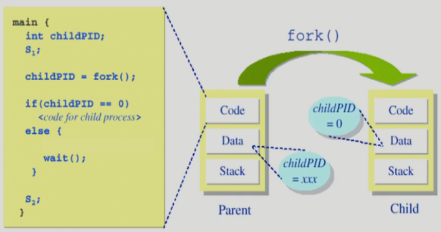

# 1. Process

- "Process is **a program in execution**"

- 프로세서의 문맥(context)

  >이 프로세서스가 어디까지 와있는가?
  >현재 시점에 프로세스의 문맥을 나타내기위한 요소
  >프로세스 문맥이 중요한 이유
  > 멀티태스킹중에 여러 작업들을 수행하면서 이러한 문맥들에대한 정보를 알고 있지 않으면 작업이 꼬일 수 가 있다.

  - CPU 수행 상태를 나타내는 하드웨어 문맥
    - Program Counter
    - 각종 register
  - 프로세스의 주소 공간
    - code, data, stack
  - 프로세스 관련 커널 자료 구조
    - PCB (Process Control Block)
    - Kernel stack
  - 

- 프로세스는 상태(state)가 변경되며 수행된다.

  - Running
    - CPU를 잡고 instruction을 수행중인 상태
  - Ready
    - CPU를 기다리는 상태(메모리 등 다른 조건을 모두 만족하는 상태)
  - Blocked (wait, sleep)
    - CPU를 주어도 당장 instruction을 수행할 수 없는 상태
    - Process 자신이 요청한 event(예: I/O)가 즉시 만족되지 않아 이를 기다리는 상태
    - 예) 디스크에서 file을 읽어와야 하는 경우
  - Suspended (stopped) **(중기스케줄러, 사용자 등에의해 생긴 상태)**
    - 외부적인 이유로 프로세스의 수행이 정지된 상태
    - 프로세스는 통째로 디스크에 swap out 된다.
    - (예) 사용자가 프로그램을 일시 정지시킨 경우 (break key)
      - 시스템이 여러 이유로 프로세스를 잠시 중단시킴 (메모리에 너무 많은 프로세스가 올라와 있을 때)
    - Blocked: 자신이 요청한 event가 만족되면 Ready
    - Suspended: 외부에서 resume해 주어야 Active
  - New: 프로세스가 생성중인 상태
  - Terminated: 수행(execution)이 끝난 상태, 중료 중인 상태
  - 

  > 운영체제 커널이 본인의 데이터영역에 자료구조로 큐를 만들어 놓고 프로세스상태를 바꿔가면서 Ready상태의 프로세스에게 CPU를 주고 Blocked에게는 주지 않고 등 관리를 한다.

- PCB

  - 운영체제가 각 프로세스를 관리하기 위해 프로세스당 유지하는 정보
  - 다음의 구성 요소를 가진다. (구조체로 유지)
    - (1) OS가 관리상 사용하는 정보
      - Proces state, Process ID
      - scheduling information, priority
    - (2) CPU 수행 관련 하드웨어 값
      - Program counter, registers
    - (3) 메모리 관련
      - Code, data, stack의 위치 정보
    - (4) 파일 관련
      - Open file descriptors...
  - 

- **문맥 교환 (Context Switch)**

  > 프로세스1에서 프로세스2로 CPU를 넘겨줄 때 다음에 다시 CPU를 얻었을 때 현재 문맥부터 실행되기 위해 레지스터에 저장되어 있던 값, 프로그램 카운터, 메모리 맵 등을 프로그램1의 PCB에 저장해 놓는다.
  >
  > 프로세스2(새로 CPU를 얻은 프로세스)는 해당 PCB를 찾아서 CPU에게 넘겨준다. 

  - CPU를 한 프로세스에서 다른 프로세스로 넘겨주는 과정
  - CPU가 다른 프로세스에게 넘어갈 때 운영체제는 다음을 수행
    - CPU를 내어주는 프로세스의 상태를 그 프로세스의 PCB에 저장
    - CPU를 새롭게 얻는 프로세스의 상태를 PCB에서 읽어옴
  - 
  - System call(프로세스가 본인이 필요해서 운영체제에게 제어권을 넘김)이나 Interrupt 발생시 반드시 context switch가 일어나는 것은 아님
    - 
      - (1)의 경우에도 CPU 수행 정보 등 context의 일부를 PCB에 save해야 하지만 문맥교환을 하는 (2)의 경우 그 부담이 훨씬 큼 (eg. cache memory flush(캐시메모리를 다 지워야함))

- 프로세스를 스케줄링하기 위한 큐
  - Job queue
    - 현재 시스템 내에 있는 모든 프로세스의 집합
  - Ready queue
    - 현재 메모리 내에 있으면서 CPU를 잡아서 실행되기를 기다리는 프로세서의 집합
  - Device queues
    - I/O device의 처리를 기다리는 프로세스의 집합
  - 프로세스들은 각 큐들을 오가며 수행된다.
  - 

- 스케쥴러 (Scheduler)

  - Long-term scheduler (장기 스케줄러 or job scheduler)
    - 시작 프로세스 중 어떤 것들을 ready queue로 보낼지 결정
    - 프로세스에 memory(및 각종 자원)을 주는 문제
    - degree of Multiprogramming(메모리에 할당되어 있는 프로세스 수)을 제어
    - time sharing system에는 보통 장기 스케줄러가 없음 (무조건 ready)
  - Short-term scheduler (단기 스케줄러 or CPU scheduler)
    - 어떤 프로세스를 다음번에 running시킬지 결정
    - 프로세스에 CPU를 주는 문제
    - 충분히 빨라야 함(millisecond 단위)
  - Medium-Term Scheduler (중기 스케줄러 or Swapper)
    - 여유 공간 마련을 위해 프로세스를 통째로 메모리에서 디스크로 쫓아냄
    - 프로세스에게서 memory를 뺏는 문제
    - degree of Multiprogramming을 제어

  > 지금의 스케줄러는 장기 스케줄러가 없시 일단 메모리에 다 올려놓고 너무 많으면 중기 스케줄러가 몇개를 쫒아냄

> - 여기서 나타내는 상태는 각각의 프로세스의 상태이지 OS 커널의 상태를 나타내는 것이 아니다.
>   - Running(monitor mode): 어떤 프로세스가 운영체제에게 어떠한 일을 요청해서 운영체제가 해당 일을 하고 있는 상태 (이 프로세스가 커널모드에서의 Running이다.)
>
> - 프로세스가 I/O요청을 하고 Suspended Blocked 당했을시 I/O요청이 완료되면 Suspended Ready 상태로 대기한다.
> - 프로세스1이 작업중이다가 어떤 I/O 작업이 완료되어 인터럭트가 CPU에게 와서 CPU가 운영체제에게 넘어가면 이 때 프로세스1의 상태는 어떻게 되냐? 
>   - 여전히 프로세스1이 Running 상태라고 한다. (운영체제가 Running이다라는 말은 쓰지않는다.)
> - Disk I/O는 하드웨어 interrupt인가 소프트웨어 interrupt인가?
>   - 둘다. I/O요청을 할때는 운영체제에게 시스템 콜을해서 CPU가 디스크 컨트롤러에게 I/O요청을 한다.(소프트웨어 interrupt) / I/O가 다 끝나면 디스크 컨트롤러가 CPU에게 interrupt를 건다.(하드웨어 interrupt)

- 프로세스 생성

  - 부모 프로세스(Parent process)가 자식 프로세스(children process)생성(복제생성)

  > 부모 프로세스가 운영체제에게 자식프로세스를 만들어 달라는 시스템 콜(fork)를 한다.

  - 프로세스의 트리(계층 구조) 형성
  - 프로세스는 자원을 필요로 함
    - 운영체제로부터 받는다
    - 부모와 약간의 자원을 공유한다.
  - 자원의 공유
    - 부모와 자식이 모든 자원을 공유하는 모델
    - 일부를 공유하는 모델
    - 전혀 공유하지 않는 모델
  - 수행 (Executiuon)
    - 부모와 자식은 공존하며 독립적으로 수행되는 모델
    - 자식이 종료(terminate)될 때까지 부모가 기다리는(wait) 모델
  - 주소 공간 (Address space)
    - 자식은 부모의 공간을 복사함 (binary and OS data)
    - 자식은 그 공간에 새로운 프로그램을 올림
  - 유닉스의 예
    - **fork()** 시스템 콜이 새로운 프로세스를 생성
      - 부모를 그대로 복사 (OS data except PID + binary)
      - 주소 공간 할당
    - fork 다음에 이어디는 **exec()** 시스템 콜을 통해 새로운 프로그램을 메모리에 올림

- 프로세스 종료

  > 프로세스의 세계에서는 자식이 먼저 죽고 부모가 뒤처리를 함

  - 프로세스가 마지막 명령을 수행한 후 운영체제에게 이를 알려줌 (**exit**이라는 시스템 콜)
    - 자식이 부모에게 output data를 보냄 (via **wait**)
    - 프로세스의 각종 자원들이 운영체제에게 반납됨
  - 부모 프로세스가 자식의 수행을 종료시킴 (**abort**)
    - 자식이 할당 자원의 한계치를 넘어섬
    - 자식에게 할당된 태스크가 더 이상 필요하지 않음
    - 부모가 종료(exit)하는 경우
      - 운영체제는 부모 프로세스가 종료하는 경우 자식이 더 이상 수행되도록 두지 않는다
      - 제일 밑의 자손들 부터 단계적인 종료

- fork() 시스템 콜

  - 운영체제에게 자식을 만들어 달라는 요청
  - A process is created by the fork() system call
    - creates a new address space that is a duplicate of the caller
  - 
    - 부모와 완전히 똑같은 코드를 복사
    - 자식도 부모의 문맥을 그대로 이어받아 fork() 다음 부터 실행된다.
    - 부모는 fork()의 return값으로 자식의 pid값을 받는다.(양수)
    - 자식은 fork()의 return값으로 0 을 받는다.
      - 이것으로 부모와 자식을 분류

- exec() 시스템 콜

  - A process can execute a different program by the exec() system call
    - replaces the memory image of the caller with a new program
  - 
    - execlp()가 실행된 이후에는 완전히 새로운 프로그램으로 덮어씌워 진다.
  
- wait() 시스템 콜

  - 
  - 프로세스1이 fork() 이후에 wait() 시스템 콜을 호출하면
    - 커널은 child가 종료될 때까지 프로세스1을 sleep시킨다 (block 상태)
    - Child process가 종료되면 커널은 프로세스1을 깨운다 (ready 상태)

- exit() 시스템 콜

  - 프로세스의 종료
    - 자발적 종료
      - 마지막 statement 수행 후 exit() 시스템 콜을 통해
      - 프로그램에 명시적으로 적어주지 않아도 main 함수가 리턴되는 위치에 컴파일러가 넣어줌
    - 비자발적 종료
      - 부모 프로세스가 자식 프로세스를 강제 종료시킴
        - 자식 프로세스가 한계치를 넘어서는 자원 요청
        - 자식에게 할당된 태스크가 더 이상 필요하지 않음
      - 키보드로 kill, break 등을 친 경우
      - 부모가 종료하는 경우
        - 부모 프로세스가 종료하기 전에 자식들이 먼저 종료됨
    - 모든 자원을 반납하고 부모에게 종료를 알림

- 프로세스 간 협력

  - 독립적 프로세스 (Independent process) (원칙적으로 독립)
    - 프로세스는 각자의 주소 공간을 가지고 수행되므로 원칙적으로 하나의 프로세스는 다른 프로세스의 수행에 영향을 미치지 못함
  - 협력 프로세스(Cooperating process) (경우에 따라서 협력도 한다)
    - 프로세스 협력 메커니즘을 통해 하나의 프로세스가 다른 프로세스의 수행에 영향을 미칠 수 있음
  - 프로세스 간 협력 메커니즘(IPC: interprocess Communication)
    - 메시지를 전달하는 방법
      - message passing: 커널을 통해 메시지 전달
    - 주소 공간을 공유하는 방법
      - shared memory: 서로 다른 프로세스 간에도 일부 주소 공간을 공유하게 하는 shared memory 메커니즘이 있음
      - thread: thread는 사실상 하나의 프로세스이므로 프로세스 간 협력으로 보기는 어렵지만 동일한 process를 구성하는 thread들 간에는 주소 공간을 공유하므로 협력이 가능
    - 
    - 

> 참고
> http://www.kocw.net/home/cview.do?cid=4b9cd4c7178db077
