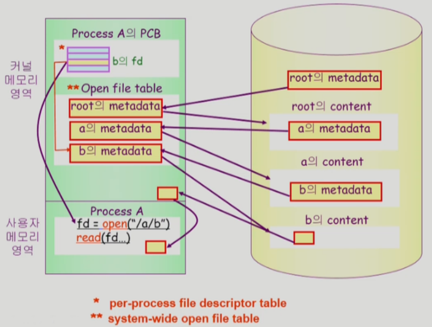
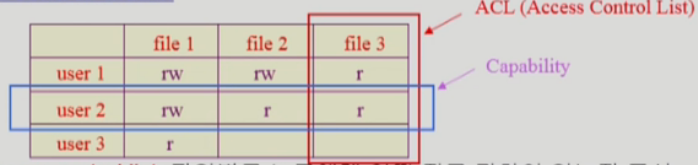
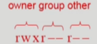
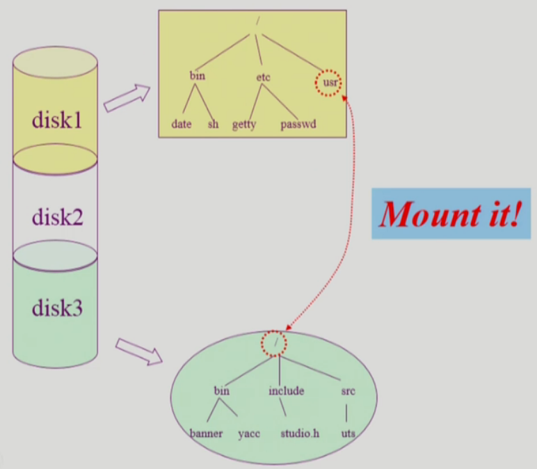
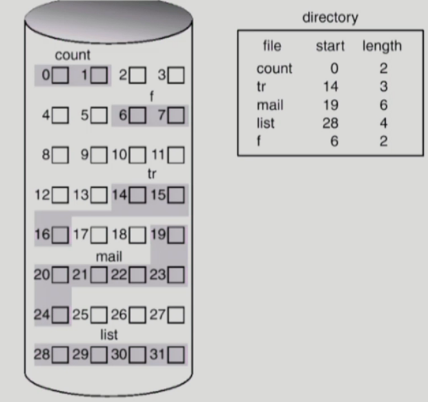
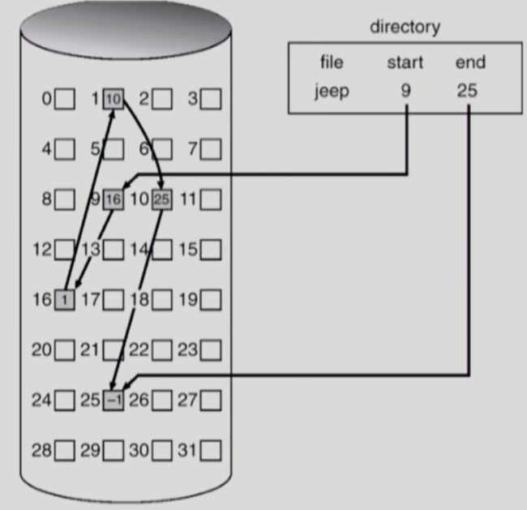
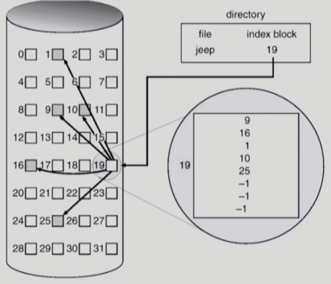

[TOC]

# 10. File System

## 10.1 File and File System

- File
  - "A named collection of related information"
  - 일반적으로 비휘발성의 보조기억장치에 저장
  - 운영체제는 다양한 저장 장치를 file이라는 동일한 논리적 단위로 볼 수 있게 해 줌
  - Operation
    - create, read, write, reposition (lseek), delete, open, close 등
- File attribute (혹은 파일의 metadata)
  - 파일 자체의 내용이 아니라 파일을 관리하기 위한 각종 정보들
    - 파일 이름, 유형, 저장된 위치, 파일 사이즈
    - 접근 권한 (읽기/쓰기/실행), 시간 (생성/병경/사용), 소유자 등
- File System
  - 운영체제에서 파일을 관리하는 부분
  - 파일 및 파일의 메타데이터, 디렉토리 정보 등을 관리
  - 파일의 저장 방법 결정
  - 파일 보호 등

### 10.1.1 open()

- open("/a/b/c")
  - 
  - 디스크로부터 파일 c의 메타데이터를 메모리로 가지고 옴
  - 이를 위하여 directory path를 search
    - 루트 디렉토리 "/"를 open하고 그 안에서 파일 "a"의 위치 획득
    - 파일 "a"를 open한 후 read하여 그 안에서 파일 "b"의 위치 획득
    - 파일 "b"를 open한 후 read하여 그 안에서 파일 "c"의 위치 획득
    - 파일 "c"를 open한다
  - Directory path의 search에 너무 많은 시간 소요
    - Open을 read / write와 별도로 두는 이유임
    - 한번 open한 파일은 read / write 시 directory search 불필요
  - Open file table
    - 현재 open 된 파일들의 메타데이터 보관소 (in memory)
    - 디스크의 메타데이터보다 몇 가지 정보가 추가
      - Open한 프로세스의 수
      - File offset: 파일 어느 위치 접근 중인지 표시 (별도 테이블 필요)
  - File descriptor (file handle, file control block) (fd)
    - Open file table에 대한 위치 정보 (프로세스 별)

## 10.2 Directory and Logical Disk

- Directory
  - 파일의 메타데이터 중 일부를 보관하고 있는 일종의 특별한 파일
  - 그 디렉토리에 속한 파일 이름 및 파일 attribute들
  - operation
    - search for a file, create a file, delete a file
    - list a directory, rename a file, traverse the file system
- Partition (=Logical Disk)
  - 하나의 (물리적)디스크 안에 여러 파티션을 두는게 일반적
  - 여러 개의 물리적인 디스크를 하나의 파티션으로 구성하기도 함
  - (물리적) 디스크를 파티션으로 구성한 뒤 각각의 파티션에 **file system**을 깔거나 **swapping** 등 다른 용도로 사용할 수 있음

## 10.3 File Protection

- 각 파일에 대해 누구에게 어떤 유형의 접근(read/write/execution)을 허락할 것인가?
- Access Control 방법
  - Access control Matrix
    - 
    - 행렬에의한 공간낭비를 줄이기위해 linked list 활용
      - Access control list: 파일별로 누구에게 어떤 접근 권한이 있는지 표시 
      - Capability: 사용자별로 자신이 접근 권한을 가진 파일 및 해당 권한 표시
  - Grouping
    - 전체 user를 owner, group, public의 세 그룹으로 구분
    - 각 파일에 대해 세 그룹의 접근 권한(rwx)을 3비트씩으로 표시
    - 예) UNIX 
  - Password
    - 파일마다 password를 두는 방법 (디렉토리 파일에 두는 방법도 가능)
    - 모든 접근 권한에 대해 하나의  password: all-or-nothing
    - 접근 권한별 password: 암기 문제, 관리 문제

## 10.4 File System의 Mounting

- 다른 파티션에 설치된 파일 시스템에 접근해야 한다면?
- 

## 10.5 Access Methods

- 시스템이 제공하는 파일 정보의 접근 방식
  - 순차 접근 (sequential access)
    - 카스트 테이프를 사용하는 방식처럼 접근
    - 읽거나 쓰면 offset은 자동적으로 증가
  - 직접 접근 (direct access, random access)
    - LP 레코드 판과 같이 접근하도록 함
    - 파일을 구성하는 레코드를 임의의 순서로 접근할 수 있음
    - 직접 접근이가능한 매체라하더라도 데이터를 어떻게 관리하냐에따라서 순차접근만 허용하는 경우도 있고 직접 접근이 가능한 경우도 있다.

## 10.6 Allocation of File Data in Disk

### 10.6.1 Contiguous Allocation

- 단점
  - external fragmentation (외부조각)
    - 파일들 사이의 작은 조각들
  - File grow가 어려움
    - fiie 생성시 얼마나 큰 hole을 배당할 것인가?
    - grow 가능 vs 낭비 (internal fragmentation)
- 장점
  - Fast I/O
    - 한번의 seek/rotation으로 많은 바이트 transfer
    - Realtime file 용으로, 또는 이미 run 중이던 process의 swapping 용
  - Direct access (=random access) 가능

### 10.6.2 Linked Allocation

- 장점
  - External fragmentation 발생 안 함
- 단점
  - No random access
    - 순차접근만 가능
  - Reliability(신뢰성) 문제
    - 한 sector가 고장나 pointer가 유실되면 많은 부분을 잃음
  - Pointer를 위한 공간이 block의 일부가 되어 공간 효율성을 떨어뜨림
    - 512 bytes/sector, 4 bytes/pointer
- 변형
  - File-allocation table (FAT) 파일 시스템
    - 포인터를 별도의 위치에 보관하여 reliability와 공간효율성 문제 해결

### 10.6.3 Indexed Allocation

- 장점
  - External fragmentation이 발생하지 않음
  - Direct access 가능
- 단점
  - Small file의 경우 공간 낭비 (실제로 많은 file들이 small)
  - Too Large file의 경우 하나의 block으로 index를 저장하기에 부족
    - 해결방안
      - linked scheme
      - multi-level index

>참고
>http://www.kocw.net/home/cview.do?cid=4b9cd4c7178db077
