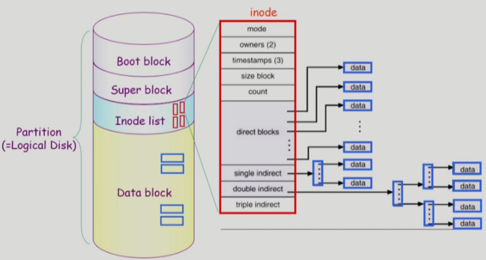
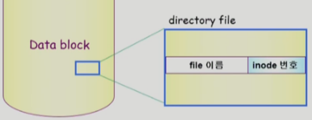
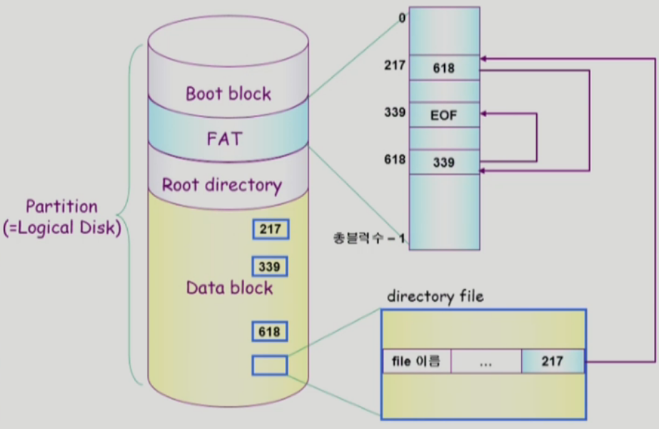
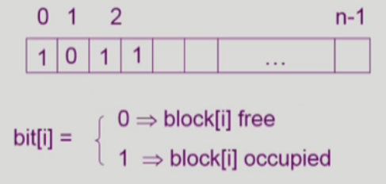
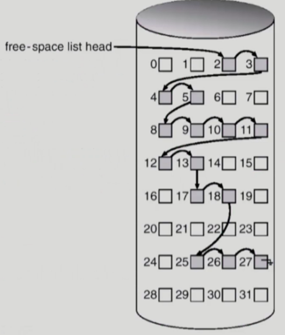
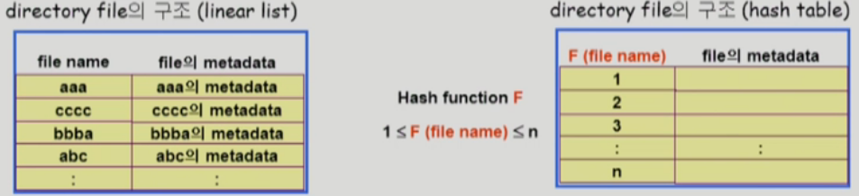
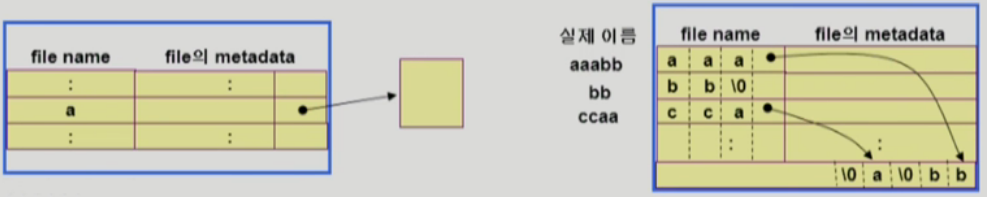
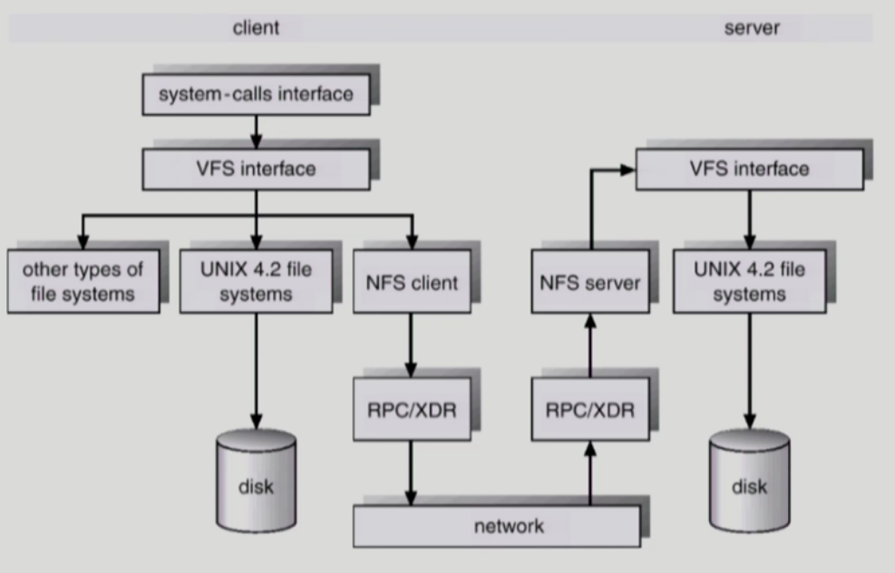
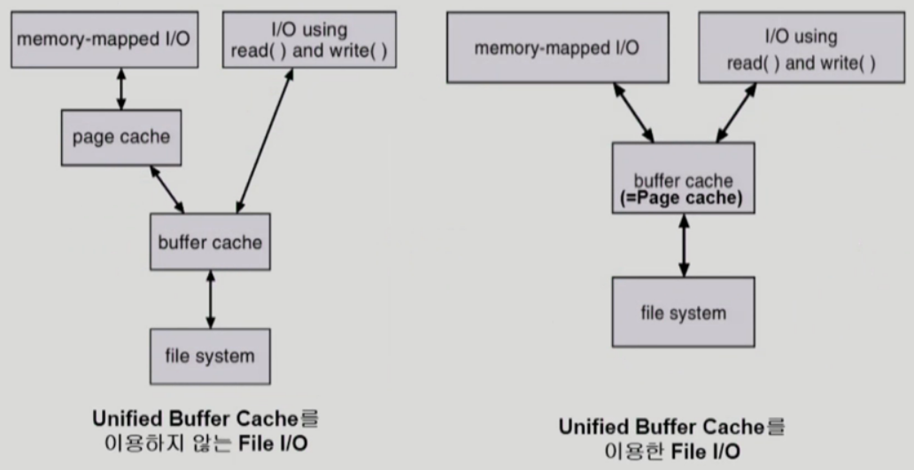

# 11. File System 2

## 11.1 UNIX 파일시스템의 구조

- 유닉스 파일 시스템의 중요 개념
  - Boot block
    - 부팅에 필요한 정보 (bootstrap loader)
  - Superblock
    - 파일 시스템에 관한 총체적인 정보를 담고 있다.
  - Inode list
    - 파일 이름을 제외한 파일의 모든 메타 데이터를 저장
    - 파일 하나당 하나의 inode를 가진다.
    - inode의 크기는 정해져있다. (=위치정보를 나타내는 포인터의 개수도 유한하다.)
      - 큰 파일을 표현하기 위해 indexed allocation을 사용해서 표현 (single indirect, double indirect ...)
    - 파일의 이름은 directory file이 가지고 있다 (inode 번호와 같이)
  - Data block
    - 파일의 실제 내용을 보관
    - 

## 11.2 FAT 파일시스템의 구조

- Linked allocation의 단점을 극복하여 사용
  - 포인터 공간때문에 block의 공간(512bytes)이 딱 맞아떨어지지 않아 공간낭비 발생하는 문제 해결
    - FAT이라는 별도의 공간을 이용
    - FAT 테이블의 배열의 크기는 data block의 개수
    - 배열의 인덱스에 해당하는 값은 다음 블럭을 가르킨다.
  - 직접 접근이 가능
    - FAT 테이블만 순회하여 해당블럭의 위치를 알 수 있음
    - data block(disk)에서 찾지않고 FAT을 사용하여 빠르게 접근할 수 있음
  - Reliability 문제해결
    - 포인터 하나가 유실되더라도 FAT에 위치정보가 있기때문에 다음 정보들이 유실되지 않음
    - FAT은 중요한 정보이기 때문에 여러카피를 저장해둔다.

## 11.3 Free-Space Management

### 11.3.1 Bit map or bit vector

- Bit map은 부가적인 공간을 필요로 함
- 연속적인 n개의 free block을 찾는데 효과적

### 11.3.2 Linked list

- 모든 free block들을 링크로 연결 (free list)
- 연속적인 가용공간을 찾는 것은 쉽지 않다. (실제로 사용하기 어려움)
- 공간의 낭비가 없다

### 11.3.3 Grouping

- indexed list 방법의 변형
- 첫번째 free block이 n개의 pointer를 가짐
  - n-1 pointer는 free data block을 가리킴
  - 마지막 pointer가 가리키는 block은 또 다시 n pointer를 가짐
- linked list 방법과 마찬가지로 연속적인 빈 블럭을 찾기 어려움

### 11.3.4 Counting

- 프로그램들이 종종 여러 개의 연속적인 block을 할당하고 반납한다는 성질에 착안
- 빈 공간을 가르키는 것 뿐만아니라 몇개가 연속으로 비어있는지에대한 정보도 저장
- 빈 블럭의 첫번째 위치와 그 위치로부터 몇개가 비었는지를 쌍으로 관리
  - (first free block, # of contiguous free blocks)을 유지

## 11.4 Directory Implementation(구현)

- Linear list
  - <file name, file의 matadata>의 list
    - 데이터의 크기를 고정시켜놓는다.
  - 구현이 간단
  - 디렉토리 내에 파일이 있는지 찾기 위해서는 linear search 필요 (time-consuming)
- Hash Table
  - linear list + hashing
  - Hash table은 file name을 이 파일의 linear list의 위치로 바꾸어줌
  - search time을 없앰
  - Collision 발생 가능
    - 서로 다른 파일의 이름에 대해서 결과값이 같은 엔트리로 맵핑되는 문제
    - 문제 해결방법까지는 여기서 설명하지않음

- File의 metadata의 보관 위치
  - 디렉토리 내에 직접 보관
  - 디렉토리에는 포인터를 두고 다른 곳에 보관
    - inode, FAT 등
- Long file name의 지원
  - <file name, file의 metadata>의 list에서 각 entry는 일반적으로 고정크기
  - file name이 고정 크기의 entry 길이보다 길어지는 경우 entry의 마지막 부분에 이름의 뒷부분이 위치한 곳의 포인터를 두는 방법
  - 이름의 나머지 부분은 동일한 directory file의 일부에 존재

## 11.5 VFS and NFS

- Virtual File System (VFS)
  - 서로 다른 다양한 file system에 대해 동일한 시스템 콜 인터페이스(API)를 통해 접근할 수 있게 해주는 OS의 layer
- Network File System (NFS)
  - 분산 시스템에서는 네트워크를 통해 파일이 공유될 수 있음
  - NFS는 분산 환경에서의 대표적인 파일 공유 방법임

## 11.6 Page Cache and Buffer Cache

- Page Cache
  - Virtual memory의 paging system에서 사용하는 page frame을 caching의 관점에서 설명하는 용어
    - swap area / backing storage 보다 빠르다
  - 이미 메모리에 존재하는 데이터(cache hit)에 대해서는 하드웨어적인 주소변환만을 하기때문에(OS가 알수 없다.) clock 알고리즘등을 사용
  - Memory-Mapped I/O를 쓰는 경우 file의 I/O에서도 page cache 사용
- Memory-Mapped I/O
  - File의 일부를 virtual memory에 mapping시킴
  - 매핑시킨 영역에 대한 메모리 접근 연산은 파일의 입출력을 수행하게 함
- Buffer Cache
  - 파일시스템을 통한 I/O연산은 메모리의 특정 영역인 buffer cache 사용
  - File 사용의 locality 활용
    - 한번 읽어온 block에 대한 후속 요청시 buffer cache에서 즉시 전달
  - 모든 프로세스가 공용으로 사용
  - 파일을 접근할 때에는 시스템 콜을 해야하기 때문에 LRU, LFU 등 사용가능
  - Replacement algorithm 필요 (LRU, LFU 등)
- Unified Buffer Cache
  - 최근의 OS에서는 기존의 buffer cache가 page cache에 통합됨

