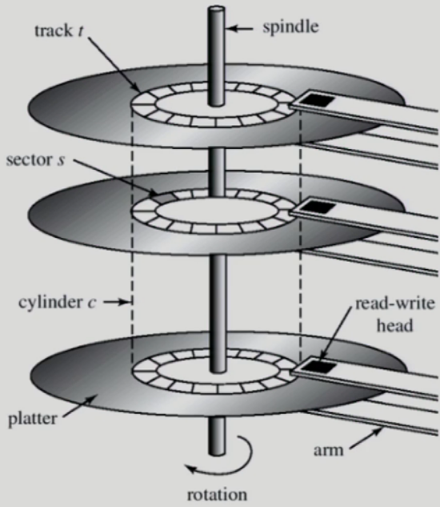
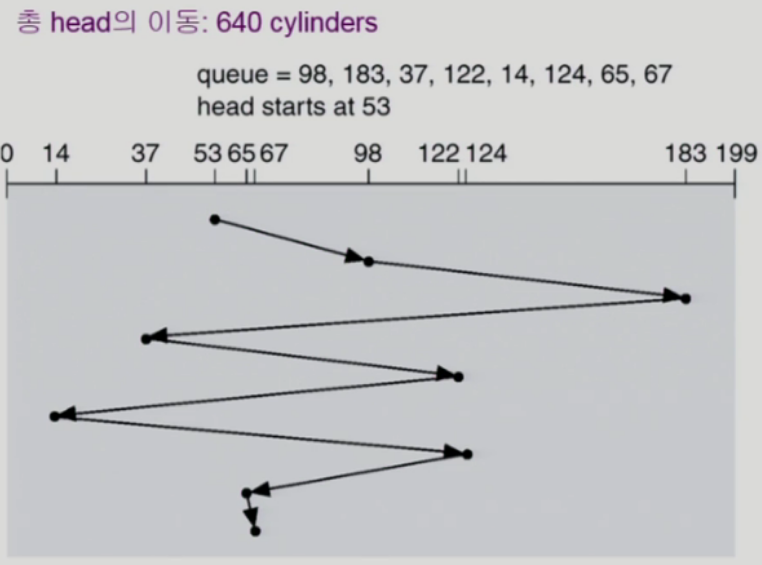
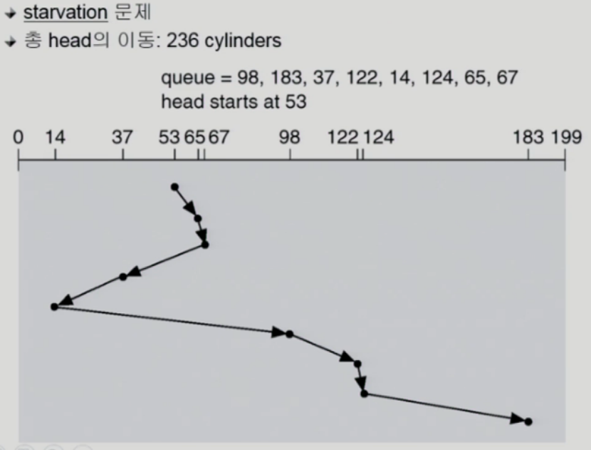
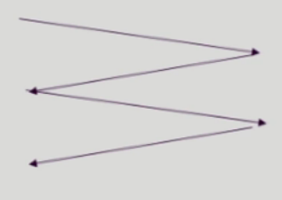
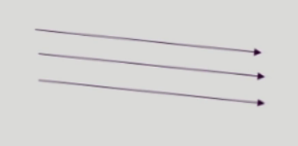
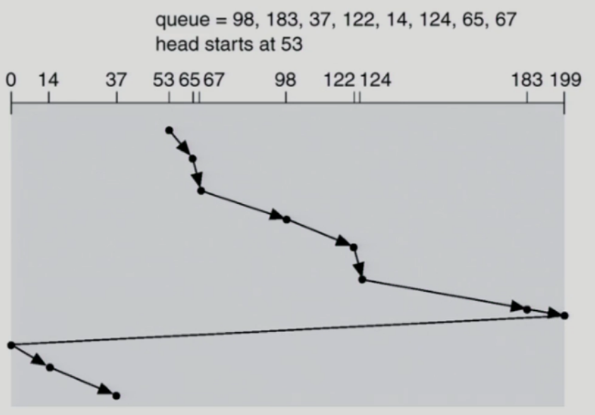
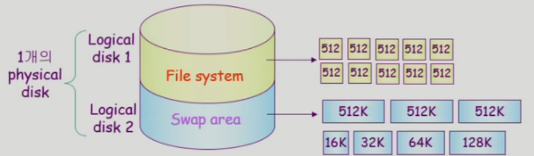
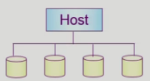

[TOC]

# 12. Disk Management and Scheduling

## 12.1 Disk Scheduling

- Access time의 구성
  - Seek time
    - 헤드를 해당 실린더로 움직이는데 걸리는 시간
    - 데이터를 얻어오는데 걸리는 시간 중 가장 많은 시간을 차지
  - Rotational latency
    - 헤드가 원하는 섹터에 도달하기까지 걸리는 회전지연시간
  - Transfer time
    - 실제 데이터의 전송 시간
- Disk bandwidth
  - 단위 시간 당 전송된 바이트의 수
- Disk Scheduling
  - Seek time을 최소화하는 것이 목표
  - Seek time는 seek distance와 비례

## 12.2 Disk Structure

- logical block

  - 디스크의 외부에서 보는 디스크의 단위 정보 저장 공간들
  - 주소를 가진 1차원 배열처럼 취급
  - 정보를 전송하는 최소 단위

  > 디스크 외부(CPU, memory)에서 디스크의 위치를 이야기 할때 특정원판 특정 트랙 특정 섹터를 이야기하는 것이 아니라 logical block번호를 이용한다.
  >
  > 논리적 주소를 실제 디스크의 물리적 주소로 맵핑하는 것은 디스크안의 컨트롤러가 담당한다.

- Sector

  - Logical block이 물리적인 디스크에 매핑된 위치
  - Sector 0은 최외곽 실린더의 첫 트랙에 있는 첫 번째 섹터이다.

## 12.3 Disk Management

- physical formatting (Low-level formatting)
  - 디스크를 컨트롤러가 읽고 쓸 수 있도록 섹터들로 나누는 과정
  - 각 섹터는 header + 실제 data(보통 512 bytes) + trailer로 구성
  - header와 trailer는 sector number, ECC (Error-Correcting code) 등의 정보가 저장되며 controller가 직접 접근 및 운영
    - ECC: 데이터의 축약본을 저장해놓고 읽을 때 데이터가 손상되었는지를 확인하는데 사용
- Partitioning
  - 디스크를 하나 이상의 실린더 그룹으로 나누는 과정
  - OS는 이것을 독립적 disk로 취급 (logical disk)
- Logical formatting
  - 파일시스템을 만드는(설치하는) 것
  - FAT, inode, free space등의 구조 포함
- Booting
  - ROM에 있는 'small bootstrap loader'의 실행
    - 전원이나가도 내용이유지되는 아주작은 메모리: ROM, 휘발성의 메모리: DRAM,
  - sector 0 (boot block)을 load하여 실행
  - sector 0은 'full Bootstrap loader program'
  - OS를 디스크에서 load하여 실행

## 12.4 Disk Scheduling Algorithm

- 큐에 다음과 같은 실린더 위치의 요청이 존재하는 경우 디스크 헤드 53번에서 시작한 각 알고리즘의 수행 결과는? (실린더 위치는 0-199)
  - 98, 183, 37, 122, 14, 124, 65, 67

### 12.4.1 FCFS (First Come First Served)

- 먼저 들어온 순서대로 처리 (비효율

### 12.4.2 SSTF (Shortest Seek Time First)

- 현재위치에서 Seek time이 가장 짧은(가장 가까운)위치 부터 처리
- starvation 문제
  - 특정 위치가 차별받아서 영원히 서비스가 되지 않을 가능성이 있다.

### 12.4.3 SCAN

- disk arm이 디스크의 한쪽 끝에서 다른쪽 끝으로 이동하며 가는 길목에 있는 모든 요청을 처리한다.
- 다른 한쪽 끝에 도달하면 역방향으로 이동하며 오는 길목에 있는 모든 요청을 처리하며 다시 반대쪽 끝으로 이동한다.
- 문제점: 실린더 위치에 따라 대기 시간이 다르다.
  - 가장자리에 있는 요청은 헤드가 막 지나쳤으면 오래기다려야함
  - 중앙에 있는 요청은 헤드가 막 지나쳤어도 비교적 빨리 돌아온다.

### 12.4.4 C-SCAN

- 헤드가 한쪽 끝에서 다른쪽 끝으로 이동하며 가는 길목에 있는 모든 요청을 처리
- 다른쪽 끝에 도달했으면 요청을 처리하지 않고 곧바로 출발점으로 다시 이동
- SCAN보다 균일한 대기 시간을 제공한다. (형평성을 높임)

### 12.4.5 Other Algorithms

- N-SCAN
  - SCAN의 변형 알고리즘
  - 일단 arm이 한 방향으로 움직이기 시작하면 그 시점 이후에 도착한 job은 되돌아올 때 service
  - 대기시간의 편차를 줄임
  - 가급적 먼저 들어온 요청이 먼저 처리됨
- LOOK and C-LOOK
  - SCAN이나 C-SCAN은 헤드가 디스크 끝에서 끝으로 이동
  - LOOK과 C-LOOK은 헤드가 진행 중이다가 그 방향에 더 이상 기다리는 요청이 없으면 헤드의 이동방향을 즉시 반대로 이동한다.

### 12.4.6 Disk-Scheduling Algorithm의 결정

- SCAN, C-SCAN 및 그 응용 알고리즘은 LOOK, C-LOOK 등이 일반적으로 디스크 입출력이 많은 시스템에서 효율적인 것으로 알려져 있음
- File의 할당 방법에 따라 디스크 요청이 영향을 받음
- 디스크 스케줄링 알고리즘은 필요할 경우(디스크의 파일시스템이나 디스크의 특성에 맞게) 다른 알고리즘으로 쉽게 교체할 수 있도록 OS와 별도의 모듈로 작성되는 것이 바람직하다.

## 12.5 Swap-Space Management

- Disk를 사용한느 두 가지 이유
  - memory의 volatile(휘발성)한 특성 -> file system
    - 전원이 나가더라도 영구적인 내용을 유지 -> file system
  - 프로그램 실행을 위한 memory 공간 부족 -> swap space (swap area)
    - 메모리의 연장공간으로 프로세스의 주소공간을 담는 곳 -> swap space (swap area)
- Swap-space
  - Virtual memory system에서는 디스크를 memory의 연장 공간으로 사용
  - 파일시스템 내부에 둘 수도 있으나 별도 partition 사용이 일반적
    - 공간효율성보다는 속도 효율성이 우선
      - 프로세스가 살아있는 동안에만 의미있는 정보, 전원이 끄면 사라짐
      - 큰 단위로 나눠서 사용 (512K, 128K, 64K ...)
    - 일반 파일보다 훨씬 짧은 시간만 존재하고 자주 참조됨
    - 따라서, block의 크기 및 저장 방식이 일반 파일시스템과 다름

## 12.6 RAID

- RAID (Redundant Array of Independent Disks)
  - 여러 개의 디스크를 묶어서 사용
- RAID의 사용 목적
  - 디스크 처리 속도 향상
    - 여러 디스크에 block의 내용을 분산 저장
    - 병렬적으로 읽어 옴 (interleaving, striping)
  - 신뢰성 (reliability) 향상
    - 동일 정보를 여러 디스크에 중복 저장
    - 하나의 디스크가 고장(failure)시 다른 디스크에서 읽어옴 (Mirroring, shadowing)
    - 단순한 중복 저장이 아니라 일부 디스크에 parity를 저장하여 공간의 효율성을 높일 수 있다.
      - parity: 축약본, 해쉬값

>참고
>http://www.kocw.net/home/cview.do?cid=4b9cd4c7178db077
