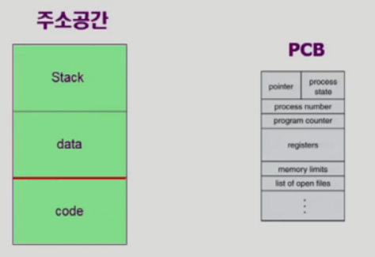
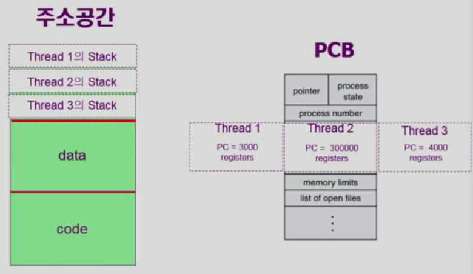

# 2. Thread

- "A thread (or lightweight process) in a basic unit of CPU utilization"
- Thread의 구성
  - program counter
  - register set
  - stack space
- Thread가 동료 thread와 공유하는 부분(=task)
  - code section
  - data section
  - OS resources
- 전통적인 개념의 heavyweight process는 하나의 thread를 가지고 있는 task로 볼 수 있다.

> - 기존의 프로세스
>   - 
>   - 운영체제가 프로세스하나를 관리하기 위해서 PCB를 하나씩 두고있다.
>     - program counter: 현재 코드의 어느 부분이 실행중이다.
>     - registers: 레지스터에 어떤값을 넣고있었는가
>   - 메모리에는 어떤 값을 갖고 있고
>   - 전역변수는 어떤것이 있고
>   - 스택에 현재 어떤 함수들이 쌓여있는가
> - **비슷한 프로그램 여러개가 실행될때 각각 프로세스를 만들면 비효율 적이지 않은가**
>   - 비슷한 부분은 공유하고
>   - 다른 부분만 따로 저장하자
> - 쓰래드를 이용한 프로세스
>   - 
> - 오버해드가 많은 컨텍스트 스위치 작업을 줄일 수 있다.

- 스레드의 장점
  - 다중 스레드로 구성된 태스크 구조에서는 하나의 서버 스레드가 blocked (wating) 상태인 동안에도 동일한 태스크 내의 다른 스레드가 실행(running)되어 빠른 처리를 할 수 있다.
  - 동일한 일을 수행하는 다중 스레드가 협력하여 높은 처리율(throughput)과 성능 향상을 얻을 수 있다.
  - 스레드를 사용하면 병렬성을 높일 수 있다.
  - ex) 웹페이지를 보여줄 때 이미지요청 등 비교적 오래걸리는 작업을 스레드로 구현하면 텍스트를 먼저 보여주는 등 훨씬 더 응답성을 높일 수 있다.
- 스레드 장점
  - Responsiveness
    - 웹페이지를 빨리 보여줄 수 있음
  - Resource Sharing
  - Economy
    - creating & CPU switching thread (rather than a process)
    - Solaris의 경우 위 두 가지 overhead가 각각 30배, 5배
    - 스레드 하나를 만드는 것이 프로세스를 만드는 것 보다 30배 효율적
    - 프로세스1에서 프로세스2로 넘어가는 것보다 스레드가 바뀌는 것이 5배 효울적
  - Utilization of MP Architectures
    - each thread may be running in parallel on a different processor
      - 예를 들어 1000*1000같은 큰 행렬을 곱셈한다고 할때 각각의 스레드를 다른 CPU에서 처리를하면 결과를 더 빨리 얻을 수 있다.
- Kernerl Threads
  - 운영체제가 스레드의 존재를 알게 구현하는 것
  - 운영체제가 CPU 스케줄링 할 때 스레드도 관리함
- User Threads
  - 운영체제가 스레드의 존재를 모른다. 하나의 프로세스로 인식
  - 프로세스 내부에서 스레드를 관리

