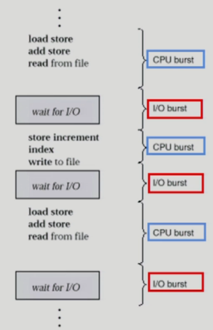

# 3. CPU Scheduling

- CPU and I/O Bursts in Program Execution

  - 
  - 하나의 프로세스의 일생을 나타낸 그림
  - CPU burst: CPU를 가지고 기계어를 실행하는 단계
  - I/O burst: I/O 작업을 실행하는 단계 (CPU burst단계보다 훨씬 시간이 오래걸림)
  - 얼마나 I/O 작업을 많이(자주) 하냐가 중요
  - I/O bound process: CPU를 잡고 계산하는 시간보다 I/O에 많은 시간이 필요한 job (many short CPU bursts)
  - CPU-bound process: 계산 위주의 job (few very long CPU bursts)
  - **CPU를 어떤 프로세스에게 먼저 주는것이 효율적인가?**
    - I/O 단계가 많은 프로세스(I/O bound job)
      - CPU를 짧게 쓰고 I/O작업을 하러 가기 때문에 먼저 CPU를 주는 것이 좋다
      - 보통 I/O작업이 많으면 사람과 인터랙션이 많다는 것이 때문에 빨리 처리해주는 것이 좋다

- CPU Scheduler & Dispatcher

  - 운영체제 코드의 일부분을 하는 역활에 따라 이름을 붙여서 부름

  - CPU Scheduler

    - Ready 상태의 프로세스 중에서 이번에 CPU를 줄 프로세스를 고른다

  - Dispatcher

    - CPU의 제어권을 CPU scheduler에 의해 선택된 프로세스에게 넘긴다
    - 이 과정을 context switch(문맥 교환)라고 한다.

    > Dispatcher는 CPU가 프로세스1에서 2로 넘어갈때(문맥 교환) CPU를 빼앗기는 프로세스의 context를 세이브해 놓고 새롭게 CPU를 얻는 프로세스의 context를 로드하는 역활을 한다.

  - CPU 스케줄링이 필요한 경우는 프로세스에게 다음과 같은 상태 변화가 있는 경우이다.

    - Running -> Blocked (예: I/O 요청하는 시스템 콜)
    - Running -> Ready (예: 할당시간말료로 timer interrupt)
    - Blocked -> Ready (예: I/O 완료후 인터럽트)
      - I/O가 완료된 직후에 실행되어야하는 중요한 작업들
    - Terminate
    - 위의 모든 스케줄링은 nonpreemptive (강제로 빼앗지 않고 자진 반납)
    - 나머지 스케줄링은 preemptive (강제로 빼앗음)

- Scheduling Criteria (Performance Index, Performance Measure, 성능 척도)

  - CPU utilization (이용률)

    - keep the CPU as busy as possible
    - 전체시간 중에서 CPU가 일한 시간

  - Throughput (처리량)

    - \# of processes that complete their execution per time unit
    - 단위 시간당 처리량

  - Turnaround time (소요시간, 반환시간)

    - amount of time to execute a particular process

    > CPU를 사용한 시간, 기다린 시간의 합, 총 CPU burst시간

  - Waiting time (대기 시간)

    - amount of time a process has been waiting in the ready queue

    > CPU burst안에서 기다린 시간들의 합

  - Response time (응답 시간)

    - amount of time it takes from when a request was submitted until the first response is produced, not output (for time-sharing environment)

    > I/O burst가 끝나고 CPU burst로 들어와서 처음 CPU를 사용하는데 까지 걸리는 시간

### CPU Scheduling 알고리즘

- FCFS (First-Come First-Served)
  - 도착한 순서에 따라 CPU를 준다.
  - Convoy effect: CPU burst time이 긴 프로세스가 먼저 도착하면 뒤에 모든 프로세스의 기다리는 시간이 길어진다. (비효율)
- SJF (Shortest-Job-First)
  - 각 프로세스의 다음번 CPU burst time을 가지고 스케줄링에 활용
  - CPU burst time이 가장 짧은 프로세스를 제일 먼저 스케줄
  - Two schemes:
    - Nonpreemptive
      - 일단 CPU를 잡으면 이번 CPU burst가 완료될 때까지 CPU를 선점(preemption) 당하지 않음
    - Preemptive
      - 현재 수행중인 프로세스의 남은 burst time보다 더 짧은 CPU burst time을 가지는 새로운 프로세스가 도착하면 CPU를 빼앗김 
      - 이 방법을 Shortest-Remaining-Time-First (SRTF)이라고도 부른다
  - SJF is optimal
    - 주어진 프로세스들에 대해 **minimum average waiting time**을 보장
  - 단점
    - CPU burst time이 긴 작업은 영원히 CPU를 얻지 못할 수도 있음
    - CPU burst time을 미리 알 수가 없다.