# 4. Process Synchronization

## OS에서 Race Condition

- 

- 하나의 공유 데이터를 여럿이 동시에 접근하는 경우

  - Memory Address Space를 공유하는 CPU Process가 여럿 있는 경우 Race Condition의 가능성이 있음 (Multiprocessor system)

- CPU가 하나 일때도 이런 현상이 일어날까?

  - 공유메모리를 사용하는 프로세스들
  - 커널 내부 데이터를 접근하는 루틴들 간
    - 커널모드 수행 중 인터럽트로 커널모드 다른 루틴 수행시

  > 프로세스1이 시스템 콜을 해서 운영체제가 어떠한 데이터를 사용하다가 CPU가 프로세스2에게 넘어가서 똑같이 시스템 콜을 하고 운영체제가 아까 프로세스1에의해 사용하던 똑같은 데이터를 사용할 경우 하나의 CPU에서도 Race condition이 발생

- OS에서 race condition은 언제 발생하는가?
  - kernel 수행 중 인터럽트 발생 시
    - 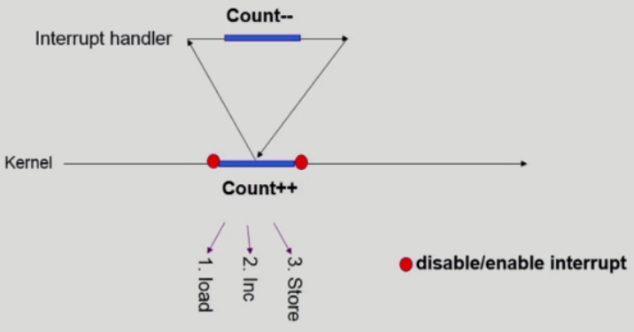
    - 운영체제가 CPU를 사용중에 Interrupt가 들어와서 Interrupt를 처리하는 중에 같은 데이터를 사용하는 경우 (위의 경우 Count--가 적용되지 않음)
    - 양쪽 다 커널 코드이므로 kernel address space 공유
    - 변수를 건드리는 중에 interrupt를 받지 않고(disable interrupt) 이 후에 interrupt를 받는다(enable interrupt)
  - Process가 system call을 하여 kernel mode로 수행 중인데 context switch가 일어나는 경우
    - 
      1. 두 프로세스의 address space 간에는 data sharing이 없음
      2. 그러나 system call을 하는 동안에는 kernel address space의 data를 access하게 됨 (share)
      3. 이 작업 중간에 CPU를 preempt 해가면 race condition 발생 (count++ 가 한번 밖에 적용 안됨)
      4. 해결책: 커널 모드에서 수행 중일 때는 CPU를 preempt하지 않음, 커널 모드에서 사용자 모드로 돌아갈 때 preempt
  - Multiprocessor에서 shared memory 내의 kernel data
    - 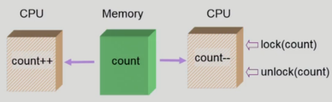
    - 어떤 CPU가 마지막으로  count를 store했는가? -> race condition
    - multiprocessor의 경우 interrupt enable/disable로 해결되지 않음
    - 방법 1) 한번에 하나의 CPU만이 커널에 들어갈 수 있게 하는 방법 (비효율)
    - 방법 2) 커널 내부에 있는 각 공유 데이터에 접근할 때마다 그 데이터에 대한 lock / unlock을 하는 방법

## Process Synchronization 문제

- 공유 데이터(shared data)의 동시 접근(concurrent access)은 데이터의 불일치 문제(inconsistency)를 발생시킬 수 있다.
- 일관성(consistency) 유지를 위해서는 협력 프로세스(cooperating process) 간의 실행 순서(orderly execution)를 정해주는 메커니즘 필요
- Race condition
  - 여러 프로세스들이 동시에 공유 데이터를 접근하는 상황
  - 데이터의 최종 연산 결과는 마지막에 그 데이터를 다룬 프로세스에 따라 달라짐
- race condition을 막기 위해서는 concurrent process는 동기화(synchronize)되어야 한다
- 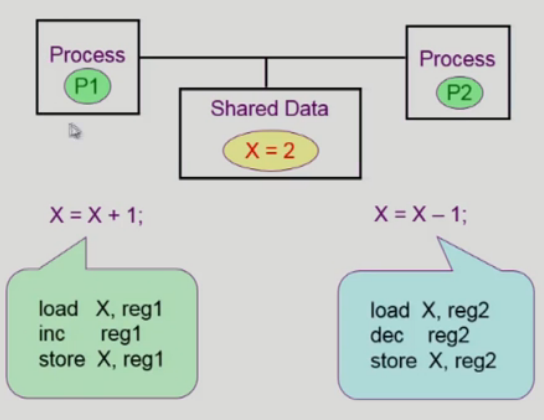
  - 사용자 프로세스 P1 수행중 timer interrupt가 발생해서 context switch가 일어나서 P2가 CPU를 잡으면?
- The Critical-Section Problem
  - n개의 프로세스가 공유 데이터를 동시에 사용하기를 원하는 경우
  - 각 프로세스의 code segment에는 **공유 데이터를 접근하는 코드인 critical section**이 존재
  - Problem
    - 하나의 프로세스가 critical section에 있을 때 다른 모든 프로세스는 critical section에 들어갈 수 없어야 한다.

## Process Synchronization 해결

- 프로그램적 해결법의 충족 조건

  - Mutual Exclusion
    - 프로세스 Pi가 critical section 부분을 수행 중이면 다른 모든 프로세스들은 그들의 critical section에 들어가면 안 된다.
  - Progress (진행)
    - 아무도 critical section에 있지 않은 상태에서 critical section에 들어가고자 하는 프로세스가 있으면 critical section에 들어가게 해주어야 한다
  - Bounded Waiting (유한대기)
    - 프로세스가 critical section에 들어가려고 요청한 후부터 그 요청이 허용될 때까지 다른 프로세스들이 critical section에 들어가는 횟수에 한계가 있어야 한다

- 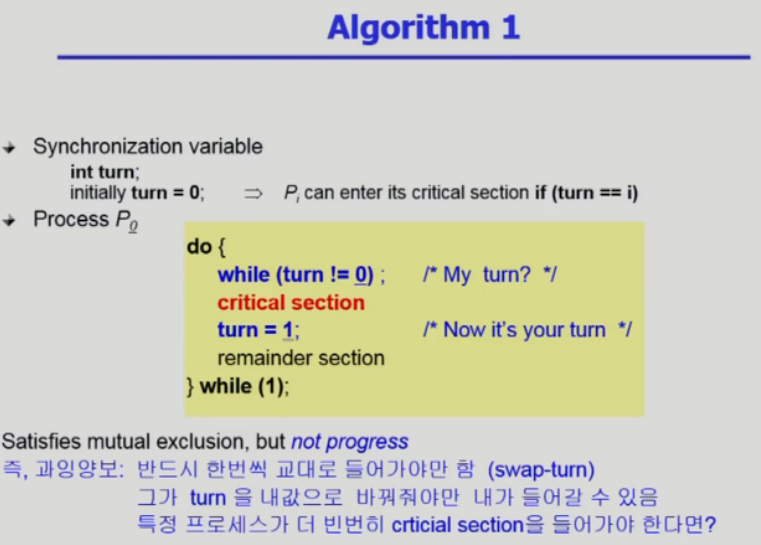

  - 문제점: 내가 critical section을 사용한 후 상대방이 critical section을 사용하기 전까지 내가 다시 critical section을 사용 할 수 없음

- 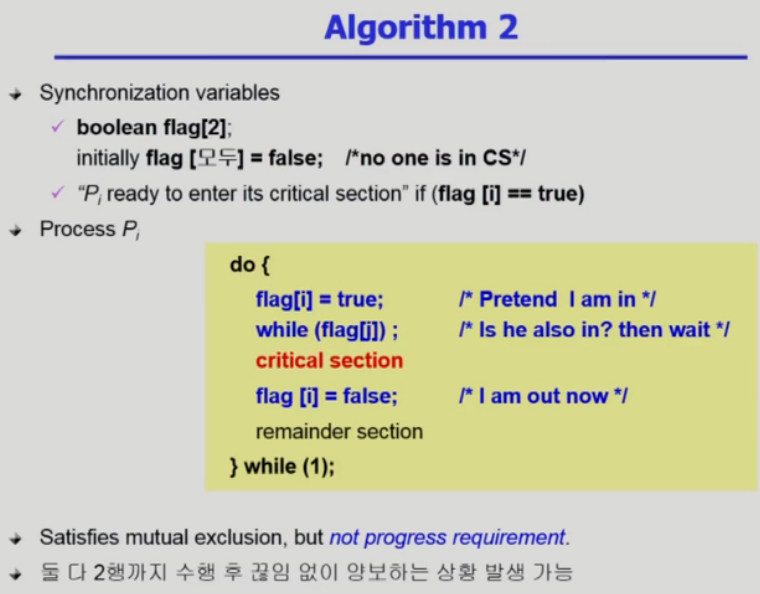

  - critical section에 들어가기 전에 깃발을 들고 다른 프로세스의 깃발이 들려있는지 확인하고 없으면 critical section에 들어간다. 이 후 깃발을 내린다.
  - 깃발만 들고 critical section에 들어가기 전에 CPU를 빼앗기면 아무도 들어가지 않고 서로 양보하는 일이 생김

- 

  - 어느 상태에서 CPU를 빼앗겨도 제대로 동작함
  - 여전히 비효율 적인 문제가 있음
    - 상대방이 critical section에 있는 동안 계속 기다리기만함, while문만 계속 순회 (Busy waiting, Spin lock)

- Synchronization Hardware

  - 하드웨어적으로 Test & modify를 atomic(원자적, 더이상 쪼갤 수 없음)하게 수행할 수 있도록 지원하는 경우 앞의 문제는 간단히 해결
    - 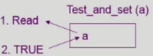
    - a라는 변수를 읽고 그 값에 상관없이 a에 1을 저장하는 일을 동시에(atomic하게) 수행
  - 
    - lock이라는 값을 읽음과 동시에 1(True)로 세팅

## Semaphores (추상 자료형)

  > 추상자료형: 그 것이 어떻게 구현 되었는 지는 논의할 바가 아니고 오브젝트와 오퍼레이션으로 구성되어 있는 것
  >
  > 정수 추상 자료형: 정수 자체(오브젝트)가있고 연산(오퍼레이션)이 있다

  - 앞의 방식들을 추상화시킴

  - Semaphore S

    - integer variable

    > 세마포의 변수 값은 정수로 정의된다

    - **아래의 두 가지 atomic 연산에 의해서만 접근 가능**

      - 
      - P(s)는 자원을 획득하는 과정 (lock을 거는 과정)
      - V(s)는 자원을 반납하는 과정 (lock을 푸는 과정)

      > 세마포변수값이 5라고하면 자원이 5개라는 뜻, 자원을 획득하기 위해서 P연산을 하면 변수값이 줄어듬 자원이 0이되면 더 이상 자원획득을 할 수 없다. V연산은 자원을 반납
      >
      > Mutual Exclusion문제에서는 세마포변수값을 1로 준다. 자원이 1개이기 때문에 1개의 프로세스만이 자원을 획득가능(critical section에 들어갈 수 있음)
      >
      > 세마포가 어떻게 구현되는 지는 몰라도 이런 것이 지원 된다면 Synchronization문제나 critical section문제를 쉽게 해결할 수 있다
      >
      > 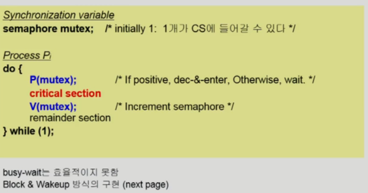

- 아직 해결하지 못한 Busy-wait문제

  - Block / Wakeup 방식
    - Semaphore를 다음과 같이 정의
      - 
    - block과 wakeup을 다음과 같이 가정
      - block
        - 커널은 block을 호출한 프로세스를 suspend시킴
        - 이 프로세스의 PCB를 semaphore에 대한 wait queue에 넣음
      - wakeup(P)
        - block된 프로세스 P를 wakeup 시킴
        - 이 프로세스의 PCB를 ready queue로 옮김
    - 
    - 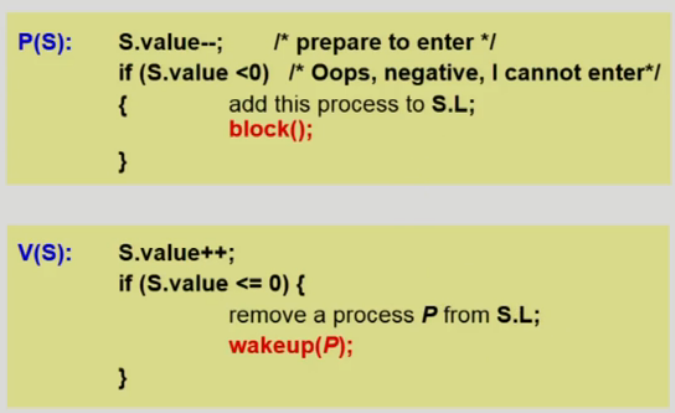
      - P연산시 세마포를 1감소시키고 세마포값이 음수이면 이 프로세스를 세마포 연결리스트에 추가시키고 block시킴
      - V연산시 세마포를 1추가 시키고 세마포가 0보다 작으면 연결리스트에서 프로세스를 지우고 프로세스를 깨움
  - Busy-wait vs Block/wakeup
    - Critical section의 길이가 긴 경우(경쟁이 치열할 때) Block/Wakeup이 적당
    - Critical section의 길이가 매우 짧은 경우 Block/Wakeup 오버헤드가 busy-wait 오버헤드보다 더 커질 수 있음
    - 일반적으로는 Block/wakeup 방식이 더 좋음

- Two Types of Semaphores
  - Counting semaphore
    - 도메인이 0 이상인 임의의 정수값
    - 주로 resource countion에 사용
  - Binary semaphore (=mutex)
    - 0 또는 1 ㄱ밧만 가질 수 있는 semaphore
    - 주로 mutual exclusion (lock/unlock)에 사용

	> 자원을 세는 것을 굳이 세마포 변수로 하는 이유는?
	>
	> 세마포에서 P연산과 V연산이 원자적(atomic)으로 실행된다고 가정을 한다.
	> (사실 원자적으로 수행이 될려면 Synchronization Hardware같은 것을 사용해서 구현을 해야한다)
	> (원자적으로 수행되면 자원에 접근하는 도중에 CPU를 빼앗길 일이 없음)

## Classical Problems of Synchroniztion (전통적인 동기화 문제 3가지)

#### 1. Bounded-Buffer Problem (Producer-Consumer Problem)

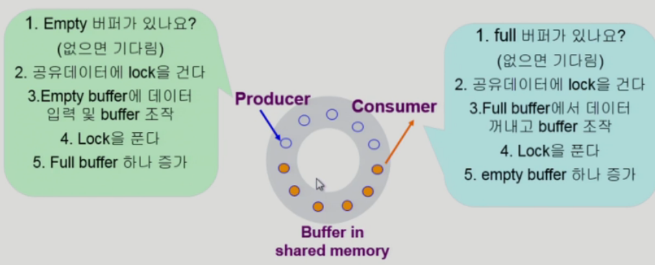

- Producer는 빈 버퍼에 데이터를 채우고, Consumer는 채워진 버퍼에서 데이터를 얻어 간다.

- 문제상황

  - 공유 버퍼이기 때문에 생산자가 데이터를 채워넣을 때 CPU를 빼앗기면 다른 생산자가 같은 자리에 채워넣을 수 있다. (접근을 막을 필요 있음)
  - 소비자 프로세스도 마찬가지로 데이터를 가져갈려고할 때 CPU를 빼앗기면 한개의 데이터를 둘이 동시에 꺼내가는 상황이 생길 수 있다.

- Shared data

  - buffer 자체 및 buffer 조작 변수 (empty/full buffer의 시작 위치)

- Synchronization variables

  - mutual exclusion: Need binary semaphore (shared data의 mutual exclusion을 위해)

  > **binary semaphore를 이용해서 공유데이터의 동시접근을 막아줌**

  - resource count: Need integer semaphore (남은 full/empty buffer의 수 표시)

  > **counting semaphore를 사용해서 내용이 들어있는 버퍼, 비어있는 버퍼의 수를 세어줌**

- 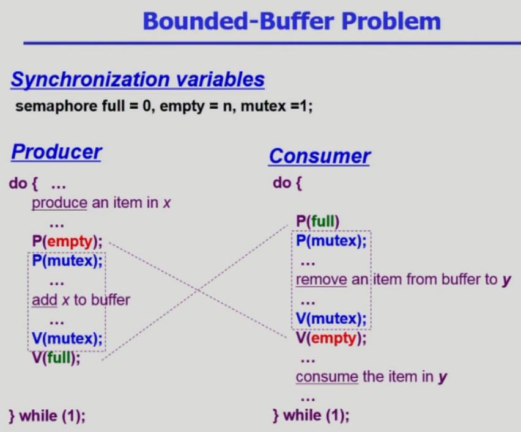

  - 생산자
    - P(empty): 빈 자리가 생기면 아래 연산을 수행함
    - P(mutex) ~ V(mutex): 공유 데이터에 접근 중 다른 프로세스의 접근을 막음
    - V(full): 공유 데이터 한개를 채움
  - 소비자
    - P(full): 채워진 데이터가 있으면 아래 연산을 수행함
    - P(mutex) ~ V(mutex): 공유 데이터에 접근 중 다른 프로세스의 접근을 막음
    - V(empty): 빈 공유데이터 한개를 추가함

#### 2. Readers-Writers Problem

- 한 process가 DB에 write 중일 때 다른 process가 접근하면 안됨
- read는 동시에 여럿이 해도 됨
- solution
  - Writer가 DB에 접근 허가를 아직 얻지 못한 상태에서는 모든 대기중인 Reader들을 다 DB에 접근하게 해준다
  - Writer는 대기 중인 Reader가 하나도 없을 때 DB접근이 허용된다.
  - 일단 Writer가 DB에 접근 중이면 Reader들은 접근이 금지된다.
  - Writer가 DB에서 빠져나가야만 Reader의 접근이 허용된다.
- Shared data
  - DB 자체
  - readcount: 현재 DB에 접근 중인 Reader의 수
- Synchronization variables
  - mutex: 공유 변수 readcount를 접근하는 코드(critical section)의 mutual exclusion 보장을 위해 사용 (binary semaphore)
  - db: Reader와 witer가 공유 DB 자체를 올바르게 접근하게 하는 역활
- 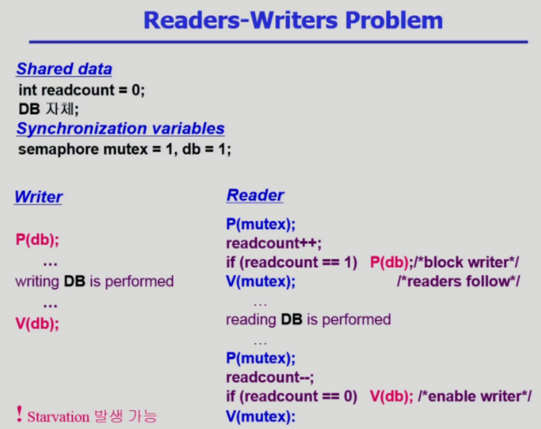
  - Writer
    - DB에 접근하기 위해서 db를 lock하고(P(db)) DB에 데이터를 쓰고 이 후 db를 unlock(V(db))
  - Reader
    - Witer와 똑같은 동작이지만 Reader들이 동시에 접근을 허용하기위해서 좀 더 복잡해짐
    - DB를 누가 읽고 있으면 DB접근을 막는다. (P(db))
    - DB를 읽고 나갈때 readcount가 0이면(DB를 읽는 프로세스가 아무도 없으면) DB접근을 허용한다.(V(db))
  - 이 해결법의 문제점
    - writer가 기다리고 있는데 계속해서 reader들이 들어오면 writer가 계속해서 DB를 읽지 못하는 Starvation 발생가능
    - 해결법
      - 신호등의 원리처럼 일정시간안에 도착한 reader들만 읽게 해주고 이 후 writer에게 DB 접근을 허용한다.
#### 3. Dining-Philosophers Problem (식사하는 철학자)

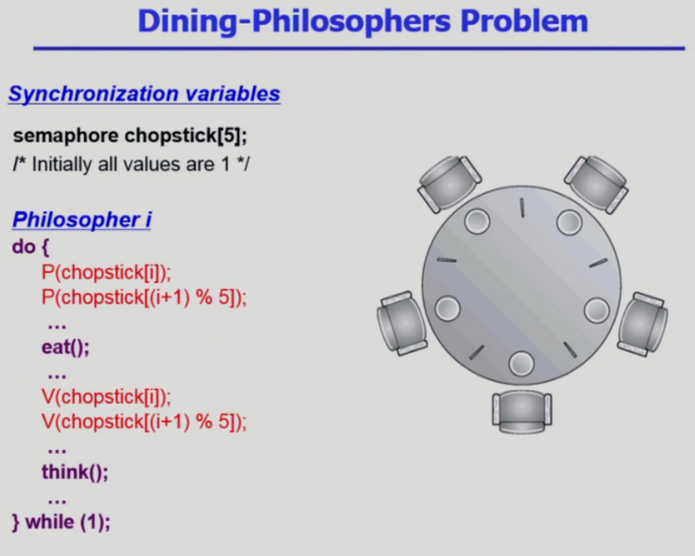

- 규칙
  - 5명의 철학자가 각자 생각하기와 밥먹기를 번갈아 가며 한다.
  - 젓가락이 한쪽에 한개만 있다. (양쪽 젓가락 모두 얻어야 밥을 먹을 수 있다.)
  - 철학자가 굶어 죽으면 안된다.
- 위 코드의 문제점
  - Deadlock 가능성이 있다
  - 모든 철학자가 동시에 배가 고파져 왼쪽 젓가락을 집어버린 경우
- 해결방안
  - 4명의 철학자만이 테이블에 동시에 앉을 수 있도록 한다
  - **젓가락을 두 개 모두 집을  수 있을 때에만 젓가락을 집을 수 있게 한다.**
  - 비대칭
    - 짝수(홀수) 철학자는 왼쪽(오른쪽) 젓가락부터 집도록 한다.
- 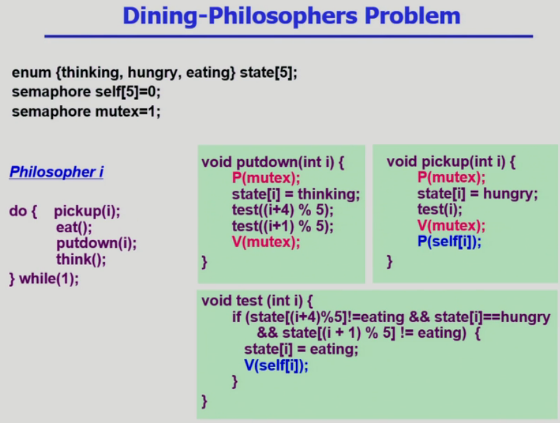
  - pickup(i): i의 상태를 hungry로 바꾸고 test(i)실행 이후 P(self[i]) 
  - test(i): 내가 배고프고 양옆이 밥을 먹고 있지 않으면 나의 상태를 eating으로 바꾸고 V(self[i])
  - putdown(i): 나의 상태를 thinking으로 바꾸고 양옆의 철학자를 test

## Monitor

- Semaphore의 문제점

  - 코딩하기 힘들다
  - 정확성(correctness)의 입증이 어렵다
  - 자발적 협력(voluntary cooperation)이 필요하다
  - 한번의 실수가 모든 시스템에 치명적 영향

- Monitor

  - 동시 수행중인 프로세스 사이에서 abstract data type의 안전한 공유를 보장하기 위한 high-level synchronization construct

  > 공유데이터에 대한 접근은 오직 모니터 안에 정의된 함수를 통해서만 접근을 할 수 있게하고 모니터 안에서 액티브하게 실행하는 프로세스는 하나로 제한하는 일을 모니터가 알아서 해준다. 따라서 공유데이터에 대해서 lock을 걸 필요가 없고 프로그래머는 모니터안에 있는 코드로서 공유데이터접근을 하게 해주면 알아서 동기화가 된다.

- 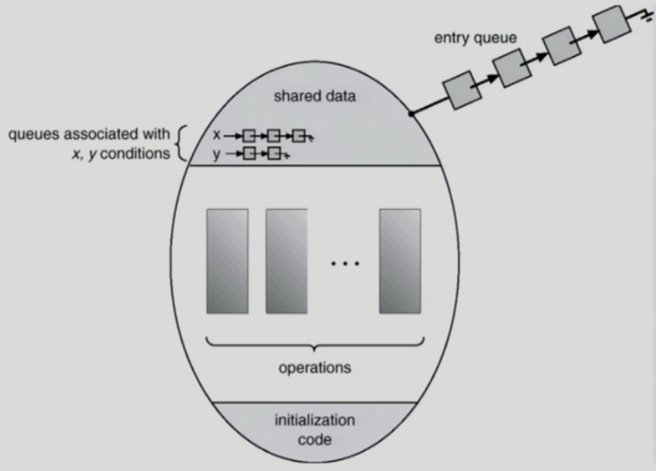

  - 프로그래머가 동기화 제약 조건을 명시적으로 코딩할 필요없음(모니터가 대신 해줌)
  - 공유데이터를 모니터 안에다 정의를 해놓는다
  - 모니터 내에서는 한번에 하나의 프로세스만이 활동 가능
  - 공유데이터를 접근하는 코드는 모니터 안에있는 연산으로만 접근 가능
  - 프로세스가 공유데이터에 접근 중일때(모니터안에서 연산을 수행 중일때) CPU를 빼앗기고 다른 프로세스가 모니터안에 들어올려고 하면 그 진입을 막는다.(큐에 줄세워 놓고 Block)
  - 공유 데이터를 사용할려고하는데 자원이 부족한 경우 그 자원에대한 큐에서 대기하게 됨(block)
    - **이 상황에서는 액티브상태로 보지않고 다음 기다리는 프로세스를 모니터로 들어올수 있게함**
    - **프로세스가 모니터 안에서 기다릴 수 있도록 하기 위해 condition variable사용**
    - Condition variable은 wait와 signal연산에 의해서만 접근 가능 (x.wait(), x.signal())
    - x.signal()은 정확하게 하나의 suspend된 프로세스를 resume한다. (suspend된 프로세스가 없으면 아무 일도 일어나지 않는다)

- 모니터를 이용한 생산자 소비자 문제 해결

  - 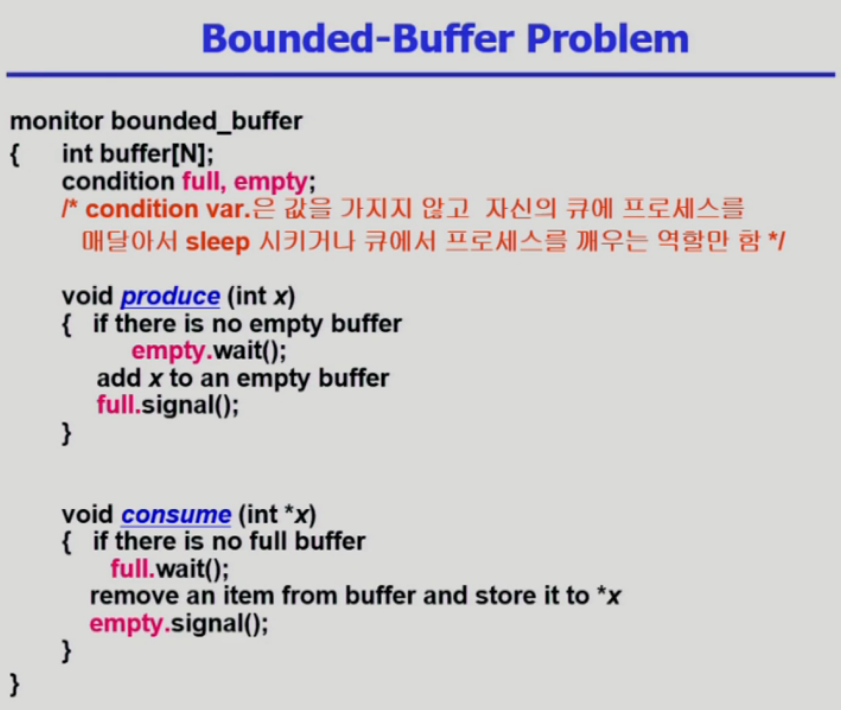
  - 모니터에서 동시접근문제를 처리해 주기때문에 공유데이터에 대해 lock, unlock을 해줄 필요가 없음
  - condition full, empty: 자원의 개수를 가지는 것이 아니라 단순히 자원에 대해서 기다리거나(큐에 넣는다) 큐에서 꺼내오거나의 역활만 한다.

- 모니터를 이용한 식사하는 철학자 문제 해결

  - 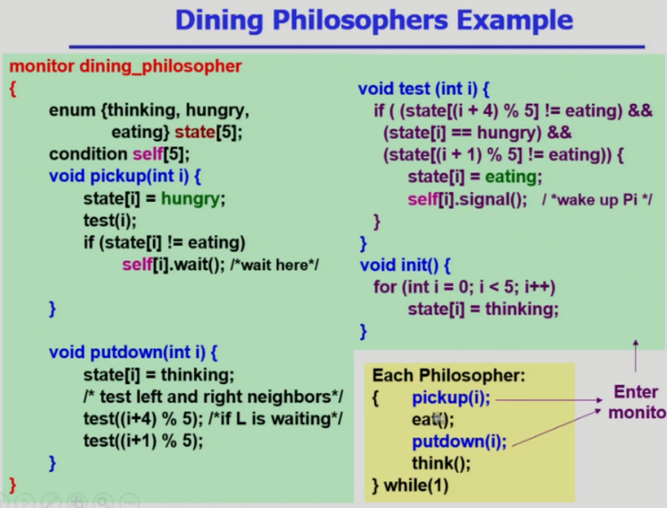
  - enum {thinking, hungry, eating} state[5]: 양옆의 상태에따라 밥을 먹을 수 있을지 결정되기 때문에 공유데이터로 처리
  - condition self[5]: 내가 밥을 먹을 수 있을지 없을지를 자원이 있고 없고로 생각하고 각각 자원이 없으면 잠들기 위해 5개의 큐를 준비
  - pickup(i): 젓가락을 잡는 것이 공유데이터접근이기 때문에 모니터 안에 정의해놓는다

### Deadlock and Starvation

- Deadlock

  > 두개의 프로세스가 2개의 공유데이터를 얻어야 하는데 서로 다른 데이터를 가지고 있는 경우

  - 둘 이상의 프로세스가 서로 상대방에 의해 충족될 수 있는 event를 무한히 기다리는 현상

- S와 Q가 1로 초기화된 semaphore라 하자.

  - 

- Starvation

  - indefinite blocking 프로세스가 suspend된 이유에 해당하는 세마포어 큐에서 빠져나갈 수 없는 현상

>참고
>http://www.kocw.net/home/cview.do?cid=4b9cd4c7178db077

