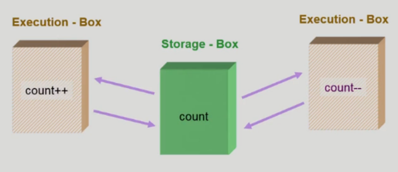
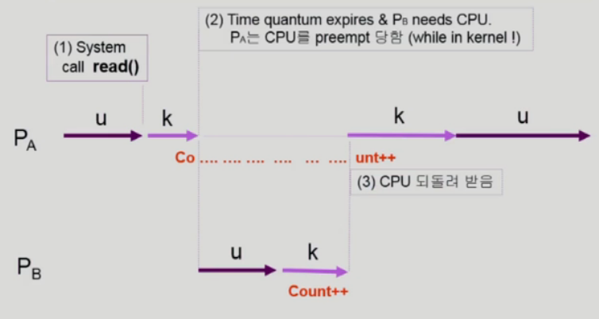
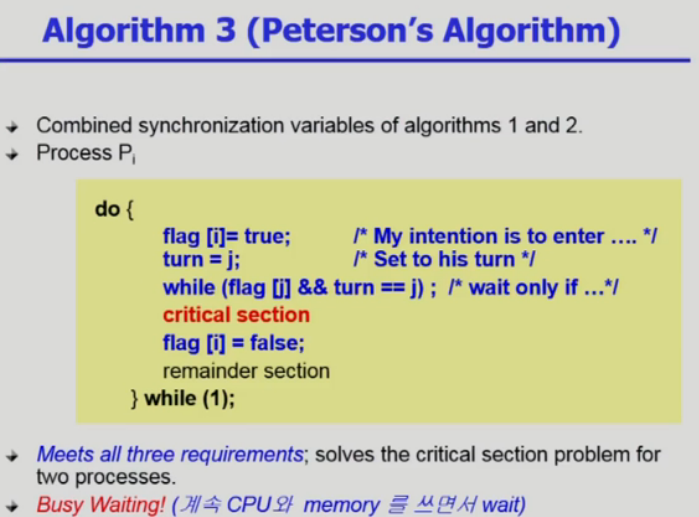
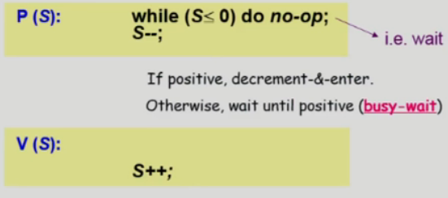
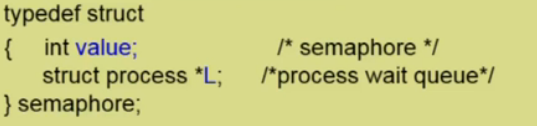

# 4. Process Synchronization

## OS에서 Race Condition

- 

- 하나의 공유 데이터를 여럿이 동시에 접근하는 경우

  - Memory Address Space를 공유하는 CPU Process가 여럿 있는 경우 Race Condition의 가능성이 있음 (Multiprocessor system)

- CPU가 하나 일때도 이런 현상이 일어날까?

  - 공유메모리를 사용하는 프로세스들
  - 커널 내부 데이터를 접근하는 루틴들 간
    - 커널모드 수행 중 인터럽트로 커널모드 다른 루틴 수행시

  > 프로세스1이 시스템 콜을 해서 운영체제가 어떠한 데이터를 사용하다가 CPU가 프로세스2에게 넘어가서 똑같이 시스템 콜을 하고 운영체제가 아까 프로세스1에의해 사용하던 똑같은 데이터를 사용할 경우 하나의 CPU에서도 Race condition이 발생

- OS에서 race condition은 언제 발생하는가?
  - kernel 수행 중 인터럽트 발생 시
    - 
    - 운영체제가 CPU를 사용중에 Interrupt가 들어와서 Interrupt를 처리하는 중에 같은 데이터를 사용하는 경우 (위의 경우 Count--가 적용되지 않음)
    - 양쪽 다 커널 코드이므로 kernel address space 공유
    - 변수를 건드리는 중에 interrupt를 받지 않고(disable interrupt) 이 후에 interrupt를 받는다(enable interrupt)
  - Process가 system call을 하여 kernel mode로 수행 중인데 context switch가 일어나는 경우
    - 
      1. 두 프로세스의 address space 간에는 data sharing이 없음
      2. 그러나 system call을 하는 동안에는 kernel address space의 data를 access하게 됨 (share)
      3. 이 작업 중간에 CPU를 preempt 해가면 race condition 발생 (count++ 가 한번 밖에 적용 안됨)
      4. 해결책: 커널 모드에서 수행 중일 때는 CPU를 preempt하지 않음, 커널 모드에서 사용자 모드로 돌아갈 때 preempt
  - Multiprocessor에서 shared memory 내의 kernel data
    - 
    - 어떤 CPU가 마지막으로  count를 store했는가? -> race condition
    - multiprocessor의 경우 interrupt enable/disable로 해결되지 않음
    - 방법 1) 한번에 하나의 CPU만이 커널에 들어갈 수 있게 하는 방법 (비효율)
    - 방법 2) 커널 내부에 있는 각 공유 데이터에 접근할 때마다 그 데이터에 대한 lock / unlock을 하는 방법

## Process Synchronization 문제

- 공유 데이터(shared data)의 동시 접근(concurrent access)은 데이터의 불일치 문제(inconsistency)를 발생시킬 수 있다.
- 일관성(consistency) 유지를 위해서는 협력 프로세스(cooperating process) 간의 실행 순서(orderly execution)를 정해주는 메커니즘 필요
- Race condition
  - 여러 프로세스들이 동시에 공유 데이터를 접근하는 상황
  - 데이터의 최종 연산 결과는 마지막에 그 데이터를 다룬 프로세스에 따라 달라짐
- race condition을 막기 위해서는 concurrent process는 동기화(synchronize)되어야 한다
- 
  - 사용자 프로세스 P1 수행중 timer interrupt가 발생해서 context switch가 일어나서 P2가 CPU를 잡으면?
- The Critical-Section Problem
  - n개의 프로세스가 공유 데이터를 동시에 사용하기를 원하는 경우
  - 각 프로세스의 code segment에는 **공유 데이터를 접근하는 코드인 critical section**이 존재
  - Problem
    - 하나의 프로세스가 critical section에 있을 때 다른 모든 프로세스는 critical section에 들어갈 수 없어야 한다.

## Process Synchronization 해결

- 프로그램적 해결법의 충족 조건

  - Mutual Exclusion
    - 프로세스 Pi가 critical section 부분을 수행 중이면 다른 모든 프로세스들은 그들의 critical section에 들어가면 안 된다.
  - Progress (진행)
    - 아무도 critical section에 있지 않은 상태에서 critical section에 들어가고자 하는 프로세스가 있으면 critical section에 들어가게 해주어야 한다
  - Bounded Waiting (유한대기)
    - 프로세스가 critical section에 들어가려고 요청한 후부터 그 요청이 허용될 때까지 다른 프로세스들이 critical section에 들어가는 횟수에 한계가 있어야 한다

- 

  - 내가 critical section을 사용한 후 상대방이 critical section을 사용하기 전까지 내가 다시 critical section을 사용 할 수 없음

- 

  - critical section에 들어가기 전에 깃발을 들고 다른 프로세스의 깃발이 들려있는지 확인하고 없으면 critical section에 들어간다. 이 후 깃발을 내린다.
  - 깃발만 들고 critical section에 들어가기 전에 CPU를 빼앗기면 아무도 들어가지 않고 서로 양보하는 일이 생김

- 

  - 어느 상태에서 CPU를 빼앗겨도 제대로 동작함
  - 여전히 비효율 적인 문제가 있음
    - 상대방이 critical section에 있는 동안 계속 기다리기만함, while문만 계속 순회 (Busy waiting, Spin lock)

- Synchronization Hardware

  - 하드웨어적으로 Test & modify를 atomic(원자적, 더이상 쪼갤 수 없음)하게 수행할 수 있도록 지원하는 경우 앞의 문제는 간단히 해결
    - 
    - a라는 변수를 읽고 그 값에 상관없이 a에 1을 저장하는 일을 동시에(atomic하게) 수행
  - 
    - lock이라는 값을 읽음과 동시에 1(True)로 세팅

- Semaphores (추상 자료형)

  > 추상자료형: 그 것이 어떻게 구현 되었는 지는 논의할 바가 아니고 오브젝트와 오퍼레이션으로 구성되어 있는 것
  >
  > 정수 추상 자료형: 정수 자체(오브젝트)가있고 연산(오퍼레이션)이 있다

  - 앞의 방식들을 추상화시킴

  - Semaphore S

    - integer variable

    > 세마포의 변수 값은 정수로 정의된다

    - 아래의 두 가지 atomic 연산에 의해서만 접근 가능

      - 
      - P(s)는 자원을 획득하는 과정 (lock을 거는 과정)
      - V(s)는 자원을 반납하는 과정 (lock을 푸는 과정)

      > 세마포변수값이 5라고하면 자원이 5개라는 뜻, 자원을 획득하기 위해서 P연산을 하면 변수값이 줄어듬 자원이 0이되면 더 이상 자원획득을 할 수 없다. V연산은 자원을 반납
      >
      > Mutual Exclusion문제에서는 세마포변수값을 1로 준다. 자원이 1개이기 때문에 1개의 프로세스만이 자원을 획득가능(critical section에 들어갈 수 있음)
      >
      > 세마포가 어떻게 구현되는 지는 몰라도 이런 것이 지원 된다면 Synchronization문제나 critical section문제를 쉽게 해결할 수 있다
      >
      > 

- 아직 해결하지 못한 Busy-wait문제

  - Block / Wakeup 방식
    - Semaphore를 다음과 같이 정의
      - 
    - block과 wakeup을 다음과 같이 가정
      - block
        - 커널은 block을 호출한 프로세스를 suspend시킴
        - 이 프로세스의 PCB를 semaphore에 대한 wait queue에 넣음
      - wakeup(P)
        - block된 프로세스 P를 wakeup 시킴
        - 이 프로세스의 PCB를 ready queue로 옮김
    - 
    - 
      - P연산시 세마포를 1감소시키고 세마포값이 음수이면 이 프로세스를 세마포 연결리스트에 추가시키고 block시킴
      - V연산시 세마포를 1추가 시키고 세마포가 0보다 작으면 연결리스트에서 프로세스를 지우고 프로세스를 깨움
  - Busy-wait vs Block/wakeup
    - Critical section의 길이가 긴 경우(경쟁이 치열할 때) Block/Wakeup이 적당
    - Critical section의 길이가 매우 짧은 경우 Block/Wakeup 오버헤드가 busy-wait 오버헤드보다 더 커질 수 있음
    - 일반적으로는 Block/wakeup 방식이 더 좋음

