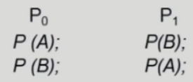
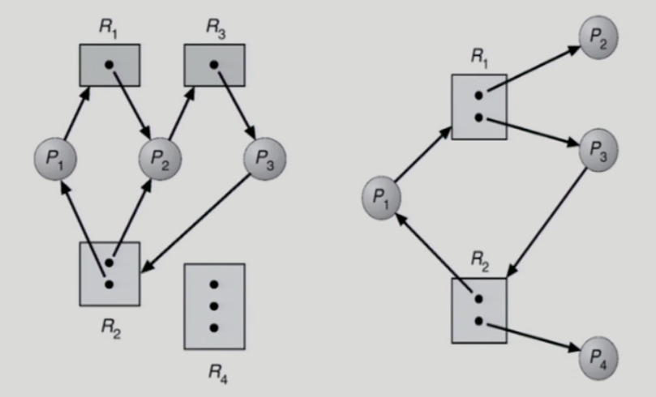
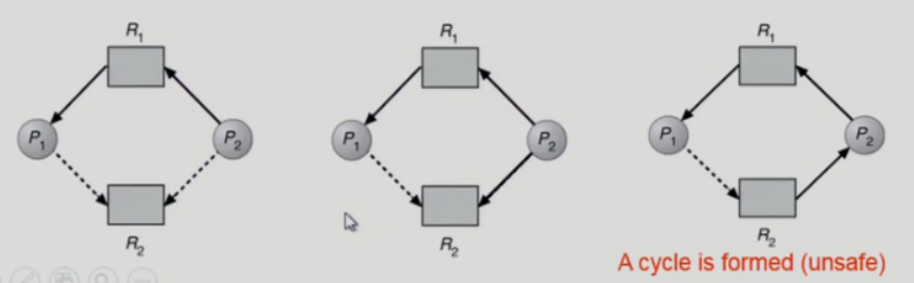
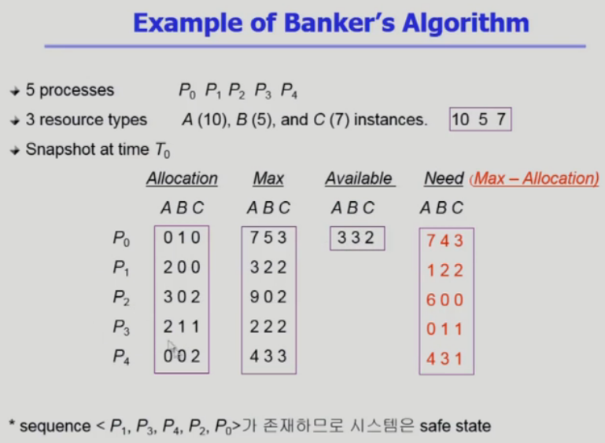
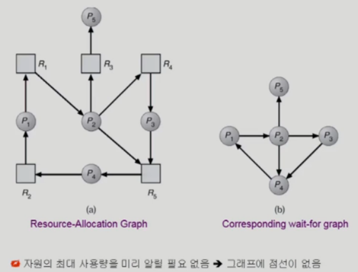
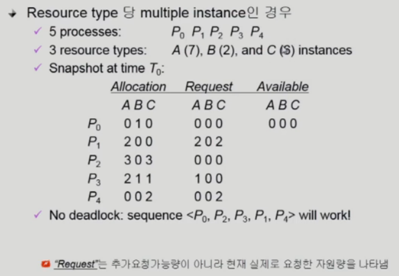

# 5. Deadlock

## The Deadlock Problem

- Deadlock

  - 일련의 프로세스들이 서로가 가진 자원을 기다리며 block된 상태

- Resource (자원)

  - 하드웨어, 소프트웨어 등을 포함하는 개념
  - 예) I/O device, CPU cycle, memory space, semaphore 등
  - 프로세스가 자원을 사용하는 절차
    - Request(요청), Allocate(할당), Use(사용), Release(반납)

- Deadlock Example 1

  - 시스템에 2개의 tape drive가 있다.
  - 프로세스 P1과 P2 각각이 하나의 tape drve를 보유한 채 다른 하나를 기다리고 있다.

- Deadlock Example 2

  - Binary semaphores A and B

    - 

    > A와 B자원 모두 얻어야하는 두 개의 프로세스가 각각 한개의 자원을 가지고(0번프로세스가 A를 얻고 CPU를 빼앗기고 1번프로세스가 CPU를 얻어 B를 얻고 A자원을 얻기를 기다린다.) 나머지 하나를 서로 계속 기다리기만을 하는 현상

## Deadlock 발생의 4가지 조건

- Mutual exclusion(상호 배제)
  - 매 순간 하나의 프로세스만이 자원을 사용할 수 있음
- No preemption
  - 프로세스는 자원을 스스로 내어놓을 뿐 강제로 빼앗기지 않음
- Hold and wait
  - 자원을 가진 프로세스가 다른 자원을 기다릴 때 보유 자원을 놓지 않고 계속 가지고 있음
- Circular wait
  - 자원을 기다리는 프로세스간에 **사이클**이 형성되어야 함

> 위 네가지 조건을 모두 만족해야 데드락 발생
> 네가지 중 어느 하나만 깨면 데드락 방지

### 자원 할당 그래프 (Resource-Allocation Graph)

- 그래프에 cycle이 없으면 deadlock이 아니다
- 그래프에 cycle이 있으면
  - if only one instance per resource type, then deadlock
  - if several instances per resource type, possibility of deadlock

> 왼쪽 그래프는 데드락 발생 (R2의 자원이 2개이지만 싸이클도 2개)
>
> 오른쪽 그래프는 데드락 없음 (자원은 2개 싸이클은 1개)

## Deadlock의 처리 방법

- Deadlock Prevention (미리 예방)
  - 자원 할당 시 Deadlock의 4가지 필요 조건 중 어느 하나가 만족되지 않도록 하는 것
- Deadlock Avoidance
  - 자원 요청에 대한 부가적인 정보를 이용해서 deadlock의 가능성이 없는 경우에만 자원을 할당
  - 시스템 state가 원래 state로 돌아올 수 있는 경우에만 자원 할당
- Deadlock Detection and recovery
  - Deadlock 발생은 허용하되 그에 대한 detection 루틴을 두어 deadlock 발견시 recover
- Deadlock Ignorance
  - Deadlock을 시스템이 책임지지 않음
  - UNIX를 포함한 대부분의 OS가 채택

### Deadlock Prevention

> 데드락 발생조건 4가지 중 1가지를 방지하여 데드락 발생을 막는다.

- Mutual Exclusion

  - 공유해서는 안되는 자원의 경우 반드시 성립해야 함

  >공유해서는 안되는 자원(여러 프로세스가 동시에 접근하면 안되는 자원)의 경우 Mutual Exclusion가 생길 수 밖에 없다.

- Hold and wait

  - 프로세스가 자원을 요청할 때 다른 어떤 자원도 가지고 있지 않아야 한다
  - 방법1: 프로세스 시작 시 모든 필요한 자원을 할당받게 하는 방법 (자원 낭비 발생)
  - 방법2: 자원이 필요할 경우 보유 자원을 모두 놓고 다시 요청

  > 자원을 요청시 가진 자원을 모두 내놓고 다시 한꺼번에 요청함
  >
  > 3개를 요청 했는데 2개만 받으면 다시 다 내놓는다.

- No Preemption

  - process가 어떤 자원을 기다려야 하는 경우 이미 보유한 자원이 선점됨
  - 모든 필요한 자원을 얻을 수 있을 때 그 프로세스는 다시 시작된다.
  - State를 쉽게 save하고 restore할 수 있는 자원에서 주로 사용(CPU, memory)

  > CPU는 빼앗을 수 있는 자원이다. -> CPU를 빼앗을 경우 CPU는 나중을 위해 현재 문맥을 저장하기 때문에 도중에 빼앗겨도 문제가 발생하지 않는다. 하지만 도중에 빼앗기면 하던일이 망치는 것들도 있음

- Circular Wait

  - 모든 자원 유형에 할당 순서를 정하여 정해진 순서대로만 자원 할당
  - 예를 들어 순서가 3인 자원을 보유 중인 프로세스가 순서가 1인 자원을 할당받기 위해서는 우선 순서 3의 자원을 우선 release(반납)해야 한다.

> 이러한 모든 방법은 자원의 Utilization(이용률) 저하, throughput 감소, starvation 문제 등을 발생시킴
> 잘 생기지도 않는 데드락때문에 자원이 남아돌아도 얻지 못 하는 이런 비효율적인 측면이 있다.

### Deadlock Avoidance

- 자원 요청에 대한 부가정보를 이용해서 자원 할당이 deadlock으로 부터 안전한지를 동적으로 조사해서 안전한 경우에만 할당

> **추가적인 정보: 프로세스마다 평생 어떤 자원을 얼마나 쓸지에 대한 정보**

- 가장 단순하고 일반적인 모델은 프로세스들이 필요로 하는 각 자원별 최대 사용량을 미리 선언하도록 하는 방법임
- safe state
  - 시스템 내의 프로세스들에 대한 safe sequence가 존재하는 상태
- safe sequence
  - 프로세스의 sequence <P1, P2, P3, ... , Pn>이 safe하려면 Pi(1<=i<=n)의 자원 요청이`"가용 자원 + 모든 Pj(j<i)의 보유 자원"`에 의해 충족되어야 함
  - 조건을 만족하면 다음 방법으로 모든 프로세스의 수행을 보장
    - Pi의 자원 요청이 즉시 충족될 수 없으면 모든 Pj(j<i)가 종료될 때 까지 기다린다.
    - Pi-1이 종료되면 Pi의 자원요청을 만족시켜 수행한다.
- Single instance per resource types
  - 
  - Claim edge Pi -> Rj
    - 프로세스 Pi가 자원 Rj를 미래에 요청할 수 있음을 뜻함 (점선으로 표시)
    - 프로세스가 해당 자원 요청시 request edge로 바뀜 (실선)
    - Rj가 release되면 assignment edge는 다시 claim edge로 바뀐다
  - request edge의 assignment edge 변경시 (점선을 포함하여) cycle이 생기지 않는 경우에만 요청 자원을 할당한다.
  - Cycle 생성 여부 조사시 프로세스의 수가 n일 때 O(n**2) 시간이 걸린다.

> 위의 그림 2번째 그래프(P2가 R2요청)에서 R2를 P2에게 줘버리면(3번째 그래프) P1이 만약 R2를 요청하는 순간 데드락이 발생해 버린다. 따라서 P2에게 R2를 주지않음으로 데드락을 미연에 방지 (P1이 R1을 다 사용하고 반납한 후에 R2를 P2에게 준다)
>
> 따라서 Deadlock Avoidance를 정리하면, 프로세스들이 본인 평생에 사용할 최대자원을 미리 알려주고 그걸 이용해서 이 프로세스가 요청하는 자원을 지금 할당해 주었을 때 안전한가를 미리 파악해서 **비록 자원의 여분이 있다고 하더라고 안전한 경우에만 할당해 주는 방법**

- Multiple instances per resource types

  - 자원의 개수가 1개가 아니고 여러개인 경우
  - Banker's Algorithm 사용
  - 
  - Allocation: 현재 할당된 자원의 수 행렬
  - Max: 프로세스들이 최대로 요청할 자원의 수 행렬
  - Available: 현재 사용 가능한 자원의 수 행렬
  - Need(Max - Allocation): 추가로 요청 할 수 있는 자원의 수 행렬

  > 현재 할당된 자원의 수(Allocation)와 사용가능한 자원의 수(Available)를 합했을 때 최대로 요청가능한 수(Max)를 충족할 때에만 자원을 할당해 준다. (Allocation + Available >= Max)
  >
  > 즉, 사용 가능한 자원(Available)이 필요한 자원(Need)보다 많거나 같을때 자원을 할당해 준다. (Available >= Need)
  >
  > 따라서, Single instance per resource types와 마찬가지로 Max행렬을 이용해서 자원을 할당하였을때 안전(safe)한지를 미리 파악하고 **비록 자원의 여분이 있다고 하더라고 안전한 경우에만 할당해 주는 방법**

### Deadlock Detection and Recovery

> 데드락이라는 것이 자주 생기는 상황이 아니기 때문에 굳이 자원의 여유가 있음에도 데드락을 방지하기위해 자원을 주지 않으면 시스템이 비효율적일 수 있기 때문에 
> 데드락이 발생했을 경우 데드락을 처리하는 방법

- single instance
  - 
    - 데드락 발생 (Detection)
      - 2개의 싸이클이 있음 (P1 -> P2 -> P4 / P1 -> P2 -> P3 -> P4)
- multiple instance
  - 
    - 가용자원(Available)이 없는 경우
      - 현재 요청중인 자원이 없는 프로세스들(P0, P2)이 자원을 내어 놓는다고 가정하고 내어놓은 자원과 가용자원을 합쳐서 현재 자원을 요청중인 프로세스들(P1, P3, P4)을 하나씩 처리할 수 있다면 데드락이 아니다라고 생각 처리 불가능하면 데드락 상태
- Recovery
  - Process termination (데드락에 연류된 프로세스들을 죽이는 방법)
    - Abort all deadlocked processes (연류된 모든 프로세스를 다 죽이는 방법)
    - Abort one process at a time untill the deadlock cycle is eliminated (데드락이 없어질 때까지 하나씩 죽이는 방법)
  - Resource Preemption (자원을 빼앗는 방법)
    - 비용을 최소화할 victim의 선정
    - safe state로 rollback하여 process를 restart
    - Starvation 문제
      - 동일한 프로세스가 계속해서 victim으로 선정되는 경우
      - cost factor에 rollback 횟수도 같이 고려

## Deadlock Ignorance

- Deadlock이 일어나지 않는다고 생각하고 아무런 조치도 취하지 않음
  - Deadlock이 매우 드물게 발생하므로 deadlock에 대한 조치 자체가 더 큰 overhead일 수 있음
  - 만약, 시스템에 deadlock이 발생한 경우 시스템이 비정상적으로 작동하는 것을 사람이 느낀 후 직접 process를 죽이는 등의 방법으로 대처
  - UNIX, Windows등 대부분의 범용 OS가 채택

>참고
>http://www.kocw.net/home/cview.do?cid=4b9cd4c7178db077
