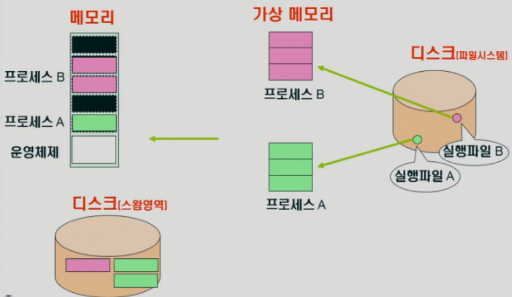
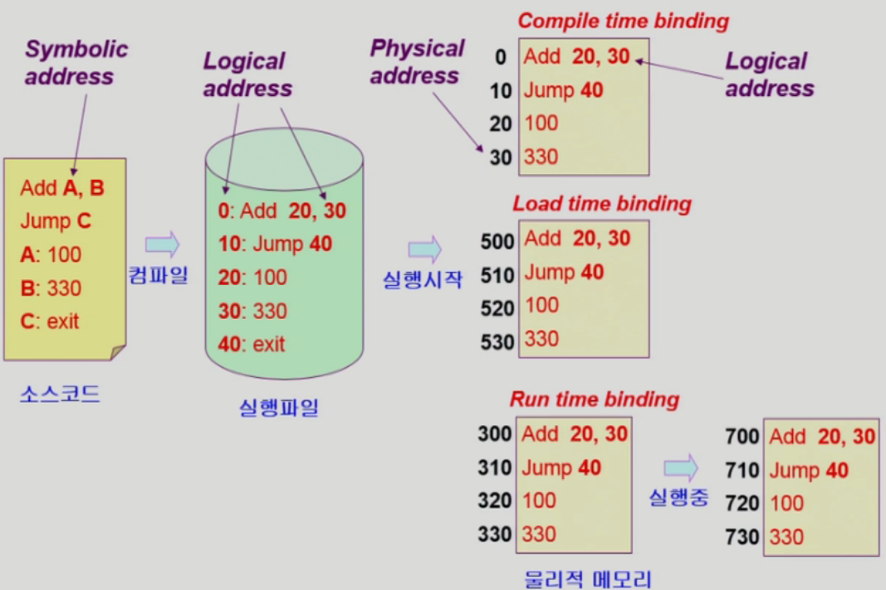
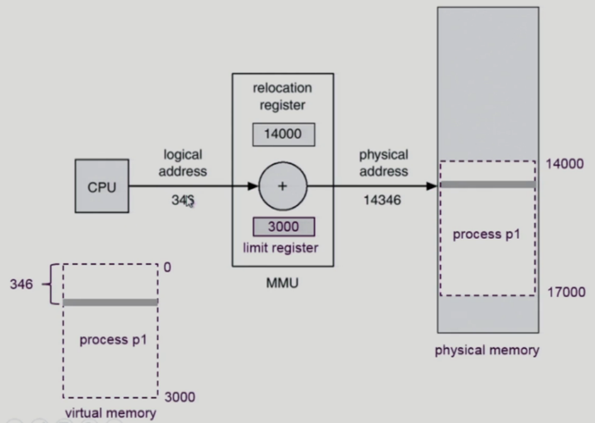
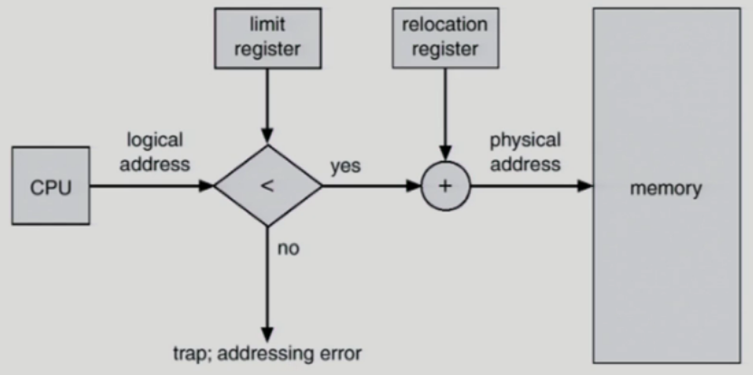
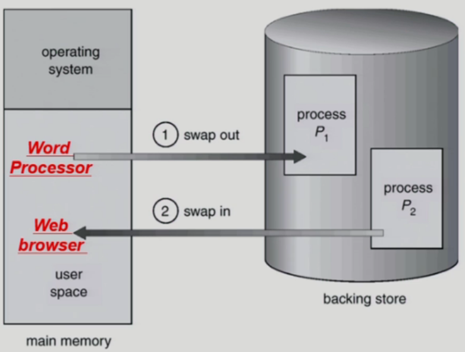
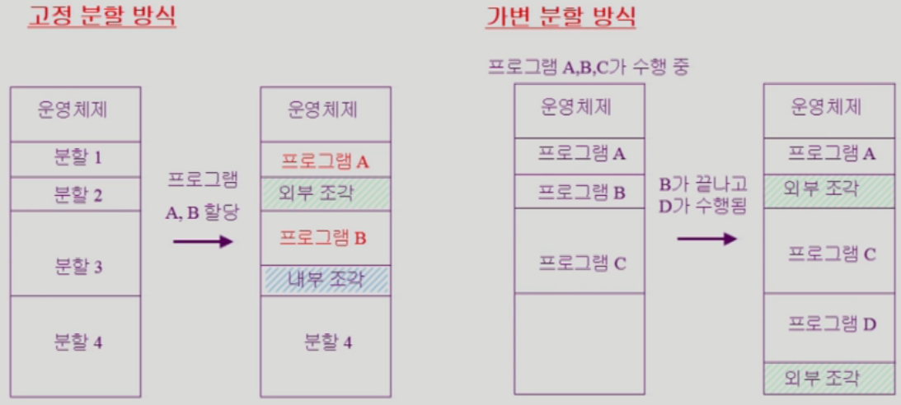

# 6. 메모리 관리

## Logical vs Physical Address

> 실제 현대 범용 운영체제는 조금 더 복잡하다.
> 어떤 프로그램이 물리적 메모리에 올라갈 때 연속적으로 통째로 올라가는 것이 아니고 프로그램의 주소공간들이 쪼개져서 산발적으로 필요한 것만 물리적 메모리에 올라가고 나머지는 디스크의 스왑영역에 쫒겨난다.

- Logical address (=virtual address) (가상메모리)
  - 프로세스마다 독립적으로 가지는 주소 공간
  - 각 프로세스마다 0번지부터 시작
  - **CPU가 보는 주소는 logical address임**
- Physical address (실제 메모리)
  - 메모리에 실제 올라가는 위치
- 주소 바인딩: 주소를 결정하는 것
  - Symbolic Address(프로그래머가 사용(변수)) -> Logical Address -> Physical address

## 주소 바인딩 (Address Binding)

> 논리적인 주소(logical address)를 물리적인 주소(physical address)로 변환하는 게 필요하다.
> 그 역활(주소바인딩(주소변환))을 하드웨어가 한다. (운영체제 X)
> 그 변환이 어느 시점에 이루어지느냐에따라 밑에 설명

- Compile time binding

  > 컴파일 타임에 이미 물리적인 주소
  > 범용운영체제에서보다는 옛날에 컴퓨터안에서 프로그램하나만 돌아가던 시절
  > 또는 전용컴퓨터(원자로제어, 로켓제어)에서 사용

  - 물리적 메모리 주소(physical address)가 컴파일 시 알려짐
  - 시작 위치 변경시 재컴파일
  - 컴파일러는 절대 코드(absolute code) 생성

- Load time binding

  > 실행시에 물리적 주소가 매겨진다.
  > 이 후 그 주소가 바뀌지 않는다.

  - Loader의 책임하에 물리적 메모리 주소 부여
  - 컴파일러가 재배치가능코드(relocatable code)를 생성한 경우 가능

- Execution time binding (=Run time binding)

  > 실행시 물리적 주소가 매겨진다.
  > 프로그램이 실행되는 도중에 바인딩이 바뀔 수 있다.
  >
  > 위의 두 바인딩의 경우 바인딩이 그렇게 큰 의미가 없지만
  > Compile tiem binding의 경우 논리적주소 = 물리적주소이기 때문에
  > Load time binding의 경우 실행시점에서 한번만 해주면 됨
  > Runtime binding의 경우 그때 그때 주소가 바뀌기 때문에 매번 메모리를 접근할 때마다 주소변환을 해야한다.
  
  - 수행이 시작된 이후에도 프로세스의 메모리 상 위치를 옮길 수 있음
  - CPU가 주소를 참조할 때마다 binding을 점검 (address mapping table)
    - 기계어안의 논리적주소를 물리적주소로 변환시 현재 binding값이 필요
  - 하드웨어적인 지원이 필요
    - (base and limit registers, MMU)

> **CPU가 보는 주소는 logical address임**
> CPU는 기계어를 실행하는데 기계어안의 주소들은 논리적 주소이다.
> 기계어안의 주소들까지 모두 바인딩하는 것은 무리가 있음
> 그래서 기계어 실행시 마다 논지적 주소를 물리적주소로 변환이 필요(MMU)

### Memory-Management Unit (MMU)

- Dynamic Relocation

- 주소변환을 하는 하드웨어
- MMU (Memory-Management Unit)
  - logical address를 physical address로 매핑해 주는 Hardware device
- MMU scheme
  - 사용자 프로세스가 CPU에서 수행되며 생성해내는 모든 주소값에 대해 base register(=relocation register)의 값을 더한다
- user program
  - logical address만을 다룬다
  - 실제 physical address를 볼 수 없으며 알 필요가 없다
- 
  - Relocation register(=base register): 접근할 수 있는 물리적 메모리 주소의 최소값(시작점)
  - Limit regitster: 논리적 주소의 범위
    - 프로그램이 자신의 주소 밖의 메모리를 요청하는 경우(실수 혹은 악의적)를 방지하기 위해 

## Some Termivologies (용어 정리)

### Dynamic Loading

- 프로세스 전체를 메모리에 미리 다 올리는 것이 아니라 해당 루틴이 불려질 때 메모리에 load하는 것
- memory utilization의 향상
- 가끔씩 사용되는 많은 양의 코드의 경우 유용
  - 예: 오류 처리 루틴
- 운영체제의 특별한 지원 없이 프로그램 자체에서 구현 가능(OS는 라이브러리를 통해 지원 가능)

> Loading: 메모리로 올리는 것

### Overlays

- 메모리에 프로세스의 부분 중 실제 필요한 정보만을 올림
- 프로세스의 크기가 메모리보다 클 때 유용
- 운영체제의 지원없이 사용자에 의해 구현
- 작은 공간의 메모리를 사용하던 초창기 시스템에서 수작업으로 프로그래머가 구현
  - Manual Overlay
  - 프로그래밍이 매우 복잡

### Swapping

- Swapping

  - 프로세스를 일시적으로 메모리에서 backing store로 쫒아내는 것

- Backing store (=swap area)

  - 디스크
    - 많은 사용자의 프로세스 이미지를 담을 만큼 충분히 빠르고 큰 저장 공간

- Swap in / Swap out

  - 일반적으로 **중기 스케줄러(swapper)에 의해 swap out 시킬 프로세스 선정** (suspended상태로 만듬)

  - priority-based CPU scheduling algorithm

    - priority가 낮은 프로세스를 swapped out 시킴
    - priority가 높은 프로세스를 메모리에 올려 놓음

  - Compile time 혹은 load time binding에서는 원래 메모리 위치로 swap in 해야 함

    > Compile time 혹은 load time binding의 경우 물리적 메모리 주소가 바뀌면 안되기 때문에 swapping이 온전히 빈메모리공간을 효율적으로 잘 사용하려면 Run time binding이 지원되는것이 좋다.

  - Execution time binding에서는 추후 빈 메모리 영역 아무 곳에나 올릴 수 있음

  - swap time은 대부분 transfer time (swap되는 양에 비례하는 시간)임

  > 오리지날 스와핑에서의 스왑아웃은 통째로 쫒겨났을때 스왑아웃되었다고 표현하지만
  > 현대적인 운영체제에서는 부분적으로 쫒겨나도 스왑아웃되었다고 표현하기도 한다

### Dynamic Linking

> 내가 작성한 코드와 라이브러리가 연결되는(내 코드에 라이브러리 코드를 포함하는) 작업

- Linking을 실행 시간(execution time)까지 미루는 기법
- Static linking (static library)
  - 라이브러리가 프로그램의 실행 파일 코드에 포함됨
  - 실행 파일의 크기가 커짐
  - 동일한 라이브러리를 각각의 프로세스가 메모리에 올리므로 메모리 낭비 (printf 함수의 라이브러리 코드)
- Dynamic linking (shared libray) (리눅스 shared object: .so) (윈도우 dynamic linking library: .dll )
  - 라이브러리가 실행시 연결(link)됨
  - 라이브러리 호출 부분에 라이브러리 루틴의 위치를 찾기 위함 stub이라는 작은 코드를 둠
  - 라이브러리가 이미 메모리에 있으면 그 루틴의 주소로 가고 없으면 디스크에서 읽어옴
  - 운영체제의 도움이 필요

> static 라이브러리의 경우 서로 다른 프로세스의 주소공간에 동일한 함수가 각각 전부 들어가 있다.
>
> shared 라이브러리의 경우 라이브러리의 위치만 가지고 있다. 같은 함수를 공유

## Allocation of Physical Memory

- 메모리는 일반적으로 두 영역으로 나뉘어 사용

  - OS 상주 영역
    - interrupt vector와 함께 낮은 주소 영역 사용
  - 사용자 프로세스 영역
    - 높은 주소 영역 사용

- 사용자 프로세스 영역의 할당 방법

  - Contiguous allocation (연속 할당) (요즘에는 잘 사용 X)

    - 각각의 프로세스가 메모리의 연속적인 공간(통째로)에 적재되도록 하는 것

    - 

    - FIxed partition allocation

    - Variable partition allocation

      - Dynamic Storage-Allocation Problem

        - 가변 분할 방식에서 size n인 요청을 만족하는 가장 적절한 hole(빈 공간)을 찾는 문제
        - First-fit
          - Size가 n 이상인 것 중 최초로 찾아지는 hole에 할당
        - Best-fit
          - Size가 n 이상인 가장 작은 hole을 찾아서 할당
          - Hole들의 리스트가 크기순으로 정렬되지 않은 경우 모든 hole의 리스트를 탐색해야함
          - 많은 수의 아주 작은 hole들이 생성됨
        - Worst-fit
          - 가장 큰 hole에 할당
          - 역시 모든 리스트를 탐색해야 함
          - 상대적으로 아주 큰 hole들이 생성됨

        > First-fit과 best-fit이 worst-fit보다 속도와 공간 이용률 측면에서 효과적인 것으로 알려짐

    - Compaction

      - 중간중간에 여러 빈공간들이 생기는 문제를 해결하기위한 하나의 방법
      - external fragmentation 문제를 해결하는 한 가지 방법
      - 사용 중인 메모리 영역을 한군데로 몰고 hole들을 다른 한 곳으로 몰아 큰 block을 만드는 것
      - 매우 비용이 많이 드는 방법임
      - 최소한의 메모리 이동으로 compaction하는 방법 (매우 복잡한 문제)
      - Compaction은 프로세스의 주소가 실행 시간에 동적으로 재배치(run time binding) 가능한 경우에만 수행될 수 있다.

  - Noncontiguous allocation (불연속 할당)

    - 하나의 프로세스가 메모리의 여러 영역에 분산되어 올라갈 수 있음
      - Paging (동일한 크기단위로 쪼갬)
      - Segmentation (의미를 기준으로 조깸)
      - Paged Segmentation
