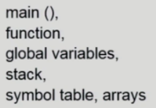
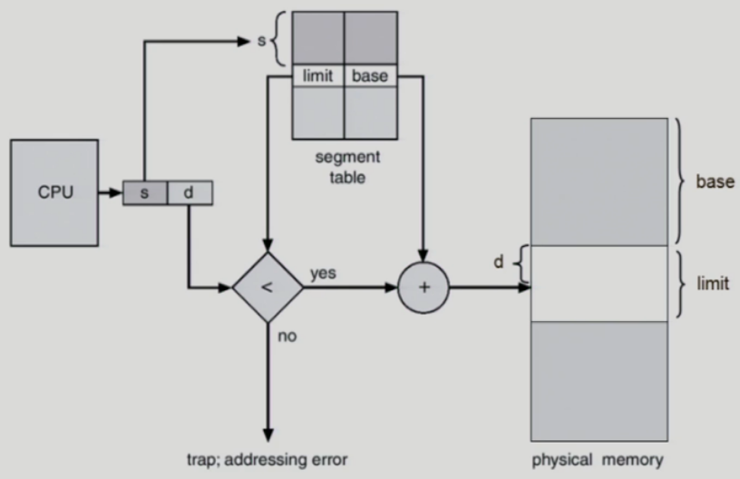
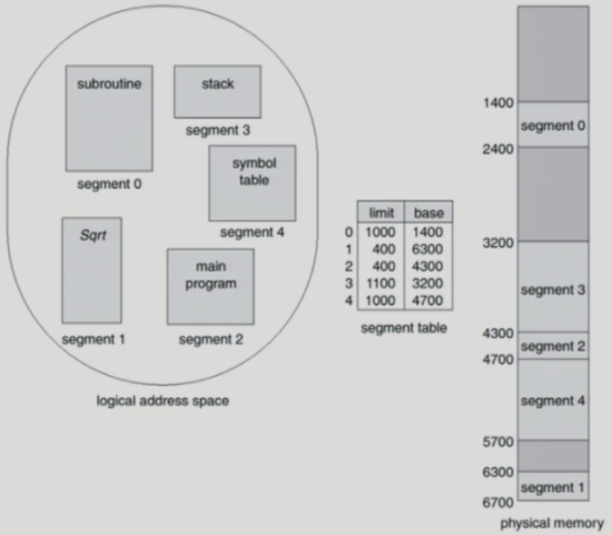
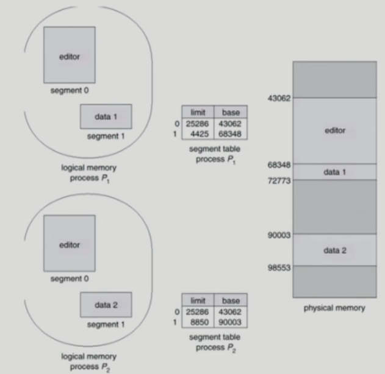
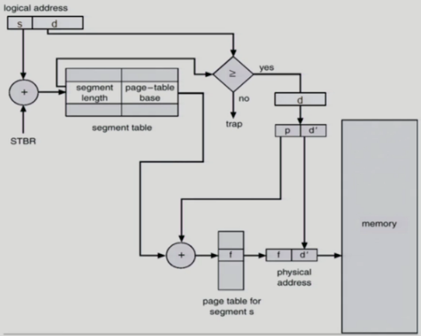

# 메모리 관리 (Segmentation)

### Segmentation

- 프로그램은 의미 단위인 여러 개의 segment로 구성
  - 작게는 프로그램을 구성하는 함수 하나하나를 세그먼트로 정의
  - 크게는 프로그램 전체를 하나의 세그먼트로 정의 가능
  - 일반적으로는 code, data, stack 부분이 하나씩의 세그먼트로 정의됨
- Segment는 다음과 같은 logical unit 들임
  - 

## Segmentation Architecture

- Logical address는 다음의 두 가지로 구성

  - <segment-number, offset>

- Segment table

  - each table entry has
    - base - starting physical address of the segment
    - limit - length of the segment
      - offset이 limit을 넘으면 안됨

- Segment-table base register (STBR)

  - 물리적 메모리에서의 segment table의 위치

- Segment-table length register (STLR)

  - 프로그램이 사용하는 segment의 수
    - segment number s is legal if s < STLR
    - segment-number가 STLR를 넘으면 안됨

- 페이징 기법의 페이지테이블보다 세그먼트페이지가 훨씬 적기때문에 메모리적으로 이득이다.

- Example of Segmentation

  - 

- Protection

  - 각 세그먼트 별로 protection bit가 있음
  - Each entry:
    - Valid bit  0 -> illegal segment
    - Read/Write/Execution 권한 bit

- Sharing

  - shared segment
  - same segment number

  > segment는 의미 단위이기 때문에 공유(sharing)와 보안(protection)에 있어 paging보다 훨씬 효과적이다.

- Allocation

  - first fit / best fit
  - external fragmentation 발생

  > segment의 길이가 동일하지 않으므로 가변분할 방식에서와 동일한 문제점들이 발생

### Sharing of Segments

## Segmentation with Paging

- 기본적으로 세그먼트기법을 사용하지만 세그먼트가 각각 물리적인 메모리에 연속해서 올라가는 것이 아니고 세그먼트가 여러개의 페이지로 구성(세그먼트가 페이지크기의 배수가 되도록한다.)
- 결국에는 페이지 단위로 물리적인메모리에 올라간다.
- pure segmentation과의 차이점
  - segment-table entry가 segment의 base address를 가지고 있는 것이 아니라 segment를 구성하는 page table의 base address를 가지고 있음
- 세그먼트 기법의 장점인 공유나 보안을 그대로 가지고 단점인 Allocation문제를 해결할 수 있다.

>참고
>http://www.kocw.net/home/cview.do?cid=4b9cd4c7178db077