# 데이터 구조

- 데이터에 편리하게 접근하고, 변경하기 위해 데이터를 저장하거나 조작하는 법
- 순서가 있는 데이터 구조
  - 문자열
  - 리스트
- 순서가 없는 데이터 구조
  - 세트
  - 딕셔너리

## 문자열

- 문자들의 나열(sequence of characters)
- 문자열의 특징
  - 변경할 수 없고(Immutable)
  - 순서가 있고(ordered)
  - 순회 가능한(iterable)
- 문자열 자르기(Slicing)
  - s[start:stop:step]
  - s[::] => 'abcde'
  - s[::-1] => 'edcba'

#### 문자열 메서드

- 문자열.find(x)

  - x의 첫번째 위치를 반환, 없으면 -1을 반환
  - 

- .index(x)
  - x의 첫 번째 위치를 반환, 없으연 오류
  - 
- .replace(old, new[, count])
  - 바꿀 대상 글자를 새로운 글자로 바꿔서 반환
  - count를 지정하면, 해당 개수만큼만 시행
  - 
- .strip([chars])
  - 특정한 문자들을 지정하면,
    - 양쪽을 제거하거나(strip), 왼쪽을 제거하거나(lstrip), 오를쪽을 제거(rstrip)
  - 문자열을 지정하지 않으면 공백을 제거함
  - 
- .split([chars])
  - 문자열을 특정한 단위로 나눠 리스트로 반환
  - 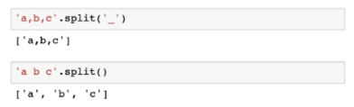
- 'separator'.join([iterable])
  - 반복가능한(iterable) 컨테이너 요소들을 separator(구분자)로 합쳐 문자열 반환
  - 
- .capitalize() : 앞글자를 대문자로
- .title() : '나 공백 이후를 대문자로
- .upper() : 모두 대문자로
- .lower() : 모두 소문자로
- .swapcase() : 대 <-> 소문자로 변경

- 문자열 관련 검증 메소드
  - .isalpha() : 알파벳 문자 여부
  - .isupper() : 대문자 여부
  - .islower() : 소문자 여부
  - .istitle() : 타이틀 형식 여부

## 리스트

- 순서가 있는 시퀀스, 인덱스로 접근
- 문자열의 특징
  - 변경가능하고(mutable)
  - 순서가 있고(ordered)
  - 순회 가능한(iterable)

#### 리스트 메서드

- .append(x)
  - 리스트에 값을 추가함
- .extend(iterable)
  - 리스트에 iterable의 항목을 추가함
  - 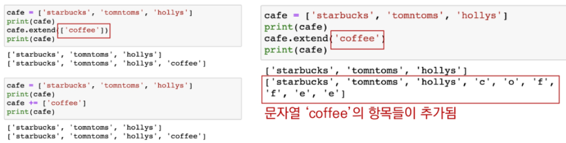
- .insert(i, x)

  - 리스트 길이보다 큰 i를 입력할 경우 맨뒤에 추가
  - 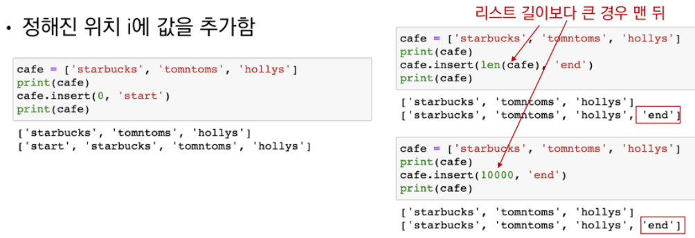

- .remove(x)
  - 리스트에서 값이 x인 것 삭제
  - 없는 경우 ValueError
- .pop( [i] )
  - 정해진 위치 i에 있는 값을 삭제하고, 그 항목을 반환함
  - i가 지정되지 않으면, 마지막 항목을 삭제하고 반환함
- .clear()

  - 모든 항목을 삭제함

- .index(x)
  - x값을 찾아 해당 index 값을 반환
  - 없는 경우 ValueError
- .count(x)
  - 원하는 값의 개수를 반환함
- .sort()
  - 원본 리스트를 정렬함, None 반환
  - 내장함수 sorted와 비교
  - 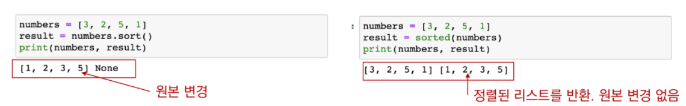
- .reverse()
  - 순서를 반대로 뒤집음(정렬하는 것이 아님)
  - 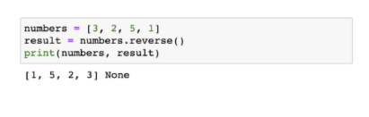

#### 리스트 복사

- 얕은 복사
  - slice 를 이용한다 : b = a[:]
  - list()를 활용 : b = list(a)
  - 주의 : 복사하는 리스트의 원소가 주소를 참조하는 경우(ex: 2중 리스트) (해결법: 딥카피)
- 깊은 복사
  - 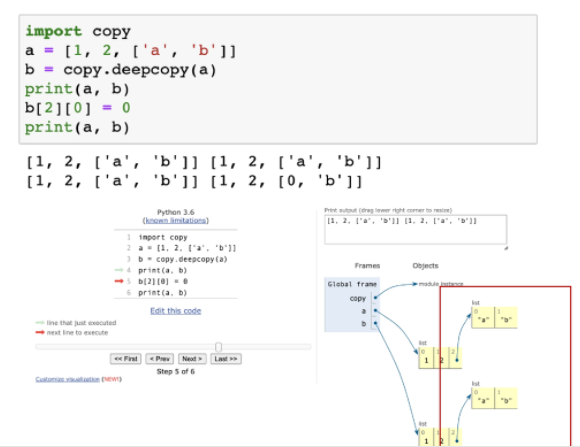

#### List comprehension

- 1~3의 세제곱의 결과가 담긴 리스트를 만드시오
  - 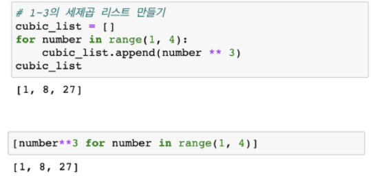
- 1~3까지의 숫자 중 짝수만 담긴 리스트를 만드시오
  - 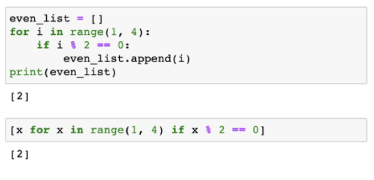
- 다음의 반복문을 List comprehension으로 표현 하시오
  - 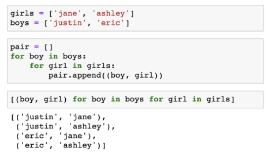

#### Built-in Function

- map(function, interable)
  - 순회 가능한 데이터구조의 모든 요소에 함수적용하고, 그 결과를 map object로 반환'
  - list()로 형변환 가능
- filter(function, iterable)
  - 순회 가능한 데이터구조의 모든 요소에 함수적용하고, 그 결과가 True인 것들을 filter object로 반환
  - 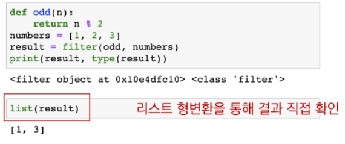
- zip(\*iterables)
  - 복수의 iterable을 모아 튜플을 원소로 하는 zip object를 반환
  - 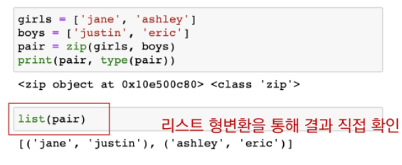

## 세트

- 중복 없이 순서가 없는 데이터 구조
- 문자열의 특징
  - 변경 가능하고
  - 순서가 없고
  - 순회 가능한

#### 메서드

- .add(elem)
  - 세트에 값을 추가
- .update(\*others)
  - 여러 값을 추가
  - 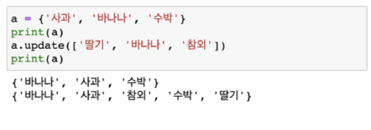
- .remove(elem)
  - 세트에서 삭제하고, 없으면 KeyError
- .discard(elem)
  - 세트에서 삭제하고 없어도 에러가 발생하지 않음
- .pop()
  - 임의의 원소를 제거해 반환
  - 세트가 이어있는 경우 KeyError

## 딕셔너리

- Key와 Value로 구성된 데이터 구조
- 딕셔너리의 특징
  - 변경 가능하고(mutable)
  - 순서가 없고(unordered)
  - 순회 가능한(iterable)

## 메서드

- .get(key[,default])
  - key를 통해 value를 가져옴
  - KeyError가 발생하지 않으며, default값을 설정할 수 있음(기본: None)
  - 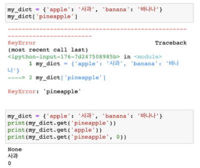
- .pop(key[,default])
  - key가 딕셔너리에 있으면 제거하고 해당 값을 반환
  - 그렇지 않으면 default를 반환
  - default값이 없으면 KeyError
  - 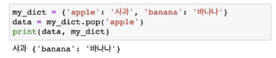
  - 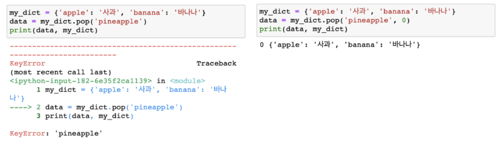
- .update()
  - 값을 제공하는 key, value로 갱신(기존 key는 덮어씀)
  - 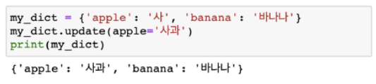

#### 딕셔너리 순회

- 딕셔너리는 기본적으로 key를 순회하면, key를 통해 값을 활용
- 추가 메서드를 활용하여 순회할 수 있음
  - keys() : Key로 구성된 결과
  - values() : Value로 구성된 결과
  - items() : (Key, Value)의 튜플로 구성된 결과
  - 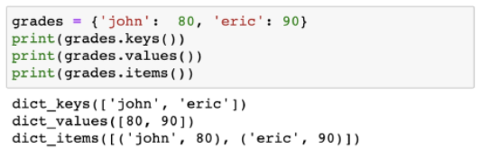
  - 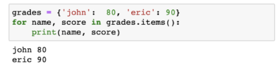

#### Dictionary Comprenension

- `{key: value for <변수> in <iterable>}`
- `{key: value for <변수> in <iterable> if <조건식>}`
- 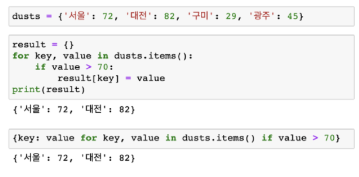
