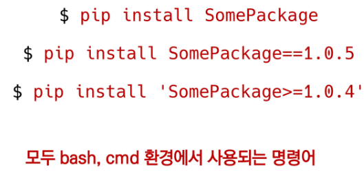
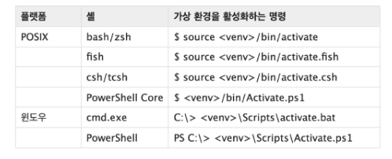
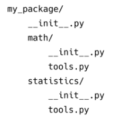
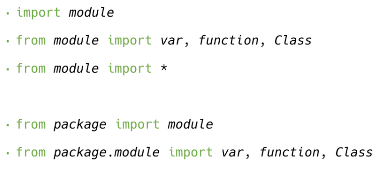

# 모듈과 패키지

- 모듈
  - 특정 기능을 파이썬 파일(.py) 단위로 작성한 것
- 패키지
  - 특정 기능과 관련된 여로 모듈의 집합
  - 패키지 안에는 또 다른 서브 패키지를 포함
- 파이썬 표준 라이브러리(Python Standard Library, PSL)
  - 파이썬에 기본적으로 설치된 모듈과 내장 함수
- 외부 라이브러리(3rd Part Library)
- 라이브러리
  - 패키지
    - 모듈

### 파이썬 패키지 관리자(pip)

- PyPI(Python Package Index)에 저장된 외부 패키지들을 설치하도록 도와주는 패키지 관리 시스템

- 패키지 설치
  - 최신버전 / 특정버전 / 최소버전을 명시하여 설치 할 수 있음
  - 
- 패키지 삭제

  - `pip uninstall SomePackage`

- 패키지 목록 및 특정 패키지 정보

  - `pip list`
  - `pip show SomePackage`

- 패키지 freeze

  - 설치된 패키지의 비슷한 목록을 만들지만, pip install에서 활용되는 형식으로 출력
  - 해당하는 목록을 requirements.txt(관습)으로 만들어 관리함
  - `pip install`
  - `pip freeze > requirements.txt`
    - requirements.txt 파일 생성
  - `pip install -r requirements.txt`
    - requirements.txt에 있는 라이브러리 설치

## 가상환경

### venv

- 가상 환경을 만들고 관리하는데 사용되는 모듀 (Python 버전 3.5부터)
- 특정 디렉토리에 가상 환경을 만들고, 고유한 파이썬 패키지 집합을 가질 수 있음
  - 특정 폴더에 가상 환경이(패키지 집합 폴더 등) 있고
  - 실행 환경(예-bash)에서 가상환경을 활성화 시켜
  - 해당 폴더에 이쓴ㄴ 패키지를 관리/사용함
- `python -m venv venv`
  - 가상환경을 생성하면, 해당 디렉토리에 별도의 파이썬 패키지가 설치됨
- 가상환경 활성화/비활성화
  - <venv>는 가상환경을 포함하는 디렉토리의 경로
  - 윈도우 `$ source venv/Scripts/activate`
  - 
  - 비활성화 : `$ deactivate`

#### 주의사항

- 가상환경이 켜진상황에서 폴더를 나간다고 가상환경이 꺼지는 것이 아니다.
- venv는 gitgub에 올리지 않는다. requirement.txt를 통해 환경을 맞춰준다.

## 모듈/패키지 활용하기

- 패키지는 여러 모듈/하위 패키지로 구조화
  - 활용 예시: package.module
- 모든 폴더에는 `__init__.py`를 만들어 패키지로 인식
  - python 3.3부터는 파일이 없어도 되지만, 하위 버전 호환 및 프레임워크 등에서의 동작을 위해 파일을 생성하는 것을 권장
- 패키지 만들기
  - 수학과 통계 기능이 들어간 패키지를 아래와 같이 구성
  - 폴더구조
    - 
- 다양한 모듈 사용법
  - 
