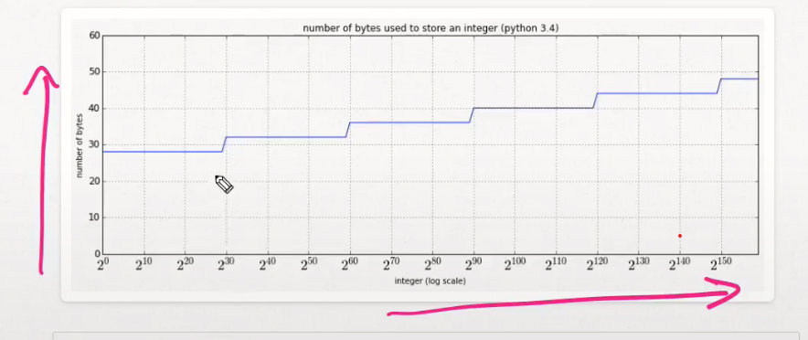
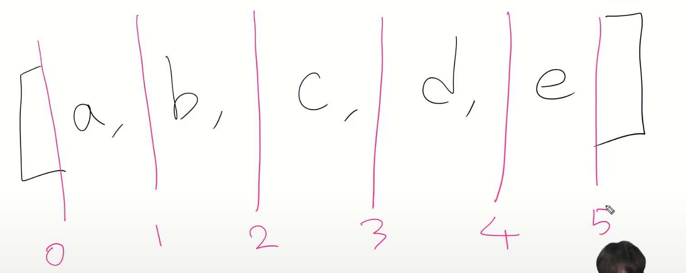
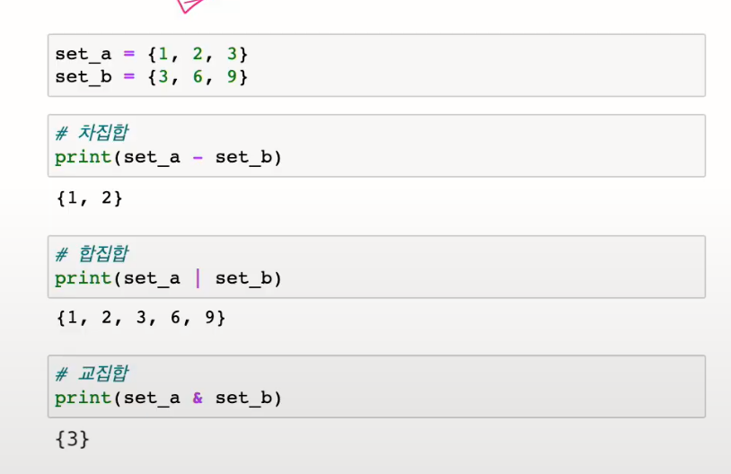
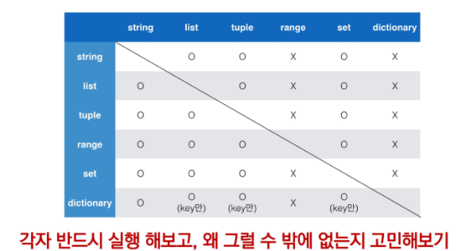
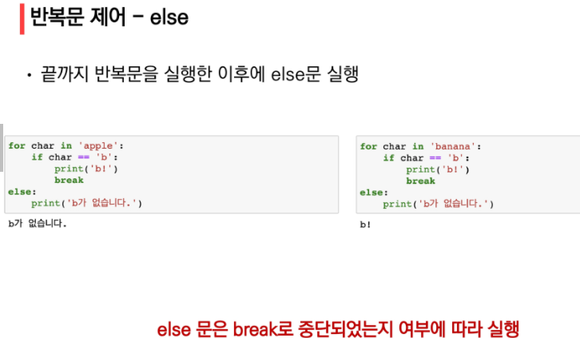

# 데이터 & 제어문


## 파이썬 특징

- 인터프리터언어
  - 한 줄씩 읽어서 바로 실행

- 객체지향 프로그래밍

- 동적타이핑
  - 변수에 별도의 타입 지정이 필요 없음


## 코드 스타일 가이드

- 어떻게 코드를 작성할지에 대한 가이드 라인
- PEP 8 -> 공식 스타일 가이드
- 구글 파이썬 스타일 가이드


## 변수와 식별자

- x = y = 1004

- x, y = 1, 2 (multiple assignment)
- y, x = x, y (갑 swap)


### 데이터 타입

- 숫자
  - int
  - float
  - complex (복소수)
- 문자열
- 참/거짓
- None


####     	int

- 오버플로가 발생하지 않음
  - 임의 정밀도 산술을 통해 고정된 형태의 메모리가 아닌 가용 메모리들을 활용하여 모든 수 표현에 활용




#### float

- Floating point rounding error
  - 부동소수점에서 실수 연산 과정에서 발생가능
  - 값 비교하는 과정에서 정수가 아닌 실수인 경우 주의할 것
  - 3.14 - 3.02 == 0.12 (False)
  - 실수는 무한하기 때문에 근사값을 사용
- 해결법
  - 매우 작은 수보다 작은지를 확인하거나 math 모듈 활용
  - abs(a - b) <= 1e-10
  - abs(a - b) <= sys.float_info.epsilon
  - math.isclose(a, b)


#### complex

- 실수부와 허수부로 구성된 복소수는 모두 complex 타입
- 허수부를 j 로 표현


#### 문자열

- 모든 문자는 str 타입


#### String Interpolation

- %-formatting
- str.format()
  - print('Hello, {}, 성적은 {}'.format(name, score))
- f-strings  (python 3.6+)
  - print(f'Hellow, {name}! 성적은 {score}')
  - f'원주율은 {pi:.3}'


#### Boolean

- 다음은 모두 False로 반환
  - 0, 0.0, (), [], {}, '', None


### 타입변환

- 암시적 타입 변환(Implicit)
  - 사용자가 의도하지 않고, 파이썬 내부적으로 타입 변환 하는 경우
  - True + 3
  - 3 + 5.0
  - 3 + 4j + 5
- 명시적 타입 변환(Explicit)
  - 사용자가 특정 함수를 활용하여 의도적으로 타입 변환 하는 경우
  - str*, float => int
  - str*, int => float
  - int, float, list, tuple, dict => str
- 문자열은 암시적 타입 변환이 되지 않음
  - '3' + 4  ===> typeError
  - int('3') + 4   =====> 7
  - int(2.5)  ====>  2     (버림)


### 연산자

- +, -, *, /(나눗셈), //(몫), **(거듭제곱)
- 나눗셈의 결과는 항상 float
- print(divmod(5, 2))    ====>  (2, 1)


#### 비교연산자

- is, is not
  - 메모리 주소를 비교함
- 3.0 == 3  True
- '3' != 3  True
- x == None 보다 x is None 사용 권장


#### 논리연산자

- and, or, not
- 단축평가
  - a = 5 and 4    ====>  4
  - b = 5 or 3    =====> 5
  - c = 0 and 5   =====> 0
  - d = 5 or 0    =====> 5


#### Containment Test

- 'a' in 'apple'   ====> True


#### Identity

- 파이썬에서 -5부터 256까지 숫자의 id는 동일 (동일한 주소를 사용)


#### Indexing / Slicing

- 'hellow'[0]   ====> 'h'
- 'hello, ssafy!'[1:5]   ====> 'ello'


#### 연산자 우선순위

- ()
- Slicing
- Indexing
- **
- 단항 연산자(+, -): 부호
- 산술 연산자(*, /, %)
- 산술 연산자(+, -)
- 비교 연산자, in, is
- not
- and
- or


# 컨테이너

- 여러 개의 값을 저장할 수 있는 것 (객체)
- 시퀀스(sequence)형 : 순서가 있는(ordered) 데이터
  - 순서가 있다 != 정렬되어 있다
  - 리스트, 튜플, 레인지, 문자형, 바이너리
- 비 시퀀스(non-sequence)형 : 순서가 없는 데이터
  - 세트, 딕셔너리


## 시퀀스형 컨테이너

### 리스트

- 순서가 있는 시퀀스로 인덕스를 통해 접근
- 인덱스는 0부터 시작
- [1, 2, 3]    /    list((1, 2, 3))


### 튜플

- 수정이 **불가능한(immutable)** 시퀀스로 인덱스로 접근

- ```python
  a = (1, 2, 3, 1)
  a[1] #2
  a[1] = '3'  #TypeError
  ```

- (1, 2, 3, 1)       /    tuple((1, 2, ,3 1))

- 추후 함수에서 복수의 값을 반환하는 경우에도 활용

- ```py
  a = (1) #int
  b = (1, ) #tuple
  ```


### 레인지(range)

- 숫자의 시퀀스를 나타내기 위해 사용

- 기본형 : range(n)

  - 0 부터 n-1까지의 숫자의 시퀀스

- 범위 지정 : range(n, m)

  - n부터 m-1까지의 숫자의 시퀀스

- 범위 및 스텝 지정 : range(n, m, s)

  - n부터 m-1까지 s만큼 증가시키며 숫자의 시퀀스

- ```py
  range(4) #range(0,4)
  list(range(4)) #[0, 1, 2, 3]
  print(type(range(4))) #<class 'range'>
  ```


### containment test

- in, not in

- ```py
  1 in [3, 2] #false
  4 in (1, 2, 'hi') # false
  ```


### concatenation(+)

- range는 TypeError

- ```py
  [1, 2] + ['a'] #[1, 2, 'a']
  range(2) + range(3) #typeerror
  ```


### 시퀀스 반복

- range는 TypeError

- ```py
  [0] * 8 #[0, 0, 0, 0, 0, 0, 0, 0]
  (1, 2) * 3 #(1, 2, 1, 2, 1, 2)
  ```


### indexing


### slicing

- 

- ```py
  [1, 2, 3, 4][0:4:2] #[1, 3]
  range(10)[1:5:3] #range(1, 5, 3)
  ```


### 길이 len()


### 최소/최대 min() / max()

- 문자열은 ascii 코드에 따름
  - ord함수 활용하여 확인가능


### count

- ```py
  [1, 2, 1, 2, 5].count(1) #2
  ```


## 비시퀀스형 컨테이너


### 세트(set)

- 순서가 없는 자료구조
  - 중괄호({}) 혹은 set()을 통해 생성
    - 빈 세트를 만들기 위해서는 set()을 반드시 활용해야 함(딕셔너리랑 겹치기 때문에)
  - 순서가 없어 별도의 값에 접근할 수 없음
- 수학에서의 집합과 동일한 구조를 가짐
  - 집합 연산이 가능
  - 중복된 값이 존재하지 않음
    - 시퀀시나 비시퀀시의 중복을 제거하기위해 사용되기도 함

- 


- 세트를 활용하면 다른 컨테이너에서 중복된 값을 쉽게 제거할 수 있음

  - 단, 이후 순서가 무시되므로 순서가 중요한 경우 사용할 수 없음

- 아래의 리스트에서 고유한 지역의 개수는?

  - ```py
    my_list = ['서울', '서울', '대전', '광주', '서울', '대전', '부산', '부산']
    let(set(my_list))
    ```


### 딕셔너리

- key와 value가 쌍으로 이뤄진 자료구조
  - key는 변경 불가능한 데이터만 활용 가능
    - string, integer, float, boolean, tuple, range
  - value는 모든 값으로 설정 가능


------------------


### 컨테이너 형변환

- 


### 컨테이너 분류

- 변경 불가능한 데이터
  - 리터럴 - 숫자, 문자열, 참/거짓
  - range
  - tuple
- 변경 불가능한 데이터의 복사
  - 값을 재할당
- 변경 가능한 데이터(mutable)
  - list
  - set
  - dictionary
- 변경 가능한 데이터의 복사
  - 동일한 객체의 주소를 참조한다
-  immutable 타입의 객체를 변수에 저장하면 call by value 가 되고 mutable 타입의 객체를 변수에 저장하면 call by reference 가 됩니다.예를 들어 문자열 자료형은 immutable 이니까 call by value, List는 mutable 이니까 Call by reference가 됩니다


----------

# 제어문


### 조건문

- PEP8에서는 4space 사용을 권장
- 1tap != 4spaces
- 에디터가 tap을 space로 변경해주기 때문에 tap사용 가능


### 반복문

- for문
  - 반복가능한 객체를 모두 순회하면 종료 (별도의 종료조건이 필요 없음)
  - 시퀀시(string, tuple, list, range)를 포함한 iterable한 객체 요소를 모두 순회함


### 리스트 순회하기 - enumerate

- ```py
  enumerate(members) #<enumerate at 0x2255d3e100
  list(enumerate(members)) #[(0, '민수'), (1, '영희'), (2, '철수')]
  list(enumerate(members, start=1)) #[(1, '민수'), (2, '영희'), (3, '철수')]
  for idx, member in enumerate(members):
  	print(idx, member)
  ```


### for - else

- 


### pass

- 특별히 할 일이 없을 때 자리를 채우는 용도로 사용
- 반복문 아니여도 사용 가능


