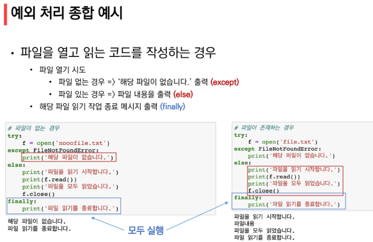

# 1. 함수


----

### 함수 output

- 함수는 항상 반환되는 값이 있으며, 어떠한 객체라도 상관 없음
- 오직 한개의 객체만 리턴됨
  - 복수의 객체를 return 하는 경우
    - 하나의 객체(tuple)을 반환
  - 명시적인 return 값이 없는 경우
    - 하나의 객체(None)을 반환


------

### 함수의 input

- parameter ( 매개변수 )

  - 함수에 입력으로 전달된 값을 받는 변수

  - ```python
    def foo(a, b):
        pass
    ```

- argument ( {전달}인자, 인수 )

  - 함수를 호출할 때 함수에 전달하는 입력 값

  - ```py
    foo(1, 2)
    ```


#### 위치 인자

- 기본적으로 함수 호출시 인자는 위치에 따라 함수 내에 전달됨

#### 기본 인자 값

- 
- ***기본 인자 값 다음에 위치인자를 활용할 수 없음***


#### 키워드 인자

- 직접 변수의 이름으로 특정 인자를 전달할 수 있음
- ***키워드 인자 다음에 위치 인자를 활용할 수 없음***
- 


#### 가변 인자 리스트

- 함수가 임의의 개수 인자로 호출될 수 있도록 지정
- 인자들은 튜플로 묶여(패킹) 처리되며, 매개변수에 *을 붙여 표현
- 


#### 가변 키워드 인자

- 함수가 임의의 개수 인자를 키워드 인자로 호출될 수 있도록 지정
- 인자들은 딕셔너리로 묶여 처리되면, 매개변수에 **를 붙여 표현
- 


#### 함수 정의 주의 사항

- `def greeting(name='john doe', age)`  (x)

- 


- `add(*args, x)`  (x)

- 


- `my_info(x, y, *args, **kwargs)` (o)

- 


#### 추가설명

- 

- 위치 인자, 기본값이 있는 위치 인자, 가변 인자, 가변 키워드 인자 순서로 작성해주시면 됩니다.

- 패킹

  - ```py
    def get_numbers(a, *args):
    	return a, args
    print(get_numbers(1, 2, 3)) # (1, (2, 3))
    ```

- 언패킹

  - ```py
    x = [1, 2, 3]
    print(get_numbers(x)) # ([1, 2, 3], ())
    print(get_numbers(*x)) # (1, (2, 3))
    ```


----


### 함수의 Scope

- 변수는 각자의 수명주기(lifecycle)가 존재
  - 빌트인 스코프(built-in scope)
    - 파이썬이 실행된 이후부터 영원히 유지
  - 전역 스코프(global scope)
    - 모듈이 호출된 시점 이후 혹은 인터프리터가 끝날 때까지 유지
  - 지역(함수) 스코프(local scope)
    - 함수가 호출될 때 생성되고, 함수가 종료될  때까지 유지
- 이름 검색 규식(Name Resolution)
  - 


- for문, if문 같은 것도 스코프가 존재하나? (x) : 파이썬은 함수와 클래스에만 스코프가 존재한다.


#### global

- 현재 코드 블록 전체에 적용되며, 나열된 식별자(이름)들이 전역 변수임을 나타냄
  - global에 나열된 이름은 같은 코드 블록에서 global 앞에 등장할 수 없음
  - global에 나열된 이름은 매개변수, for 루프 대상, 클래스/함수 정의 등으로 정의되지 않아야 함
- 선언되지 않은 변수에 사용가능 (전역변수로 할당됨)


#### nonlocal

- 전역을 제외하고 가장 가까운 (둘러 싸고 있는) 스코프의 변수를 연결하도록 함
- 

#### 주의


-----

### 재귀 함수


#### 재귀함수를 활용한 팩토리얼 구현

- ```python
  def factorial(n):
      if n == 1:
          return n
      else:
          return n * factorial(n-1)
  
  print(factorial(4))
  ```


#### 재귀함수를 활용한 피보나치 구현

- 


#### 재귀 함수 주의 사항

- 


-----


# 2. 에러/예외 처리


### 예외(Exception)


### 복수의 예외 처리 실습


