# OOP


## 객체

- 파이썬의 모든 것은 객체이다.
- 객체지향 프로그래밍에 객체는 클래스와 인스턴스이다.
- 집의 설계도, 축소모형 == 클래스
- 실제집 == 객체


- 객체는 특정 타입의 인스턴스이다.
  - 123, 900, 5는 모두 int의 인스턴스
  - 'hello', 'bye'는 모두 string의 인스턴스
  - [23, 42, 1], []은 모두 list의 인스턴스


- 객체(object)의 특징
  - 타입(type) : 어떤 연산자(operator)와 조작(method)가 가능한가?
  - 속성(attribute) : 어떤 상태(데이터)를 가지는가?
  - 조작법(method) : 어떤 행위(함수)를 할 수 있는가?


-  클래스도 객체인데....특정타입의 인스턴스도 되나요?
  - 네 맞습니다. 클래스 객체를 생성하는 클래스를 메타클래스라 부르고, 클래스의 타입을 확인하면 class 'type' 을 확인할 수 있습니다. 즉 모든 클래스는 type 메타클래스의 인스턴스 입니다. (어려운 개념이죠..)


- is 연산자
  - 객체의 아이덴티티를 검사하는 연산자
    - 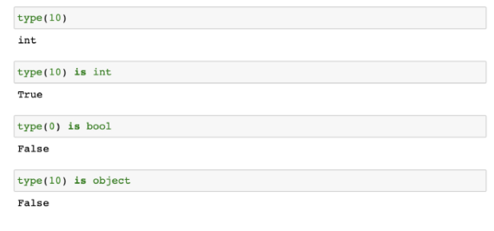
- ininstance 함수
  - isinstance(object, classinfo)
    - classinfo의 instance거나 subclass인 경우 True (상속에서 추가설명)
    - classinfo가 tuple인 경우(type으로 구성된) 하나라도 일치하면 True
    - classinfo가 type이거나 type으로 구성되지 않은 경우 TypeError
    - 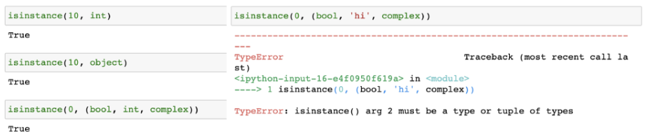


- 변수를 할당하는 모든 과정은 클래스의 인스턴스를 만드는 것?
- `a = 1` 은 사실 `a = int(1)`


#### 클래스와 인스턴스

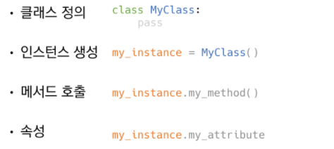


### self

- self는 인스턴스 자기자신

- 파이썬에서 인스턴스 메서드는 호출 시 첫번째 인자로 인스턴스 자신이 전달되게 설걔

  - 매개변수 이름으로 self를 첫번째 인자로 정의

- ```python
  'apple'.capitalize()
  #'Apple'
  
  #사실 위의 동작은 아래와 같이 동작하지만 위처럼 축약해서 사용한다
  #str.capitalize('apple')
  ```

- self가 있기때문에 인스턴스가 메서드를 호출할 수 있다.


### 생성자

- 인스턴스 객체가 생성될 때 호출되는 메서드
- `__init__`
- 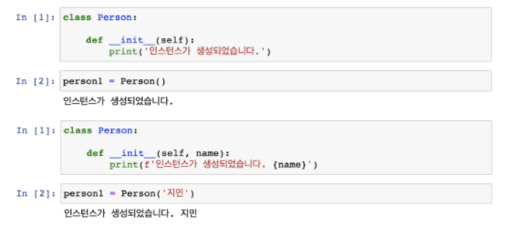


### 소멸자

- 인스턴스 객체가 소멸되기 직전에 호출되는 메서드
- `__del__`


### 매직 메서드

- Double underscore(__)가 있는 메서드는 특수한 동작을 위해 만들어진 메서드로, 스페셜 메서드 혹은 매직 메서드라고 불림
- 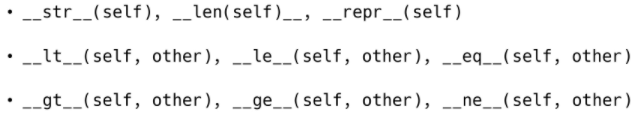


----


## 클래스와 인스턴스


#### 인스턴스 변수

- 인스턴스의 속성(attribute)
- 각 인스턴스들의 고유한 변수
  - 메서드에서 `self.<name>`으로 정의
  - 인스턴스가 생성된 이후 `<instance>.<name>`으로 접근 및 할당
- 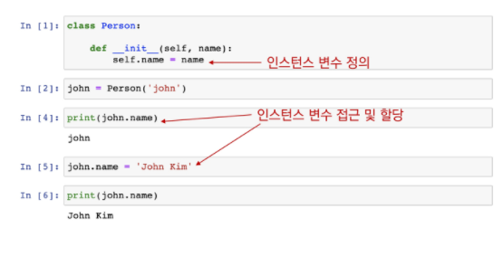

#### 클래스 변수

- 클래스 속석(attribute)
- 모든 인스턴스가 공유
- 클래스 선언 내부에서 정의
- `<classname>.<name>`으로 접근 및 할당


#### 인스턴스와 클래스 간의 이름 공간(namespace)

- 클래스를 정의하면, 클래스와 해당하는 이름 공간 생성
- 인스턴스를 만들면, 인스턴스 객체가 생성되고 이름 공간 생성
- 인스턴스에서 특정 속성에 접근하면, 인스턴스 - 클래스 순으로 탐색


#### 인스턴스 메서드

- 인스턴스가 사용할 메서드
- 클래스 내부에 정의되는 메서드의 기본
- 호출 시, 첫번째 인자로 인스턴스 자기자신(self)이 전달됨
- 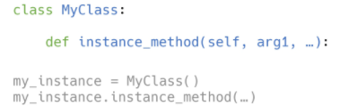


#### 클래스 메서드

- 클래스가 사용할 메서드
- @classmethod 데코레이터를 사용하여 정의
- 호출 시, 첫번째 인자로 클래스(cls)가 전달됨
- 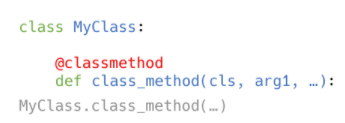


#### 스태틱 메서드(정적 메서드)

- 클래스가 사용할 메서드
- @staticmethond 데코레이터를 사용하여 정의
- 호출 시, 어떠한 기본 인자(self, cls)도 절달되지 않음(클래스 정보에 접근/수정 불가)
- 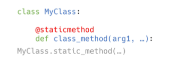


#### 메서드 정리

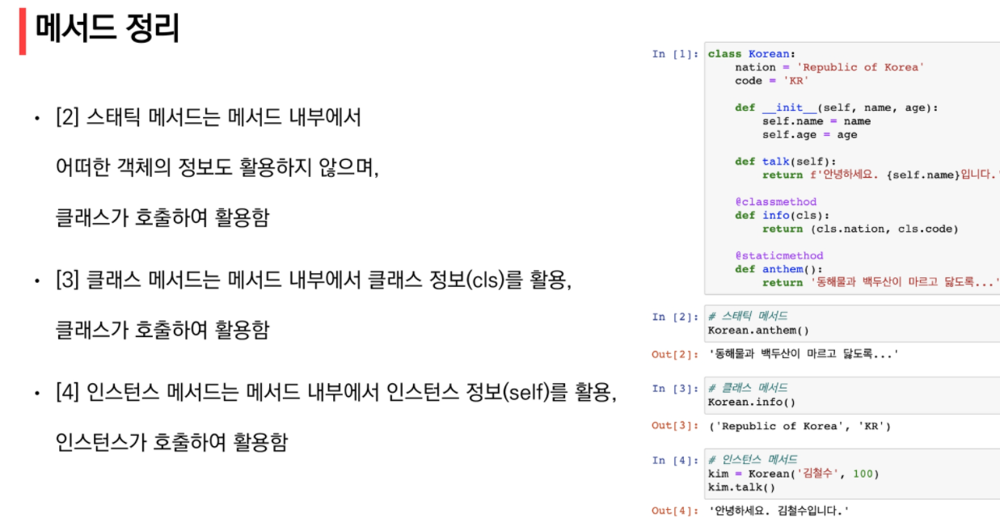


- 인스턴스는 세개의 모든 메서드에 접근은 가능하다
- 메서드는 해당 함수에서 어떤 값을 활용하고 변경하는지에 따라 정의할 것
  - 인스턴스는 모든 메서드를 호출 할 수 있음
    - 하지만, 인스턴스의 동작은 반드시 인스턴스 메서드로 정의
  - 클래스는 클래스 속성 접근 여부에 따라
  - 클래스메서드나 정적메서드로 정의


#### 클래스 변수와 인스턴스 변수의 함정 - 정리

- 클래스 변수는 모든  클래스 인스턴스에서 공유하는 데이터를 위한 변수
- 인스턴스 변수는 각 인스턴스에 고유한 데이터를 위한 것
- 클래스 변수는 동일한 이름의 인스턴스 변수에 의해 가려질 수 있기 때문에 주의해야함 (버그나 원치 않은 동작을 유발할 수 있음)


#### == & is

- ==
  - 동등한(equal)
  - 변수가 참조하는 객체가 동등한(내용이 같은) 경우 True
- is
  - 동일한(identical)
  - 두 변수가 동일한 객체를 가리키는 경우 True


#### 스태틱 메서드는 언제 사용해야 할까?

- 스태틱 메서드는 self, cls 인자를 취하지 않기 때문에 사용에 있어 큰 제약이 있어보임
  - 하지만, 반대로 특정한 메서드가 주변의 다른 것들과 독립적일 수 있음을 뜻하는 것이기도 함
- 스태틱 메서드와 클래스 메서드를 사용하는 것은 개발자의 의도를 전달하는 동시에 개발자가 자신의 의도를 강제해 버그로 인해 설꼐를 깨뜨리지 않도록 함
- self, cls 인자를 전달하지 않기 때문에 객체 인스턴스, 클래스 상태에 접근할 수 없음을 보장
- 또한 일반 함수를 사용하는 것처럼 실행할 수 있기 때문에 객체 지향 프로그래밍과 절차 지향 프로그래밍 스타일 사이를 연결하는 역할을 하기도 함


## 상속

- 클래스는 상속이 가능함
  - 모든 파이썬 클래스는 object를 상속 받음
- 상속을 통해 객체 간의 관계를 구축
- 부모 클래스의 속성, 메서드가 자식 클래스에 상속되므로 코드 재사용성이 높아짐
- `class ChildClass(ParentClass):`


- `isinstance(object, classinfo)`
- 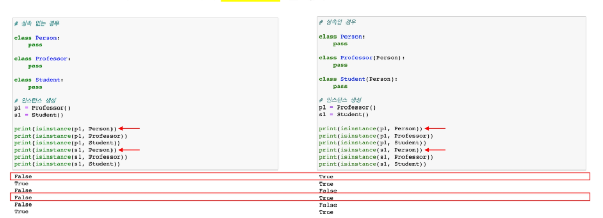
- issubclass(class, classinfo)
  - class가 classinfo의 subclass면 True
  - classinfo는 클래스 객체의 튜플일 수 있으며, classinfo의 모든 항목을 검사
  - 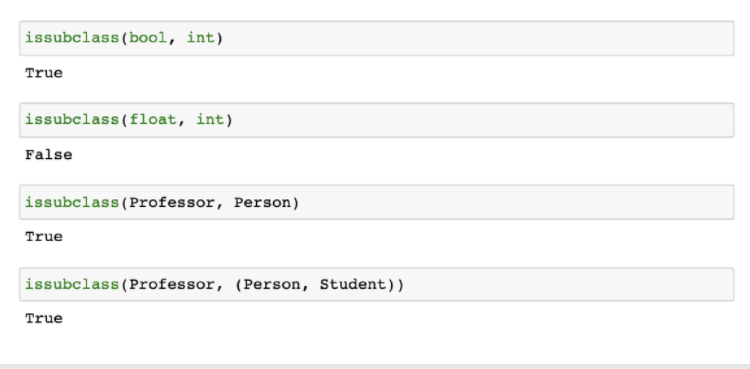


- 메서드 오버라이딩
  - 상속 받은 메서드를 재정의
    - 상속받은 클래스에서 같은 이름의 메서드로 덮어씀
    - 부모 클래스의 메서드를 실행시키고 싶은 경우 super를 활용
    - 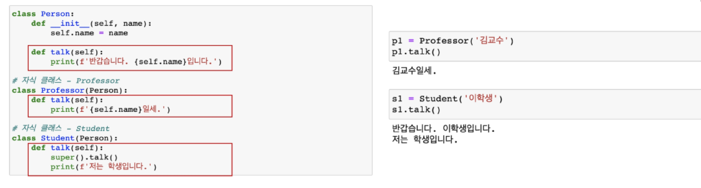
- 상속정리
  - 파이썬의 모든 클래스는 object로부터 상속됨
  - 부모 클래스의 모든 요소(속성, 메서드)가 상속됨
  - super()를 통해 부모 클래스의 요소를 호출할 수 있음
  - 메서드 오버라이딩을 통해 자식 클래스에서 재정의 가능함
  - 상속관계에서의 이름 공간은 인스턴스, 자식 클래스, 부모 클래스 순으로 탐색
  - 다중상속 가능 순서중요
