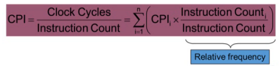

# Computer Abstractions and Technology

- Progress in computer technology
  - Underpinned by **Moore's Law**
- Computers are pervasive

### Moore's Law

- In 1965, Inter's Gorden Moore predicted that the **number of transistors that can be integrated on single chip would double about every two years**

>**하나의 칩에 들어 갈수 있는 트랜지스터의 칩은 매 2년 마다 2배씩 늘어날 것이다.** 라고 예측
>2000년대 초반까지는 잘 맞았지만 그 이후로는 더 이상 지켜지지 않고있다.

### Some Basic Definitions

> 2의 배수 단위는 컴퓨터, 저장장치 쪽에서 사용
> 10의 배수 단위는 네트워크, 통신 쪽에서 사용

## Understanding Performance

- Algorithm
  - Determines number of operations executed

> operations의 수를 줄이는 것

- Programming Language, compiler, architecture
  - Determine number of machine instructions executed per operation

>실행하는 instructions(명령어) 수를 줄이는 것

- Processor and memory system
  - Determine how fast instructions are executed

> 명령어 들을 얼마나 빨리 실행 시키냐

- I/O system (including OS)
  - Determines how fast I/O operations are executed

> I/O operations를 얼마나 빨리 처리하느냐

### Eight Great Ideas

- Design for **Moore's Law**
- Use **abstraction** to simplify design
- Make the **common case fast**
- Performance via **parallelism**
- Performance via **pipelining**
- Performance via **prediction**
- **Hierarchy** of memories
- **Dependability** via redundancy

## Below Your Program

- Application software
  - Written in high-level language
- System software
  - Compiler: translates HLL code to machine code
  - Operating System: service code
    - Handling input/output
    - Managing memory and storage
    - Scheduling tasks & sharing resources
- Hardware
  - Processor, memory, I/O controllers

### Levels of Program Code

- High-level language
  - Level of abstraction closer to problem domain
  - Provides for productivity(생산성) and portability(휴대성)
- Assembly language
  - Textual representation of instructions

> 바이너리 코드, 머신코드의 텍스트 표현

- Hardware representation
  - Binary digits (bits)
  - Encoded instructions and data

## Abstractions

- Abstraction helps us deal with complexity
  - Hide lower-level detail

> 복잡한 부분을 감추고 문제를 단순화하여 쉽게 해결한다.

- instruction set architecture (ISA)
  - The hardware/software interface

> 소프트웨어는 instruction으로 구성되어 있고 하드웨어는 이 instruction을 실행한다.

- Application binary interface(ABI)
  - The ISA plus system software interface

> ABI가 같으면 다른 컴퓨터의 시스템 프로그램에서 실행이 가능하다.

- Implementation
  - The details underlying and interface

> ISA를 어떻게 실제로 구현할 것인가, 구현방법

> **소프트웨어와 하드웨어가 밀접한 관련이 없도록(independency) 만들어주는 것이 ISA.**
> 소프트웨어는 ISA에서 지원해주는 instruction을 가지고 프로그램을 만들면 되고,
> 하드웨어는 ISA에서 지원해주는 instruction을 실행하면 된다.

## Performance

- Response time (latency)
  - How long it takes to do a task

> 하나의 일을 수행하는데 얼마의 시간이 걸리냐

- Throughput
  - Total work done per unit time
    - tasks/transactions/ .... per hour

>단위 시간당 몇개의 일을 하느냐

- How are response time and throughput affected by
  - Replacing the processor with a faster version?
    - response time은 줄어들고 throughput은 증가한다.
  - Adding more processors
    - response time은 그대로이고 throughput은 증가한다.
- We'll focus on **response time** for now...

### Relative Performance

- Define Performance = 1/Execution Time
- "X is n time faster than Y"
  - 
- Example: time taken to run a program
  - 10s on A, 15s on B
  - Execution Time(B) / Execution Time(A) = 15s /10s = 1.5
  - So A is 1.5 times faster than B

#### Measuring Execution Time

- Elapsed time
  - Total response time, including all aspects
    - Processing, I/O, OS overhead, idle time
  - Determines system performance
- CPU time
  - Time spent processing a given job
    - Discounts I/O time, other job's shares
  - Comprises user CPU time system CPU time
  - **Different programs are affected differently by CPU and system performance**

#### CPU Clocking

- Operation of digital hardware governed by a constant-rate clock
- 
- Clock period
  - rising edge 하나와 falling edge 하나로 구성
  - 하나의 클락사이클에 걸리는 시간
- Clock frequency (rate)
  - 1초에 싸이클이 몇개 인가
- **Clock rate is inverse of clock cycle time**
  - 

#### CPU Time

- 
- Perfomance improved by
  - Reducing number of clock cycles
  - Increasing clock rate
  - **Hardware designer must often trade off clock rate against cycle count**

> clock rate을 높이면 cycle count도 같이 증가한다. 상관관계가 있다.
> 따라서, 하드웨어 디자이너들은 두개의 비율을 잘 조정해서 성능이 좋은 포인트를 찾아야 한다.

#### Instruction Count and CPI

- 
- Instruction Count for a program
  - Determined by program, ISA and compiler
  - instruction count는 위의 세가지에 의해 결정된다.
- Average cycles per instruction
  - Determined by CPU hardware
  - If different instructions have different CPI
    - Average CPI affected by instruction mix
    - 프로그램마다 명령어들의 비율이 다르기 때문에 average CPI가 다를 수 있다.
- Example
  - 
  - Computer A가 B보다 1.2배 빠르다.

#### CPI in More Detail

- if different instruction classes take different numbers of cycles
  - 
  - 각각의 명령어들은 다른 CPI를 갖기 때문에 각각의 CPI를 곱해주어야 한다.
- Weighted average CPI
  - 

#### Performance Summary

- 

  - CPU Time = Instructions count * CPI * Clock period

- Performance depends on

  - Algorithm: affects IC, possibly CPI

  - Programming language: affects IC, CPI
  - Compiler: affects IC, CPI
  - Instruction set architecture: affects IC, CPI, Clock period

> **따라서 퍼포먼스는 알고리즘, 프로그램 언어, 컴파일러, ISA 에게 모두 영향을 받는다.**

## The Power Wall

- In CMOS IC technology
  - 
- The power wall
  - We can't reduce voltage further
  - We can't remove more heat

> 프로세서가 발전하면서 필요 전력량은 더 이상 높힐 수 없을 정도로 높아지며 발열문제를 겪고 있었고, 때문에 전력을 유지하면서 미세공정으로 전압을 낮춰서 트랜지스터를 더 많이 집적하거나(Capacity Load) 클럭(Frequancy)을 더 높게 올리는 방식으로 성능을 개선했다.
> 하지만 어느순간부터 더 이상 전압을 낮추면 전류가 새어버리는 지경에 도달했고, 결국 더이상 전압을 낮출 수 없게 되면서 이방법으로는 성능을 확보(Capacitive load와 Frequency를 증가시키기)하는게 어려워졌다.

- How else can we improve performance?

  - Multcore microprocessors

    - More than one processor per chip

  - Requires explicitly parallel programming

    - Compare with instruction level parallelism

      - Hardware executes multiple instructions at once

      - Hidden from the programmer

      > 하드웨어가 여래개의 명령어를 동시에 처리한고 이를 개발자들은 몰라도 된다.

    - Hard to do

      - Programming for performance
      - Load balancing
      - Optimizing communication and synchronization

## Fallacies and Pitfalls

#### Amdahl's Law

> 컴퓨터의 하나의 컴포넌트의 성능을 향상시키면 그 컴포넌트가 전체 시스템에서 차지하는 비중에 비례해서 전체 성능이 향상된다.

- Improving an aspect of a computer and expecting a proportional improvement in overall performance

- Example: multiply accounts for 80s/100s

  - How much improvement in multiply performance to get 5 x overall?

    

    > multiply의 성능 향상만을 가지고는 전체성능의 5배가 향상될 수 없다.

- Corollary: make the common case fast

> 전체 성능에서 많이 차지하는 부분을 향상시키는 것이 더 효율적이다.

#### Low Power at Idle

- i7 power benchmark
  - at 100% load: 258W
  - at 50% load: 170W (66%)
  - at 10% load: 121W (47%)
- Google data center
  - mostly operates at 10% - 50% load
  - at 100% load less than 1% of the time
- Consider designing processors to make power proportional to load

> 적은 로드에서는 비교적 높은 전력을 사용하기 때문에 비효율적이다.
> 따라서, 로드에 비례하게 전력을 사용하게끔하는 것이 중요하다.

#### MIPS as a Performance

- MIPS: Millions of Instructions Per Second
> 1초에 몇 백만개의 명령어를 실행하는가
  - Doesn't account for
    - Differnces in ISAs between computers
    - Differnces in complexity between instructions

- CPI varies between programs on a given CPU

> MIPS는 결국 CPI에 의해 결정되지만 CPI는 프로그램마다 달라질 수 있다.
>
> 따라서, MIPS는 올바른 성능지표가 아니다.

> 참고문헌
> *Computer Organization and Design, 5th Edition, by Patterson and Hennessy, 2014*
